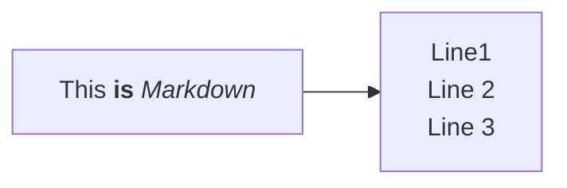

# Contribution Guide

Your contribution to the DataPLANT Knowledge Base is highly appreciated. This guide is intended to show you how to contribute new articles and tutorials or review and adapt parts of existing ones. For changes and suggestions, feel free to open a GitHub issue or pull request.


- [Setup](#setup)
  - [Installation](#installation)
  - [Create content and watch locally](#create-content-and-watch-locally)
  - [Check for dead links](#check-for-dead-links)
  - [Markdown](#markdown)
  - [VSCode](#vscode)
- [Where should I place my content?](#where-should-i-place-my-content)
  - [Start here](#start-here)
  - [Core Concepts](#core-concepts)
  - [Guides](#guides)
  - [`<specific-tool>`](#specific-tool)
  - [Fundamentals](#fundamentals)
- [Authorship](#authorship)
- [Style Guide](#style-guide)
- [Composition](#composition)
  - [Use Starlight components](#use-starlight-components)
  - [Use Custom components](#use-custom-components)
  - [Images](#images)
  - [html](#html)
  - [Tables](#tables)
  - [Lists](#lists)
  - [Article cross-references](#article-cross-references)
  - [Using tabs](#using-tabs)
  - [ARC Representation](#arc-representation)

## Setup

The DataPLANT Knowledge Base is built on [astro starlight](https://starlight.astro.build). Many features not covered here specifically may be found in their docs.

Starlight itself builds on [Astro](https://astro.build). Please check out [their website](https://docs.astro.build/en/install-and-setup/) for detailed installation instructions.

### Installation

1. Install [Node JS](https://nodejs.org/)
2. Clone the Knowledge Base repository via `git clone https://github.com/nfdi4plants/nfdi4plants.knowledgebase`

### Create content and watch locally

1. Install package dependencies via `npm install`
2. Start the knowledge base in watch mode via `npm run dev`

### Check for dead links

Especially when moving or cross-linking files (other articles or images), make sure to test-build the site via `npm run build`! This validates all links.

### Markdown

All articles are written in markdown (.md or .mdx).
See https://starlight.astro.build/guides/authoring-content/ for a short introduction.

### VSCode

We recommend working with VSCode to generate content.

Recommended VSCode extensions:

- Astro Build: https://marketplace.visualstudio.com/items?itemName=astro-build.astro-vscode
- MDX: https://marketplace.visualstudio.com/items?itemName=unifiedjs.vscode-mdx

💡 The mdx files cannot be previewed in VSCode. Please use `npm run dev` as described above.

## Where should I place my content?

### Start here

This is a place for content required for the recommended way to work with an ARC.

### Core Concepts

DataPLANT and ARC core concepts, design decisions, etc. 

### Guides

Here you can place content for a specific topic or task. Do not place specific tools documentation here.

### `<specific-tool>`

If you have a tool that is used in the context of an ARC, you can place the documentation here.

### Fundamentals

Basic information about RDM, not necessary ARC related.

## Authorship

Authors listed via a file in [`src/content/authors`](src/content/authors) can easily be mentioned in the yaml header of articles. 

For example `src/content/authors/kevin-frey.yml`:

```yaml
name: Kevin Frey
image: "@images/authors/kevin-frey.jpg"
socials:
  - icon: simple-icons:github
    href: https://github.com/Freymaurer
  - icon: simple-icons:orcid
    href: https://orcid.org/0000-0002-8510-6810
affiliation: DataPLANT
styling:
  text: KFR
```

The author is linked simply via yaml article metadata

```yaml
authors:
  - kevin-frey
```

## Style Guide


All files and folders must always be [kebab-case](https://developer.mozilla.org/en-US/docs/Glossary/Kebab_case). This means all lower case and `-` as word separator.

```txt title="Example"
src\assets\images\arc-commander\access-2.png
```


## Composition

Always follow **DRY (Don't Repeat Yourself)** principle. If you have the same content in multiple places, consider creating a reusable component.

In `.mdx` you can not only link to other content, but also directly insert other content in the current file.


### Use Starlight components

The Starlight framework has some nice components that can be used in the `.mdx` files.

Have an eye on the existing components to improve the readability of the content.

[Starlight components](https://starlight.astro.build/components/using-components/)

### Use Custom components

Checkout the `src/components/mdx` directory for custom components.

Can only be used in mdx files.

#### Mermaid

```mdx
import Mermaid from '@components/mdx/Mermaid.astro'

<Mermaid>

</Mermaid>
```

#### Viola Says

```mdx
import ViolaSays from '@components/ViolaSays.astro'

<ViolaSays>
Ok, I think I understand. The study is used to describe the overall experiment and the sample generation. Then the assays are used to describe the individual lab processes and the data generation!
</ViolaSays>
```

#### File Trees

Example file trees can be generated with the FileTree component, e.g.

```mdx
import { FileTree } from '@astrojs/starlight/components'

<FileTree>
- assays
    - **SugarMeasurement**
        - dataset
            - ...
        - protocols
            - ...
        - isa.assay.xlsx
        - README.md
    - ...
</FileTree>
```

The file tree of an empty ARC is available in `components/mdx/BaseARC.mdx` and can directly be included via

```mdx
import BaseARC from '@components/mdx/BaseARC.mdx';

<BaseARC />
```


#### Use Swate Icons and other components

To avoid having to describe Swate features, some Swate icons and widgets are now available as components.

##### Icons

```js
import Icons from '@components/swate/Icons';

<Icons.BuildingBlock />
<Icons.FilePicker />
<Icons.FileImport />
<Icons.BuildingBlock />
<Icons.FilePicker />
<Icons.DataAnnotator />
<Icons.FileImport />
<Icons.FileExport />
<Icons.Terms />
<Icons.Templates />
<Icons.Settings />
<Icons.About />
<Icons.PrivacyPolicy />
<Icons.Docs />
<Icons.Contact />
<Icons.Save />
<Icons.Delete />
<Icons.Forward />
<Icons.Backward />
<Icons.BuildingBlockInformation />
<Icons.RemoveBuildingBlock />
<Icons.AutoformatTable />
<Icons.CreateAnnotationTable />
<Icons.CreateMetadata />
<Icons.Back />
```

##### Term Search

```js
import TermSearch from '@components/swate/TermSearch';

<TermSearch name={"Test"} parentId={"MS:1000031"} showTerm client:only="react"/>

```

### Images

#### How to store

Try to use `.svg` files for icons, graphics and logos. Use any other file format for screenshots or tutorial images.

Images should be stored in the `src/assets/images` directory. If your image has a obvious context, you SHOULD create a subdirectory for it. 

```txt title="Example"
src
|-- assets
    |-- images
        |-- arc-commander
            |-- access-1.png
            |-- access-2.png
            |-- access-3.png
```

#### Use in `.md`/`.mdx`

Two options to insert images.

In markdown you can use the following syntax:

```md

```

For html in `.mdx` you can use the following syntax:

```mdx
import MacOSSecurity from "@images/arcitect/macos-security.png"


```

### html

Try to avoid html as it will usually override the consistent page design.  
**Don't use `<br />`!**

If you really need some special design or styling, raise an issue or contact the main contributors to discuss.

### Tables

Tables as summary for content MUST be avoided!

Tables may be used to show an example Annotation Table or to compare small information sets.

### Lists

Do not use lists for content. Lists are only allowed for navigation or short information sequences.

<details>
<summary>Good example:</summary>

```md
Please explore the sections on the left to find guides on:

- adding building blocks to your annotation table
- filling cells with ontology terms
- using and creating templates
```
</details>

<details>
<summary>Bad example:</summary>

```md
### Addition of assays

- An assay may consist of experimentally measured data together with experimental protocols.
- An assay folder structure can be created by using `arc a init`. Under assays an assay folder named after the assay identifier is created which includes:
  - dataset
  - protocol
  - assay.isa.xlsx
  - README.md
- An existing assay can be registered to the investigation by using `arc a register`.
- To create the folder structure and afterwards register the new assay `arc a add` can be used. This command combines init and register.
```
</details>

### Article cross-references

Avoid relative paths when cross-referencing another knowledge base article.
Instead, use references starting from the `docs` folder as root and add `/nfdi4plants.knowledgebase/`, e.g.

```md
[wiki associated to the ARC](/nfdi4plants.knowledgebase/datahub/datahub-arc-wiki)
```

### Using tabs

#### Multilingual code

Some software libraries of the DataPLANT ecosystem are transpiled and can be accessed from three different programming languages: 
  - FSharp
  - JavaScript
  - Python

In cases where this applies, it is recommended to present code snippets in the documentation by making use of `Tab` components.

First start out by importing the components at the top of your `mdx` file:

```js
import { Tabs, TabItem } from '@astrojs/starlight/components';
```

Then for multilanguage code blocks use the following structure:

```html
<Tabs syncKey="pl">

<TabItem label="FSharp" icon='seti:f-sharp'>
// Your F# documentation here
</TabItem>

<TabItem label="JavaScript" icon='seti:javascript'>
// Your JS documentation here
</TabItem>

<TabItem label="Python" icon='seti:python'>
// Your Py documentation here
</TabItem>

</Tabs>
```

Make sure the `syncKey` is always `"pl"` (programming language), and the labels are written exactly as `FSharp`, `JavaScript` and `Python`.


### ARC Representation

The ARC metadata comes in [two representations](https://arc-rdm.org/details/arc-representation/): json (RO-Crate) and tabular (scaffold).
To showcase these representations for different users (coders: json, biologists: table), you can use the `Tab` component and icons `seti:json` and `seti:xls`.

```html
<Tabs syncKey="arc-dual-view">

<TabItem label="Tabular View" icon="seti:xls">

// tabular or scaffold example

</TabItem>

<TabItem label="ARCtrl.json" icon="seti:json">

// json example

</TabItem>
</Tabs>
```
