# Block 2 &ndash; Intro to DataPLANT and ARC

---

# DataPLANT &ndash;  The NFDI4Plants

- NFDI: "Nationale Forschungsdaten Infrastruktur" &ndash; [www.nfdi.de](https://www.nfdi.de/)
- Funded since end of 2020

---

# Data Stewardship between DataPLANT and the community  <!-- fit -->

---

# Annotated Research Context (ARC)

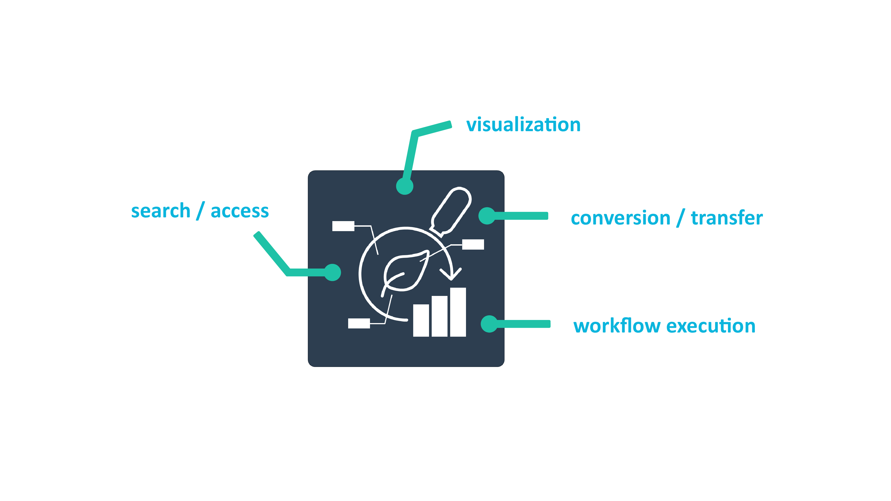

---

# What does an ARC look like?

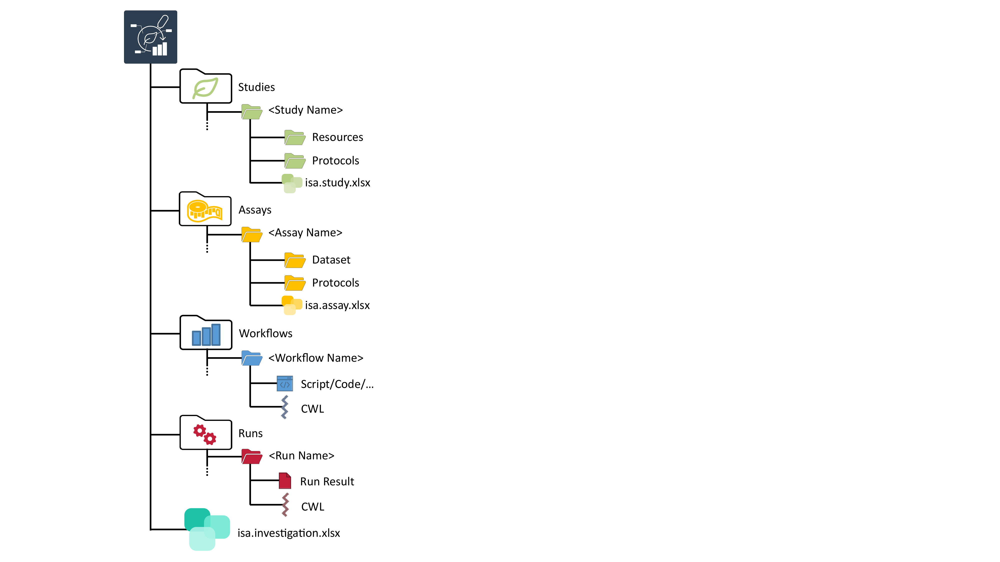

---

# What does an ARC look like?

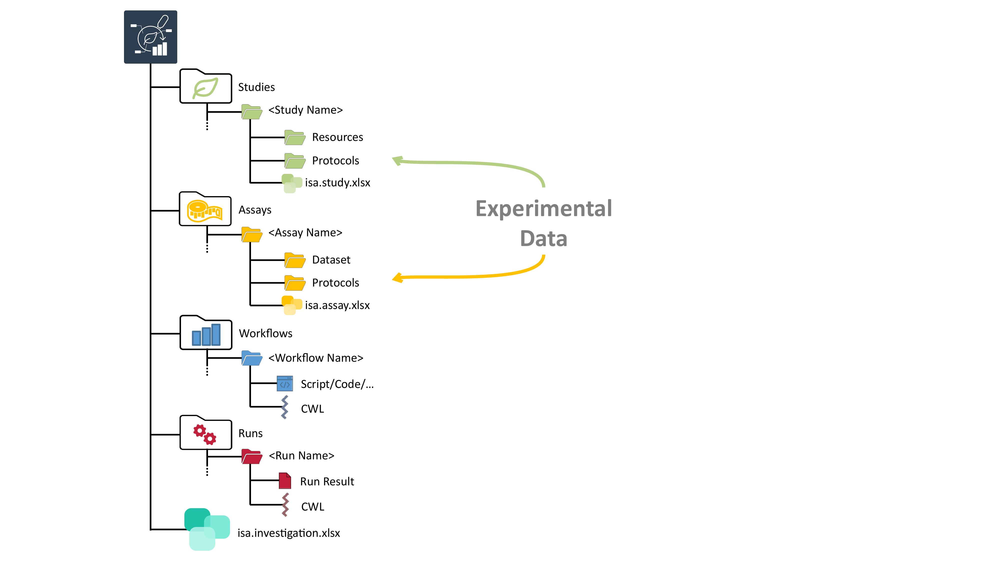

---

# What does an ARC look like?

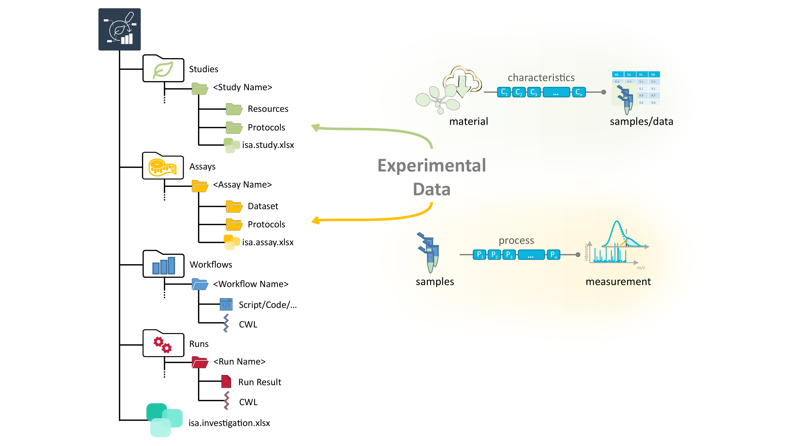

---

# What does an ARC look like?

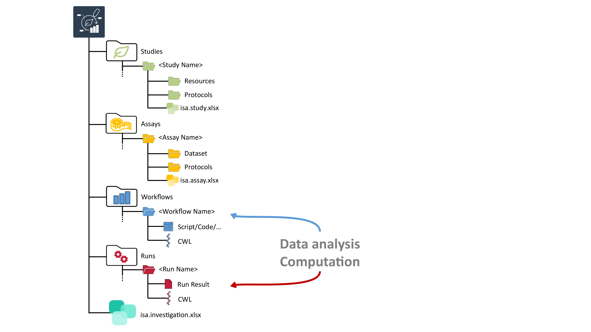

---

# What does an ARC look like?

---

# What does an ARC look like?

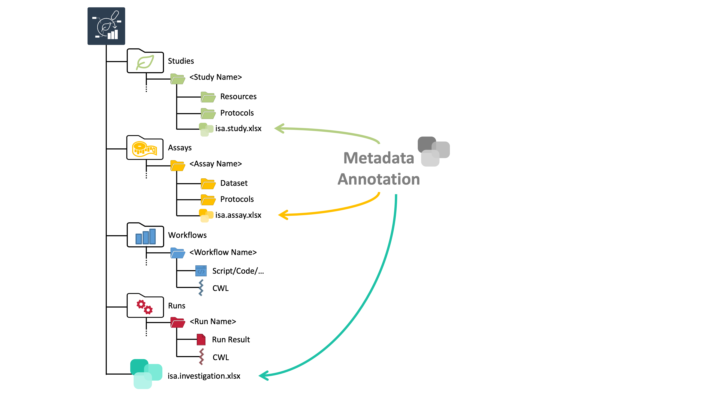

---

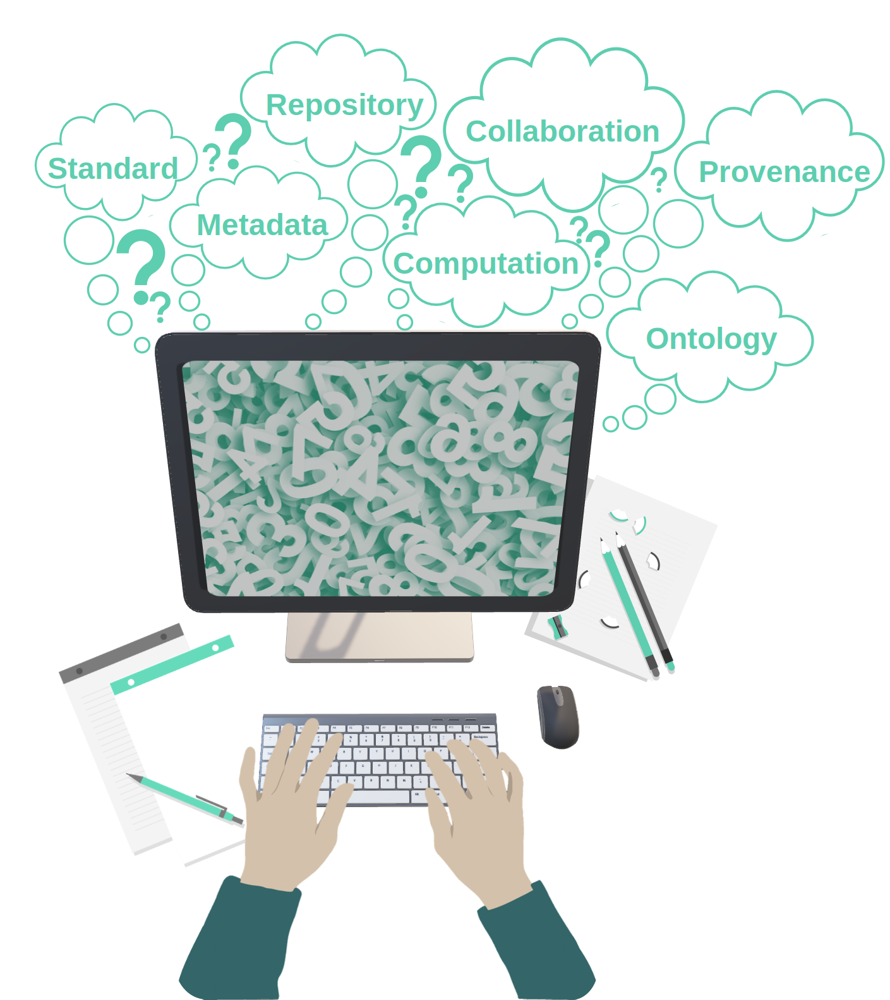

---

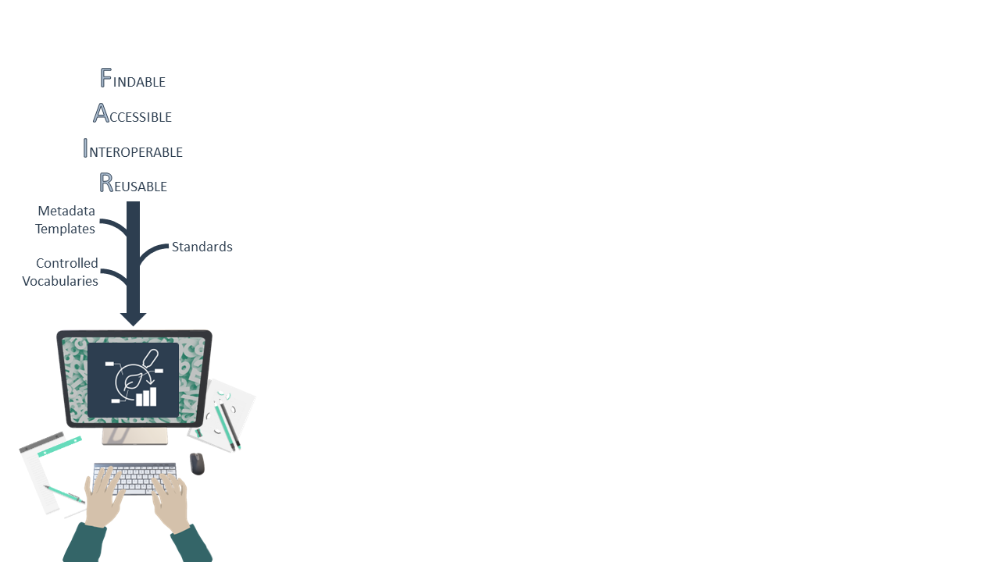

---

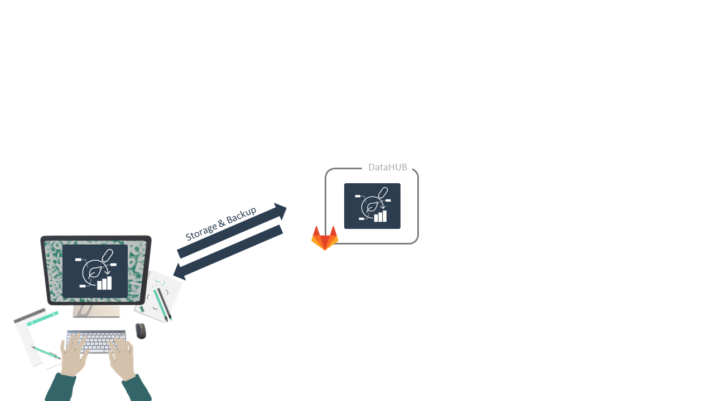

---

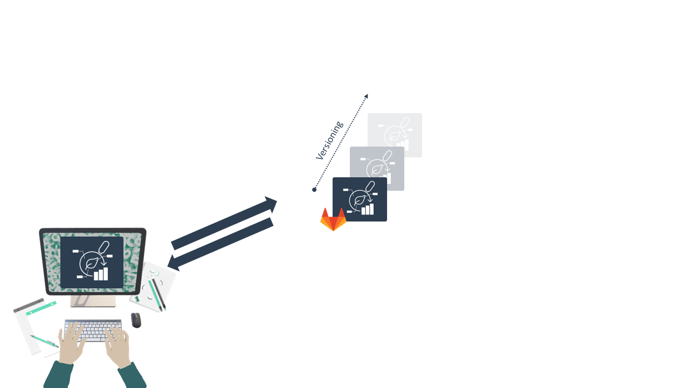

---

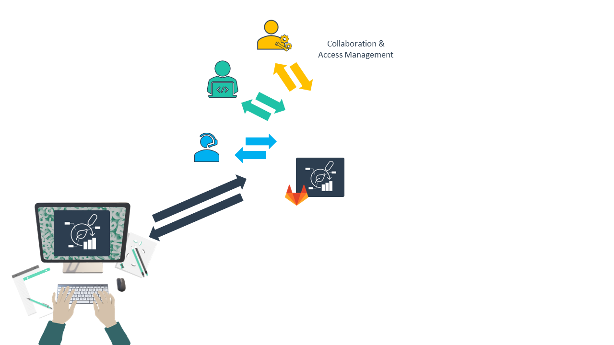

---

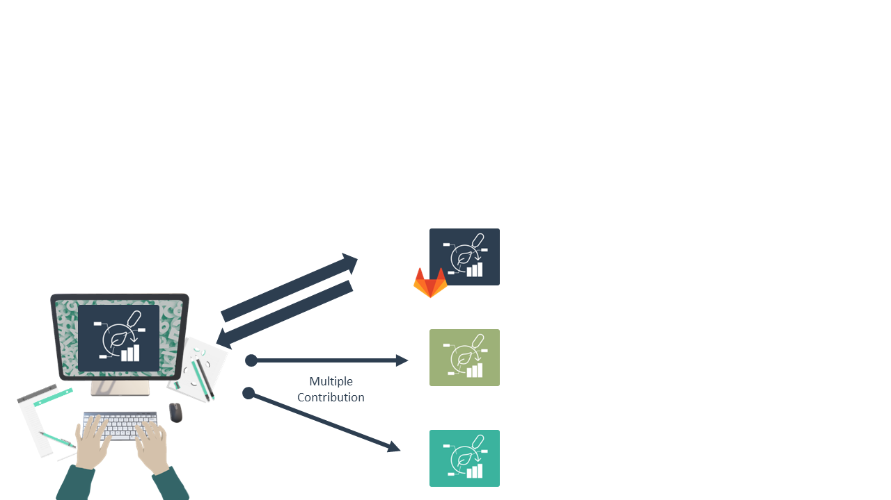

---

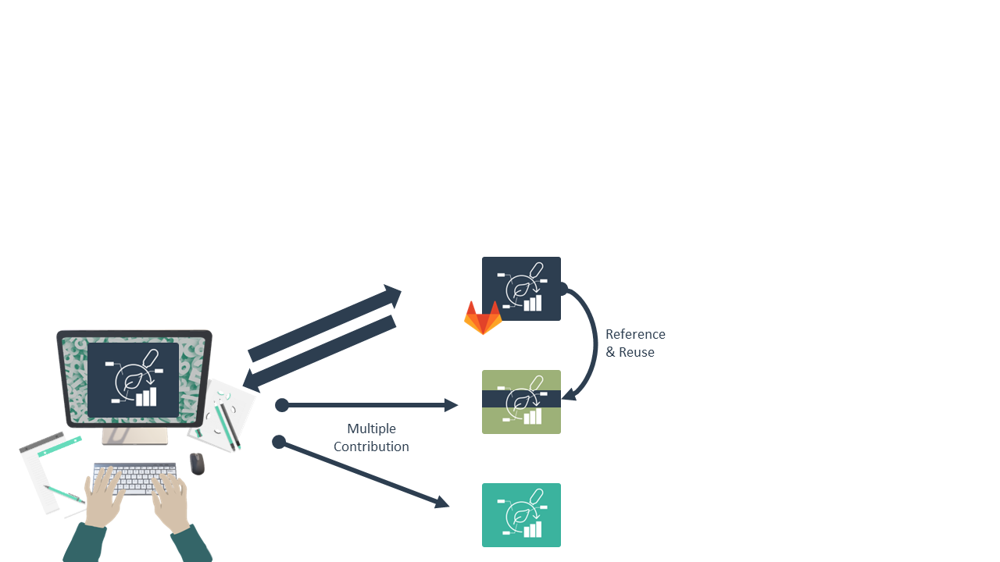

---

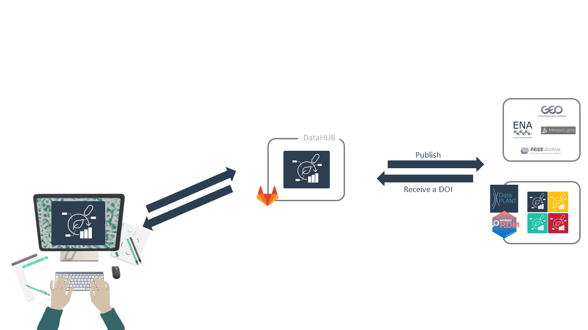

---

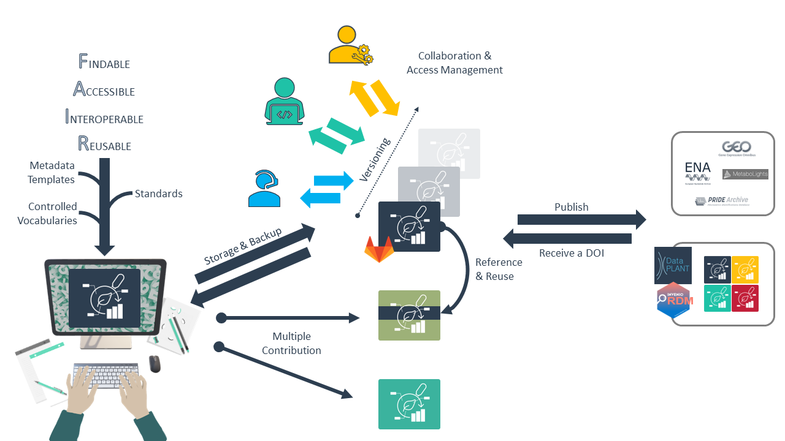

---

---

# Contributors

Slides presented here include contributions by

- name: Dominik Brilhaus
  github: https://github.com/brilator
  orcid: https://orcid.org/0000-0001-9021-3197
- name: Cristina Martins Rodrigues
  github: https://github.com/CMR248
  orcid: https://orcid.org/0000-0002-4849-1537
- name: Martin Kuhl
  github: https://github.com/Martin-Kuhl
  orcid: https://orcid.org/0000-0002-8493-1077

