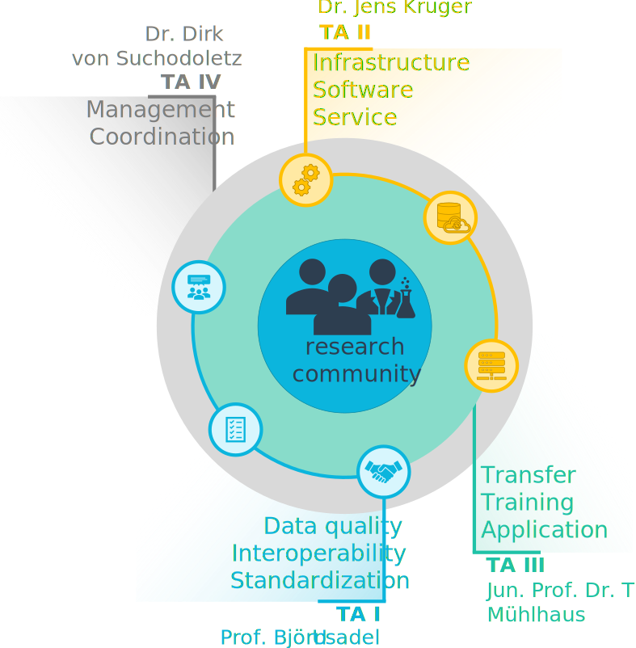
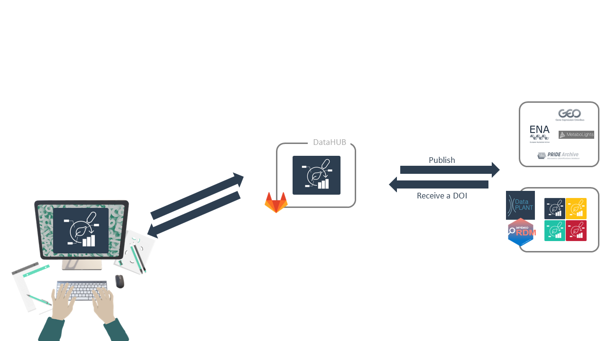
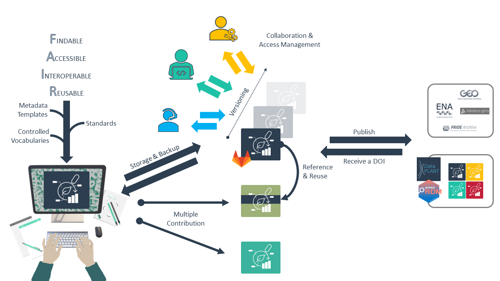
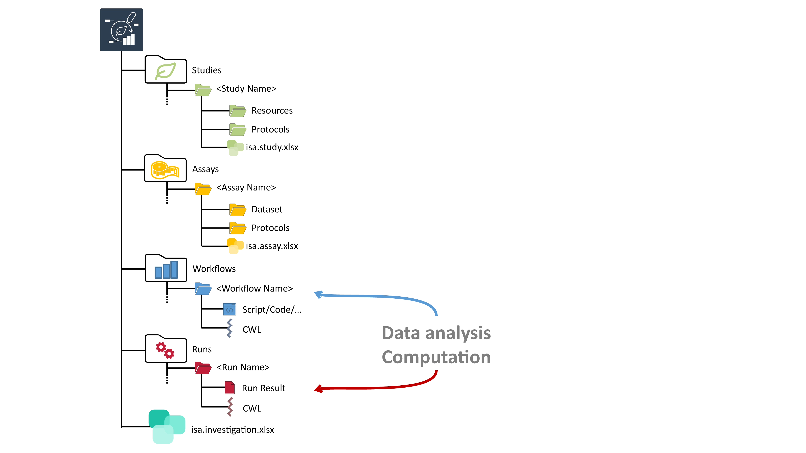
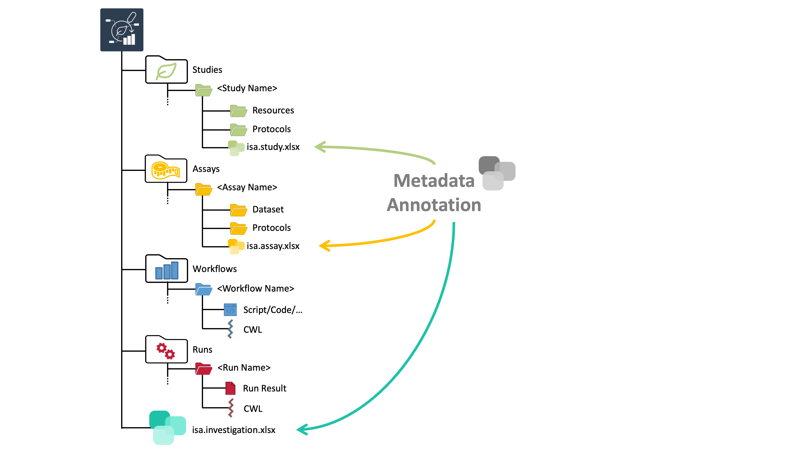

# Block 2 &ndash; Intro to DataPLANT and ARC

October 5th, 2023

Dominik Brilhaus, [CEPLAS Data Science](https://www.ceplas.eu/en/research/data-science-and-data-management/)

---

# DataPLANT &ndash;  The NFDI4Plants

- NFDI: "Nationale Forschungsdaten Infrastruktur" &ndash; [www.nfdi.de](https://www.nfdi.de/)
- Funded since end of 2020

---

# Data Stewardship between DataPLANT and the community  <!-- fit -->

---

# Annotated Research Context (ARC)

---

---

---

---

---

---

---

---

---

---

# What does an ARC look like?

---

# What does an ARC look like?

---

# What does an ARC look like?

---

# What does an ARC look like?

---

# What does an ARC look like?

---

# What does an ARC look like?

---

# Resources

###  DataPLANT (nfdi4plants)

Website: <a href="https://nfdi4plants.org/" target="_blank">https://nfdi4plants.org/</a>
Knowledge Base: <a href="https://nfdi4plants.org/nfdi4plants.knowledgebase/" target="_blank">https://nfdi4plants.org/nfdi4plants.knowledgebase/</a>
DataHUB: <a href="https://git.nfdi4plants.org" target="_blank">https://git.nfdi4plants.org</a>

GitHub: <a href="https://github.com/nfdi4plants" target="_blank">https://github.com/nfdi4plants</a>
HelpDesk: <a href="https://helpdesk.nfdi4plants.org" target="_blank">https://helpdesk.nfdi4plants.org</a>

:bulb: You can help us by raising issues, bugs, ideas...

---
---

# Contributors

Slides presented here include contributions by

- name: Dominik Brilhaus
  github: https://github.com/brilator
  orcid: https://orcid.org/0000-0001-9021-3197
- name: Cristina Martins Rodrigues
  github: https://github.com/CMR248
  orcid: https://orcid.org/0000-0002-4849-1537
- name: Martin Kuhl
  github: https://github.com/Martin-Kuhl
  orcid: https://orcid.org/0000-0002-8493-1077

