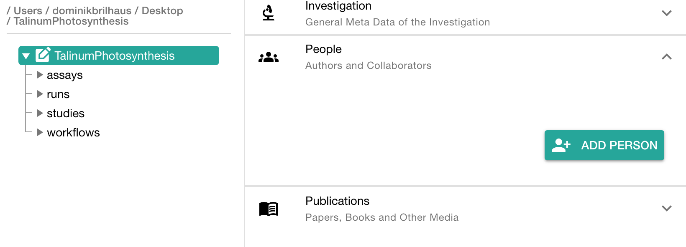
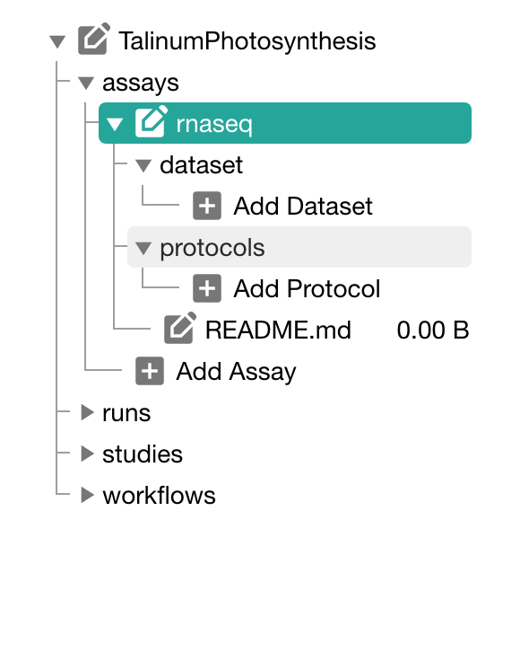
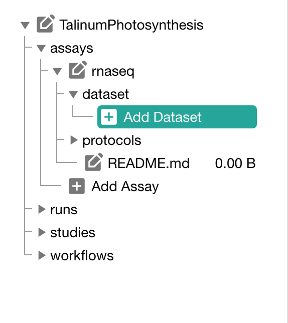
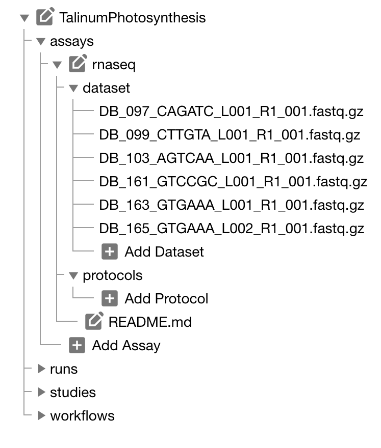
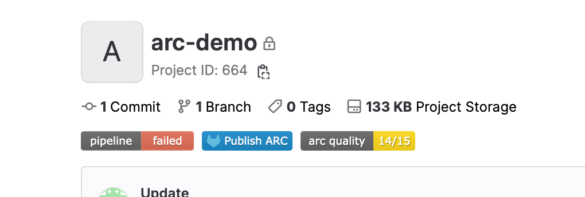
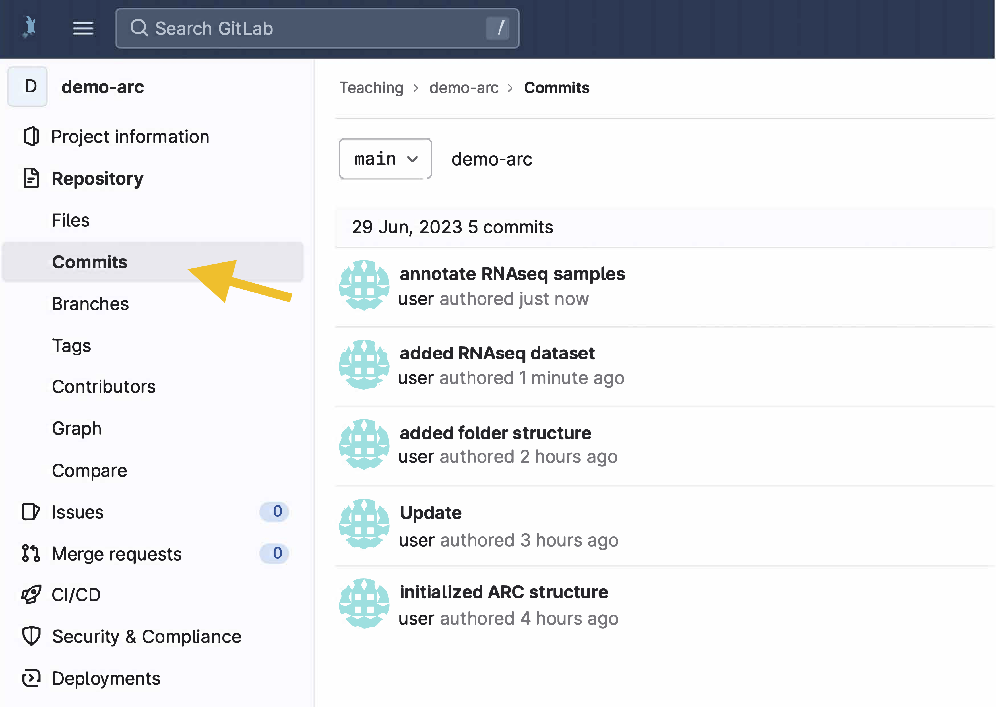
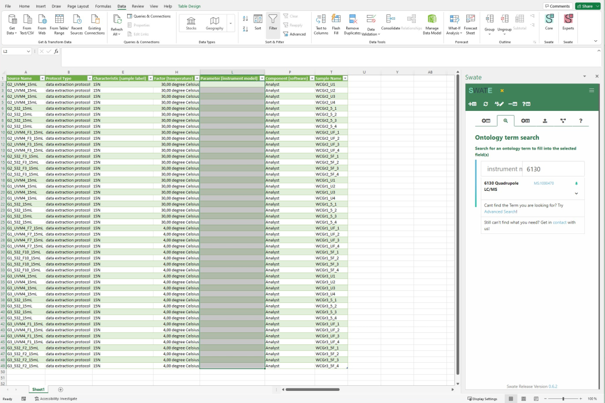
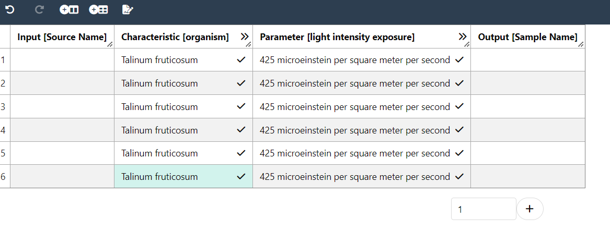

# Block 0 &ndash; Preparation

<style scoped>section {background: none; background-color: white}</style>
<!-- _paginate: false -->

**before** September 29th, 2023

Dominik Brilhaus, [CEPLAS Data Science](https://www.ceplas.eu/en/research/data-science-and-data-management/)

---

# Checklist hands-on sessions

<style scoped>

ul{
  list-style-type: none; /* Remove bullets */
}
</style>

:bulb: Please prepare the following before the workshop:

- :white_check_mark: Register at DataPLANT
- :white_check_mark: Find your command line
- :white_check_mark: Install and configure Git on your computer
- :white_check_mark: Install ARCitect on your computer
- :white_check_mark: Install Swate on your computer
- :white_check_mark: (optional) Install VS Code

---

# DataPLANT Registration

If you do not have a DataPLANT account, please register at the <a href="https://register.nfdi4plants.org" target="_blank">DataPLANT website</a>.


---

## Role and consortium

Please add your `Project/consortium` (e.g. CEPLAS, SFB, TRR) and choose the role `Guest`


---

# The command line

Find the **command-line interface (CLI)** on your system.

- On Windows: Enter `powershell` into the explorer path
- On MacOS: Search `terminal` via spotlight (&#8984; + &#9251;) or navigate to `Applications` -> `Utilities` -> `Terminal`

<br>

:bulb: In our tutorials we sometimes use *terminal*, *command-line interface (CLI)* and *powershell* interchangeably.

---

# Git Installation

Please install <a href="https://git-scm.com/downloads" target="_blank">Git</a> and <a href="https://git-lfs.github.com/" target="_blank">Git LFS</a> on your system

:bulb: Git LFS may already be installed with your Git installation (at least on Windows)

:bulb: For macOS we recommend to install via homebrew as described on the site above

---

# Configuration of Git

Check the git user configuration on your system, by executing

```bash
git config --global --get-regexp user
```

This should prompt two lines
`user.name <Your Name>`
`user.email <Your Email>`

:bulb: Configuration needs to be done once after installation of git on your system.

---

# Git configuration

Set the git user configuration on your system, by executing

1. Your name

```bash
git config --global user.name "Your Name"
```

2. Your email address

```bash
git config --global user.email "Your Email"
```

---

# ARCitect Installation

Please follow the instructions to install the latest version of ARCitect.

- <a href="https://nfdi4plants.org/nfdi4plants.knowledgebase/docs/ARCitect-Manual/arcitect_installation_macos.html" target="_blank">macOS</a>
- <a href="https://nfdi4plants.org/nfdi4plants.knowledgebase/docs/ARCitect-Manual/arcitect_installation_windows.html" target="_blank">Windows</a>

---

# Swate Installation

Please follow <a href="https://nfdi4plants.org/nfdi4plants.knowledgebase/docs/SwateManual/Docs01-Installing-Swate.html" target="_blank">these instructions</a> to install the latest version of Swate.

---

## Have a simple text editor ready

- Windows Notepad
- MacOS TextEdit

Recommended text editor with code highlighting, git support, terminal, etc: <a href="https://code.visualstudio.com/" target="_blank">Visual Studio Code</a>

---

# Resources

###  DataPLANT (nfdi4plants)

Website: <a href="https://nfdi4plants.org/" target="_blank">https://nfdi4plants.org/</a>
Knowledge Base: <a href="https://nfdi4plants.org/nfdi4plants.knowledgebase/" target="_blank">https://nfdi4plants.org/nfdi4plants.knowledgebase/</a>
DataHUB: <a href="https://git.nfdi4plants.org" target="_blank">https://git.nfdi4plants.org</a>
GitHub: <a href="https://github.com/nfdi4plants" target="_blank">https://github.com/nfdi4plants</a>

---

---

# Contributors

Slides presented here include contributions by

- name: Dominik Brilhaus
  github: https://github.com/brilator
  orcid: https://orcid.org/0000-0001-9021-3197
---


# Start your ARC Workshop

<style scoped>section {background: none; background-color: white}</style>
<!-- _paginate: false -->

for CSCS

October 5th, 2023

Dominik Brilhaus, [CEPLAS Data Science](https://www.ceplas.eu/en/research/data-science-and-data-management/)

---
# Block 1 &ndash; Welcome and Intro


---

# Welcome

Please introduce yourselves

- Who are you?
- Where are you?
- What was your **motivation** to join this workshop?
- Summarize your **study design**
- Name your **favorite assay** or measurement technique

---

# House-keeping

--- 


## This workshop session will be recorded

I will cut out all participant chat, video, audio, etc. or ask for permission before sharing any recordings

---
## Let's make this an interactive workshop

Please feel free to use the chat, raise hands, discuss, etc.

<br>


<br>

:bulb: Let's try to collect questions and answers in the Q&A panel =>


---

# Goal

Create ARCs to share research data

<br>
  
:bulb: In this workshop we focus more on **how** and less on **why**

---

# Tentative agenda

Time | Topics
-------- | --------
13:00 - 14:00 | Welcome and intro
14:00 - 14:15 | *Short break*
14:15 - 16:00 | ARC and ARCitect Hands-on
16:00 - 16:15 | *Short break*
16:15 - 17:00 | Q & A

:bulb: Please try to prepare your own ARC until the next session

---


# Block 2 &ndash; Intro to DataPLANT and ARC

October 5th, 2023

Dominik Brilhaus, [CEPLAS Data Science](https://www.ceplas.eu/en/research/data-science-and-data-management/)

---

# DataPLANT &ndash; <br>The NFDI4Plants


- NFDI: "Nationale Forschungsdaten Infrastruktur" &ndash; [www.nfdi.de](https://www.nfdi.de/)
- Funded since end of 2020

---

# Data Stewardship between DataPLANT and the community  <!-- fit -->


---

# Annotated Research Context (ARC)


---


---


---


---


---


---


---


---


---


---

# What does an ARC look like?


---

# What does an ARC look like?


---

# What does an ARC look like?


---

# What does an ARC look like?


---

# What does an ARC look like?


---

# What does an ARC look like?


---

# Resources

###  DataPLANT (nfdi4plants)

Website: <a href="https://nfdi4plants.org/" target="_blank">https://nfdi4plants.org/</a>
Knowledge Base: <a href="https://nfdi4plants.org/nfdi4plants.knowledgebase/" target="_blank">https://nfdi4plants.org/nfdi4plants.knowledgebase/</a>
DataHUB: <a href="https://git.nfdi4plants.org" target="_blank">https://git.nfdi4plants.org</a>


GitHub: <a href="https://github.com/nfdi4plants" target="_blank">https://github.com/nfdi4plants</a>
HelpDesk: <a href="https://helpdesk.nfdi4plants.org" target="_blank">https://helpdesk.nfdi4plants.org</a>

:bulb: You can help us by raising issues, bugs, ideas...


---
---

# Contributors

Slides presented here include contributions by

- name: Dominik Brilhaus
  github: https://github.com/brilator
  orcid: https://orcid.org/0000-0001-9021-3197
- name: Cristina Martins Rodrigues
  github: https://github.com/CMR248
  orcid: https://orcid.org/0000-0002-4849-1537
- name: Martin Kuhl
  github: https://github.com/Martin-Kuhl
  orcid: https://orcid.org/0000-0002-8493-1077


---


# Block 3 &ndash; ARCitect Hands-on

<style scoped>section {background: none; background-color: white}</style>
<!-- _paginate: false -->

October 5th, 2023

Dominik Brilhaus, [CEPLAS Data Science](https://www.ceplas.eu/en/research/data-science-and-data-management/)

---

# Check-in

---

## Registration

Did everyone <a href="https://register.nfdi4plants.org" target="_blank">sign-up</a> at the DataHUB?

---

## ARCitect installation

Please install the latest version of the ARCitect: https://github.com/nfdi4plants/ARCitect

:fire: (released September 20th, 2023) :fire:

---

## Download the demo data <!-- fit -->


https://nfdi4plant.sharepoint.com/:f:/s/Teaching/Eik7k-oJiMREgZ24kto7sIYBGxHmmZlS_Kzf7psk-5w-xg?e=u0sADd


---

## You just received your data


---

## Goal

- Structure,
- (Annotate, and)
- Share your experimental data.

<br>

:bulb: We'll talk about data annotation later


---

# Open the ARCitect


---

# Initiate the ARC folder structure


1. Create a **New ARC** (2)
2. Select a location and name it **TalinumPhotosynthesis**

---

# Your ARC's name

<style scoped>section {font-size: 23px;}</style>

💡 By default, your ARC's name will be used:

  1. for the ARC folder on your machine
  2. to create your ARC in the DataHUB at `https://git.nfdi4plants.org/<YourUserName>/<YourARC>` (see next steps)
  3. as the identifier for your investigation

💡 Make sure that no ARC exists at  `https://git.nfdi4plants.org/<YourUserName>/<YourARC>`. Otherwise you will sync to that ARC.

💡 Avoid spaces in your ARC's name


---

# Add a description and title to the investigation

1. Click on the ARC's name
2. Add a title (e.g. "Talinum Photosynsthesis")
3. Add a description
4. Click "Update" to save your changes


---

# Add contributors

In the section "People" click "ADD PERSON" to add at least one contributor

<br>



---

# Add contributor details


:bulb: For each person that you add, make sure to add
- First Name
- Last Name
- Email
- Affiliation

---

# Add a study

by clicking "Add Study" and entering **talinum_drought** as identifier for the study


---

# Study panel

In the study panel you can add

- general metadata,
- people, and
- publications
- data process information


---

# Add a protocol to the study


Click "Add Protocol" in the sidebar to add a protocol to the study

---

# Adding protocols

You can either

- directly write a **new protocol** within the ARCitect or
- import an existing one from your computer


---

# Transfer the protocol information

From the demo data, transfer the lab notes stored in `plant_material.txt` to the **talinum_drought** study.

---

# Add an assay to the ARC

Click "Add Assay" in the sidebar


---

# Name and link the assay

1. Enter **rnaseq** as the identifier
2. Link the assay to the study **talinum_drought**


---

# Add information about the assay

In the assay panel you can

1. link or unlink the assay to studies, and
2. define the assay's
   - measurement type
   - technology type, and
   - technology platform.
3. add data process information


---

# Add information about the assay

1. Add the following information: 
   - Measurement Type: `Gene Expression Analysis`
   - Technology type: `Next Generation Sequencing`
   - Technology platform: `Illumina HiSeq 2500`
2. Click "Update" to save your changes

---


# Add protocols and datasets

In the file tree you can
  - **add a dataset** and 
  - **protocols** associated with that dataset



---

# Import the demo dataset to the ARC

1. Cick "Add Dataset"
2. Select the *.fastq.gz files from the demo data




---

# Import the protocols

From the demo data, import the lab notes related to the `rnaseq` assay:
  
  - RNA_extraction.txt
  - Illumina_libraries.txt
  - NGS_SampleSheet.xlsx


---

# Collaborate and share


---

# Login to the DataHUB

Click **Login** (1) in the sidebar to login to the DataHUB.

:bulb: This automatically opens your browser at the DataHUB (https://git.nfdi4plants.org) and asks you to login, if you are not already logged in. 


---

# Versions: Connection to the DataHUB

To communicate with the DataHUB, navigate to **Versions** (6)


---

# Versions

The versions panel allows you to

- store the local changes to your ARC in form of "commits",
- sync the changes to the DataHUB, and
- check the history of your ARC


---

# Connection to the DataHUB

If you are logged in, the versions panel shows
- your DataHUB's *Full Name* and *eMail*
- the URL of the current ARC in the DataHUB `https://git.nfdi4plants.org/<YourUserName>/<YourARC>`


---

# Upload your ARC to the DataHUB

1. Enter a "commit message" to shortly describe the changes to your ARC
2. Click "COMMIT" to save your changes locally
3. Click "UPLOAD" to upload your ARC to the DataHUB


---

# Check whether your ARC was uploaded successfully

1. [sign in](https://git.nfdi4plants.org/) to the DataHUB
2. Check your projects

---

# Received two emails from "GitLab" about a failed pipeline? <!-- fit -->


:fire: Don't worry :smile:

--- 

## Pipeline Failed



- a "continuous quality control" (CQC) pipeline validates your ARC
- This fails if one of the following metadata items is missing:

    ```bash
    Investigation Identifier
    Investigation Title
    Investigation Description
    Investigation Person Last Name
    Investigation Person First Name
    Investigation Person Email
    Investigation Person Affiliation
    ```  

---

## Pipeline Failed

If the pipeline has failed once, it is disabled by default


---

## Reactivate the CQC pipeline

<style scoped>
section {font-size: 22px;}
</style>

To reactivate it and let the DataHUB validate your ARC again:
  
  1. navigate to CI/CD setting `<arc-url>/-/settings/ci_cd`
  2. expand "Auto DevOps"
  3. check box "Default to Auto DevOps pipeline"
  4. Save changes


---

# Collaborate and share


---

# Invite collaborators

* Unless changed, your ARC is set to private by default
* To collaborate, you can invite lab colleagues or project partners to your ARC

---

1. Click on **Project Information** in the left navigation panel


---

2. Click on **Members**


---

3. Click on **Invite members**


---

4. Search for potential collaborators


---

5. Select a role


---

# Choosing the proper role

<style scoped> section{font-size: 22px;}</style>

<u>Guests</u>
Have the least rights. They will not be able to see the content of your ARC (only the wiki page).

<u>Reporters</u>
Have **read access** to your ARC. This is recommended for people you ask for consultancy.

<u>Developers</u>
The choice for most people you want to invite to your ARC. Developers have **read and write access**, but cannot maintain the project on the DataHUB, e.g. inviting others.

<u>Maintainers</u> 
Gives the person the same rights as you have (except of removing you from your own project). This is recommended for inviting PIs or group leaders allowing them to add their group members for data upload or analysis to the project as well.

*A detailed list of all permissions for the individual roles can be found [here](https://docs.gitlab.com/ee/user/permissions.html)*

---

# <div align="center">Congratulations!</div>
<div align="center">You have just shared your ARC with a collaborator.</div>

<style scoped>

section p img {
width: 1000px;
height: 300px;
object-fit: cover;
object-position: 100% 45%;
/* display: block; */;
}
</style>


---

# Add the remaining data

1. Add another assay (`metabolomics`)
   1. Add the protocols
   2. Add the dataset
2. Go to the Versions panel
   1. Add a "commit message"
   2. Upload your changes to the DataHUB


---

# Check the progress of your ARC

1. Navigate to Versions
2. Check the History panel at the bottom


---


# Your ARC is ready

<style scoped>

section p br {
   display: block;
   margin-top: 20px;
   content: "";
}
</style>

👩‍💻 Initiated an ARC
<br>
📂 Structured and ...  
<br>
 ... annotated experimental data
<br>
🌐 Shared with collaborators


---

# DataHUB


---

## Deleting an ARC

<style scoped>section ul li{margin-left: 0px;} </style>

1. Click on *Settings* in the sidebar of your ARC
2. Navigate to the general (1) settings
3. In the advanced section (4) you can **delete** your ARC


---

## Follow your progress in the DataHUB

1. Open your ARC in the [DataHUB](https://git.nfdi4plants.org/) 
2. In the sidebar on the left, navigate to `Repository` &rarr; `Commits`
3. There you find a chronological list of syncing messages together with who synced and when



---

## Undo latest changes

4. Click on the latest (i.e. uppermost) commit.
5. In the top-right corner select `Revert` from the drop-down menu `Options`.


--- 
## Undo latest changes

6. Un-check the box "Start a new merge request with these changes".
7. Click "Revert"


---

## Update your local ARC

If your ARC has changed in the DataHUB (by yourself or collaborators), you need to update your "local" version of the ARC. 

1. Navigate to Versions
2. Click "Download"


--- 

--- 

# Contributors

Slides presented here include contributions by

- name: Dominik Brilhaus
  github: https://github.com/brilator
  orcid: https://orcid.org/0000-0001-9021-3197
- name: Cristina Martins Rodrigues
  github: https://github.com/CMR248
  orcid: https://orcid.org/0000-0002-4849-1537
- name: Sabrina Zander
  github: https://github.com/SabrinaZander
  orcid: https://orcid.org/0009-0000-4569-6126

---


# Q&A and Wrap-up


---

# Tentative agenda

Time | Topics
-------- | --------
13:00 - 14:00 | Welcome and intro
14:00 - 14:15 | *Short break*
14:15 - 16:00 | ARC and ARCitect Hands-on
16:00 - 16:15 | *Short break*
16:15 - 17:00 | Q&A

---

# Preparation for next week

- Please try to prepare your own ARC
- Please install SWATE

---

# Five-Finger-Feedback

<style scoped>
section {
  text-align: center;
  /* background: #F9CD69; */
}
</style>


<!-- 
- Invite participants to give feedback
- If feasible, collect transparently on a board or in a markdown pad, etc. 

# Five-Finger-Feedback

...was too short | I'm happy with... | I did not like at all ...| This idea or advice was good: ... | I really liked ...  
---|---|---|---|---
... | ... | ... | ... | ...

-->


---

# Resources

###  DataPLANT (nfdi4plants)

Website: <a href="https://nfdi4plants.org/" target="_blank">https://nfdi4plants.org/</a>
Knowledge Base: <a href="https://nfdi4plants.org/nfdi4plants.knowledgebase/" target="_blank">https://nfdi4plants.org/nfdi4plants.knowledgebase/</a>
DataHUB: <a href="https://git.nfdi4plants.org" target="_blank">https://git.nfdi4plants.org</a>


GitHub: <a href="https://github.com/nfdi4plants" target="_blank">https://github.com/nfdi4plants</a>
HelpDesk: <a href="https://helpdesk.nfdi4plants.org" target="_blank">https://helpdesk.nfdi4plants.org</a>

:bulb: You can help us by raising issues, bugs, ideas...

---


# Start your ARC Workshop

<style scoped>section {background: none; background-color: white}</style>
<!-- _paginate: false -->

for CSCS

October 11th, 2023

Dominik Brilhaus, [CEPLAS Data Science](https://www.ceplas.eu/en/research/data-science-and-data-management/)

---

# Welcome back

1. Welcome and feedback
2. Metadata and ISA
3. Swate Hands-On
4. ARC Ecosystem Summary
5. Q & A

---

# Feedback

:bulb: Share your experience


---


# Block 6 &ndash; Metadata and ISA

<style scoped>section {background: none; background-color: white}</style>
<!-- _paginate: false -->

October 11th, 2023

Dominik Brilhaus, [CEPLAS Data Science](https://www.ceplas.eu/en/research/data-science-and-data-management/)


---

# What is <br> **metadata**?

<style scoped>
section {
  text-align: center;
  background: #F9CD69;
}
section::after {
  display: none;
}
footer {
  display: none;
}
</style>

<!-- 
Exercise: Association map

Online: Let participants annotate (via video conference tool)
Presence: Draw map on (white) board

-->

---

# Viola's PhD Project

Exercise: Take 5 minutes to note down the metadata

<style scoped>
section {
  text-align: justify;  
}
</style>

Viola investigates the effect of the plant circadian clock on sugar metabolism in *W. mirabilis*. For her PhD project, which is part of an EU-funded consortium in Prof. Beetroot's lab, she acquires seeds from a South-African botanical society. Viola grows the plants under different light regimes, harvests leaves from a two-day time series experiment, extracts polar metabolites as well as RNA and submits the samples to nearby core facilities for metabolomics and transcriptomics measurements, respectively. After a few weeks of iterative consultation with the facilities' heads as well as technicians and computational biologists involved, Viola receives back a wealth of raw and processed data. From the data she produces figures and wraps everything up to publish the results in the Journal of Wonderful Plant Sciences.

---

# Metadata everywhere

<style scoped>
section {
  text-align: justify;  
}
</style>

`Viola` investigates the `effect of the plant circadian clock` on `sugar metabolism` in *`W. mirabilis`*. For her `PhD project`, which is part of an `EU-funded consortium` in `Prof. Beetroot's lab`, she acquires `seeds` from a `South-African botanical society`. Viola `grows the plants` under `different light regimes`, harvests `leaves` from a `two-day time series experiment`, extracts `polar metabolites` as well as `RNA` and submits the samples to nearby `core facilities for metabolomics and transcriptomics` measurements, respectively. `After a few weeks` of iterative consultation with the facilities' heads as well as `technicians` and `computational biologists` involved, Viola receives back a wealth of `raw and processed data`. From the data she `produces figures` and wraps everything up to `publish the results in the Journal of Wonderful Plant Sciences`.

---

# Project metadata

<style scoped>
.columns {
    display: grid;
    grid-template-columns: repeat(3, minmax(0, 1fr));
    gap: 1rem;
}
ul {
    margin: 5; padding: 0;
}
</style>

<div class="columns">
<div class="columns-left">

### project design

- researcher
- institute and project
- biological context
- research question
- purpose of data collection
- ...

</div>
<div class="columns-right">

### experimental processes

- origin and nature of the biological material
- lab protocols
- instrument model
- ...

</div>

<div class="columns-right">

### data-analytical processes

- algorithms
- tools
- software versions and dependencies employed
- ...

</div>
</div>

---

# Other types of metadata

<style scoped>
.columns {
    display: grid;
    grid-template-columns: repeat(3, minmax(0, 1fr));
    gap: 1rem;
}
ul {
    margin: 5; padding: 0;
}
</style>

<div class="columns">
<div class="columns-left">

### bibliographic

- Title
- Publication date and title
- Description
- Author
- Contacts
- Keywords
- ...

</div>
<div class="columns-right">

### legal or administrative

- data origin, ownership, rovenance,
- licensing
- ethical aspects
- ...

</div>

<div class="columns-right">

### technical

- expected data volume
- storage location
- file formats
- ...

</div>
</div>

---

# Metadata from a FAIR perspective

<style scoped>
.columns {
    display: grid;
    grid-template-columns: repeat(2, minmax(0, 1fr));
    gap: 4rem;
}

</style>

<div class="columns">
<div class="columns-left">

**Findable**

- metadata names the content of the data
- basis for search engines
- makes it categorizable for people and machines

**Accessible**

- information about origin
- location of storage
- access rights

</div>

<div class="columns-right">

**Interoperable**

- metadata identifies software and file formats
- required conversions between file formats

**Reusable**

- obtain and reuse research data according to clear rules described in licenses

</div>
</div>

---

# ARC builds on ISA


<https://isa-tools.org/format/specification.html>

---

# ARC builds on ISA


---

# isa.<>.xlsx files within ARCs


---

# Study and assay files are registered in the investigation file <!-- fit -->


---

# The output of a study or assay file can function as input for a new isa.assay.xlsx

Output building blocks:

- Sample Name
- Raw Data File
- Derived Data File


---

#


---

# Swate

---

# Annotation by flattening the knowledge graph


- Low-friction metadata annotation
- Familiar spreadsheet, row/column-based environment

---

# Annotation principle

<!-- <style scoped>
section p img{
  /* padding-left: 230px */
}  
</style> -->


- Low-friction metadata annotation
- Familiar spreadsheet, row/column-based environment

---

# Adding new building blocks (columns)


- Swate can be used for the annotation of **isa.study.xlsx and isa.assay.xlsx** files

---

# Annotation Building Block types <!--fit-->

<style scoped>

section{
    font-size: 25px
}

</style>


- Source Name (Input)
- Protocol Columns
  - Protocol Type, Protocol Ref
- Characteristic
- Parameter
- Factor
- Component
- Output Columns
  - Sample Name, Raw Data File, Derived Data File

Let's take a detour on [Annotation Principles](https://nfdi4plants.org/nfdi4plants.knowledgebase/docs/guides/isa_AnnotationPrinciples.html) | [slides](https://nfdi4plants.org/nfdi4plants.knowledgebase/docs/teaching-materials/units/AnnotationPrinciples/isa_AnnotationPrinciples-slides.html)

---

# Ontology term search

<style scoped>
h1{
  text-align: left
}
section {
  text-align: center;
}
</style>



Enable **related term directed search** to directly fill cells with child terms

---

# Fill your table with ontology terms


---

# Hierarchical combination of ontologies


<!-- combination of ISA (Characteristics, Parameter, Factor) and a biological or technological ontology (e.g. temperature, strain, instrument model) gives the flexibility to display an ontology term, e.g. temperature, as a regular process parameter or as the factor your study is based on (Parameter \[temperature\] or Factor \[temperature\]). -->

---

# Swate templates

---

# Checklists and Templates


Metadata standards or repository requirements can be represented as templates

<style scoped>
h1{
  text-align: left
}
section {
  text-align: center;
}
</style>

---

# Realization of lab-specific metadata templates


Facilities can define their most common workflows as templates

<style scoped>
h1{
  text-align: left
}
section {
  text-align: center;
}
</style>

---

# Directly import templates via Swate

- DataPLANT curated
- Community templates


---

---

# Contributors

Slides presented here include contributions by

- name: Dominik Brilhaus
  github: https://github.com/brilator
  orcid: https://orcid.org/0000-0001-9021-3197
- name: Martin Kuhl
  github: https://github.com/Martin-Kuhl
  orcid: https://orcid.org/0000-0002-8493-1077
- name: Sabrina Zander
  orcid: https://orcid.org/0009-0000-4569-6126
  
---


# Block 7 &ndash; Swate hands-on

<style scoped>section {background: none; background-color: white}</style>
<!-- _paginate: false -->

October 11th, 2023
 
Dominik Brilhaus, [CEPLAS Data Science](https://www.ceplas.eu/en/research/data-science-and-data-management/)

---

# Goals

- Get familiar with ISA metadata and Swate
- Annotate data in your ARC

---

## Check Swate installation

:ballot_box_with_check: Make sure [Swate is installed](./../../../SwateManual/Docs01-Installing-Swate.html):

1. Open Excel (online or Desktop)
2. Go to the `Insert` tab: Click the arrow next to "My Add-ins". There you should be able to select Swate.
3. Go to the `Data` tab: you should see the Swate (Core) add-in.

:bulb: Alternatively, you can use [Swate standalone](https://swate-alpha.nfdi4plants.org)  
(:warning: this is however *work in progress* and likely to change)

---

## Have a simple text editor ready

- Windows Notepad
- MacOS TextEdit

Recommended text editor with code highlighting, git support, terminal, etc: <a href="https://code.visualstudio.com/" target="_blank">Visual Studio Code</a>

---


## Download the demo data


1. Open the ARCitect
2. Login (1) to your DataHUB account
3. Navigate to **Download ARC** (4)

---

## Download the demo data


4. Search for **Talinum-CAM-Photosynthesis**
5. Click the download button, select a location and open the ARC.


:bulb: This is basically the ARC we created last session.

---

## Where we left off last time

👩‍💻 Initiated an ARC
📂 Structured and ...  
🌐 Shared with collaborators

<br>

**Today** we want to

 ... **annotate the experimental data**


---

# Swate hands-on with demo data

---

## Swate Overview


---

## Let's annotate the plant samples first

1. Navigate to the demo ARC. 
2. Open the lab notes `studies/talinum_drought/protocols/plant_material.txt` in a text editor. 
3. Open the empty `studies/talinum_drought/isa.study.xlsx` workbook in Excel.


---

## Create an annotation table

<br>

<style scoped>
.columns {
    /* grid-template-columns: repeat(2, minmax(0, 1fr)); */
    grid-template-columns: 500px 500px;
    gap: 30px;
    display: flex;
    justify-content: center;
}
</style>

<div class="columns">
<div class="columns-left">

Create a Swate annotation table via the <kbd>create annotation table</kbd> button in the yellow pop-up box *OR* click the <kbd>Create Annotation Table</kbd> quick access button.

<br>

> :bulb: Each table is by default created with one input (`Source Name`) and one output (`Sample Name`) column  

> :bulb: Only one annotation table can be added per Excel sheet

</div>

<div class="columns-right">
    
</div>

</div>

---

## Add a building block

1. Navigate to the *Building Blocks* tab via the navbar. Here you can add *Building Blocks* to the table.
2. Instead of *Parameter* select *Characteristic* from the drop-down menu (A)
3. Search for `organism` in the search bar (B). This search looks for suitable *Terms* in our *Ontology* database.
4. Select the Term with the id `OBI:0100026` and, 
5. Click <kbd>Add building block</kbd>.

> :bulb: This adds three columns to your table, one visible and **two** hidden.


---
## Insert values to annotate your data

1. Navigate to the *Terms* tab in the Navbar
2. In the annotation table, select any number of cells below `Characteristic [organism]`
3. Click into the search field in Swate.

> :bulb: You should see `organism` showing in a field in front of the search field  
> :bulb: The search will now yield results related to `organism`

4. In the search field, search for "Talinum fruticosum"
5. Select the first hit and click <kbd>Fill selected cells with this term</kbd>

---

## Add a building block with a unit

1. In the *Building Blocks* tab, select *Parameter*, search for `light intensity exposure` and select the term with id `PECO:0007224`.
2. Check the box for *This Parameter has a unit* and search for `microeinstein per square meter per second` in the adjacent search bar.
3. Select `UO:0000160`.
4. Click <kbd>Add building block</kbd>.

> :bulb: This adds four columns to your table, one visible and **three** hidden.

---

## Insert unit-values to annotate your data

In the annotation table, select any cell below `Parameter [light intensity exposure]` and add "425" as light intensity.

> :bulb: You can see the numbers being complemented with the chosen unit, e.g. `425.00 microeinstein per square meter per second`

---

## Showing ontology reference columns

Hold <kbd>Ctrl</kbd> and click the *Autoformat Table* quick access button to adjust column widths and un-hide all hidden columns.

> :bulb: You can see that your organism of choice was added with id and source Ontology in the reference (hidden) columns.  
> :warning: This feature is currently not supported on MacOS

---

## Update ontology reference columns

Click the <kbd>Update Ontology Terms</kbd> quick access buttons.

> :bulb: This updates all reference columns according to the main column. In this case the reference columns for `Parameter [light intensity exposure]` are updated with the id and source ontology of the `microeinstein per square meter per second` unit.

---

## Your ISA table is growing

At this point. Your table should look similar to this:



---

## Hiding ontology reference columns

Click the <kbd>Autoformat Table</kbd> quick access button without holding <kbd>Ctrl</kbd> to hide all reference columns.

---

## Exercise :pencil:

Try to add suitable *building blocks* for other pieces of metadata from the plant growth protocol (`studies/talinum_drought/protocols/plant_material.txt`).

---


## Let's annotate the RNA Seq data

1. Navigate to the demo ARC. 
2. Open the lab notes `assays/rnaseq/protocols/RNA_extraction.txt` in a text editor. 
3. Open the empty `assays/rnaseq/isa.assay.xlsx)` workbook in Excel.

---

## Use a template

1. Navigate to *Templates* in the Navbar and click *Browse database* in the first function block.

> :bulb: Here you can find community created workflow annotation templates

1. Search for `RNA extraction` and click <kbd>select</kbd> 
    - You will see a preview of all building blocks which are part of this template.
2. Click <kbd>Add template</kbd> to add all Building Blocks from the template to your table, which <u>do not exist yet</u>.


---

## Adding / Updating unit references

Sometimes you need to add or update the unit of an existing building block. 

1. Select any number of rows of the `Parameter [biosource amount]` building block to mark it for the next steps.
2. Open the *Building Blocks* tab
3. In the bottom panel "Add/Update unit reference to existing building block", search for the unit "milligram". Select the unit term and click <kbd>Update unit for cells</kbd>.
:bulb: If you already had values in the main column they will be updated automatically.
4. Click the *Update Ontology Terms* <a href="./images/swate-overlay-exp.jpg" target="_blank">quick access button</a>, to update the reference columns.
   
---

## Remove building blocks

If there are any Building Blocks which do not fit your experiment you can use the <kbd>Remove Building Block</kbd> quick access button to remove it including all related (hidden) reference columns.

:warning: Due to the hidden reference columns, we recommend not to delete table columns via usual Excel functions. 

---

## New process, new worksheet

1. Add a new sheet to the `assays/rnaseq/isa.assay.xlsx)` workbook.
2. Add the template "RNASeq Assay"

---

## Exercise :pencil:

Try to fill the two sheets with the protocol details:
  - `assays/rnaseq/protocols/RNA_extraction.txt` and
  - `assays/rnaseq/protocols/Illumina_libraries.txt`

---

## Your ISA table is ready 🎉

Go ahead, adjust the Building Blocks you want to use to describe your experiment as you see fit.
Insert values using Swate Term search and add input and output.

---

## A small detour on "Excel Tables"

Swate uses Excel's "table" feature to annotate workflows. Each table represents one *process* from input (e.g. plant leaf material) to output (e.g. leaf extract).

Example workflows with three *processes* each:

- Plant growth &rarr; sampling &rarr; extraction
- Measured data files  &rarr; statistical analysis  &rarr; result files

> :bulb: Excel tables allow to group data that belongs together inside one sheet. This is not to be confused with a (work)sheet or workbook.
> ```bash
> workbook              (e.g. "isa.assay.xlsx")
>  └─── worksheet       (e.g. "plant_growth")
>           └─── table  (e.g. "annotationTable")


---

# Annotation with ARCitect

:construction: Is not yet available.

---

---

# Contributors

Slides presented here include contributions by

- name: Dominik Brilhaus
  github: https://github.com/brilator
  orcid: https://orcid.org/0000-0001-9021-3197
- name: Kevin Frey
  github: https://github.com/Freymaurer
  orcid: https://orcid.org/0000-0002-8493-1077
- name: Martin Kuhl
  github: https://github.com/Martin-Kuhl
  orcid: https://orcid.org/0000-0002-8493-1077
- name: Sabrina Zander
  orcid: https://orcid.org/0009-0000-4569-6126

---


<style>

figcaption {
  font-size: 10px;
  font-style: italic;
}

.reference {
  font-size:15px;
  line-height: 1.2em;
  position: fixed;
  left: 50%;
  bottom: 0px;
  transform: translate(-50%, -50%);
  margin: 0 auto;
}

.reference-bgright {
  font-size:15px;
  line-height: 1.2em;
  position: fixed;
  right: 0px;
  bottom: 0px;
  transform: translate(-50%, -50%);
  margin: 0 auto;
}

</style>

# ARC Ecosystem Demo

"A FAIR RDM journey along a (mutable) data life cycle"

October 11th, 2023

Dominik Brilhaus, [CEPLAS Data Science](https://www.ceplas.eu/en/research/data-science-and-data-management/)


<br>


<span class="footer-reference">https://rdmkit.elixir-europe.org, [CC BY 4.0](https://creativecommons.org/licenses/by/4.0/)</span>

---

# Collect 


<!-- 

- create study folder
  - take a picture (add more demo pictures)
- create assay folder
  - add fastq data

-->

---

# Process (e.g. annotate)  

<style scoped>

section p img {
width: 900px;
height: 400px;
object-fit: cover;
object-position: 50% 60%;
/* display: block; */;
}
</style>


<!-- 

- annotate plant samples
- annotate rnaseq extraction -->

---

# Analyse 

<!-- 
- run fastqc
- receive back results
-->


<span class="footer-reference"> Weil, H.L., Schneider, K., et al. (2023), PLANTdataHUB: a collaborative platform for continuous FAIR data sharing in plant research. Plant J. https://doi.org/10.1111/tpj.16474 </span>

---

# Preserve  

<!--
1. Validation: CQC on each DataHUB commit
2. Publication: DOI
-->


<span class="footer-reference"> adapted from Weil, H.L., Schneider, K., et al. (2023), PLANTdataHUB: a collaborative platform for continuous FAIR data sharing in plant research. Plant J. https://doi.org/10.1111/tpj.16474 </span>

---

# Preserve and publish 

<!--
1. Validation: CQC on each DataHUB commit
2. Publication: DOI
-->


<span class="footer-reference"> Weil, H.L., Schneider, K., et al. (2023), PLANTdataHUB: a collaborative platform for continuous FAIR data sharing in plant research. Plant J. https://doi.org/10.1111/tpj.16474 </span>

---

# Share and collaborate 


---

# Reuse 


<!-- 
- via ARC https://arcregistry.nfdi4plants.org/arcsearch
- via ISA https://arcregistry.nfdi4plants.org/isasearch 
-->

<span class="footer-reference"> Weil, H.L., Schneider, K., et al. (2023), PLANTdataHUB: a collaborative platform for continuous FAIR data sharing in plant research. Plant J. https://doi.org/10.1111/tpj.16474 </span>

---

# **Mutable** data life cycle


<!-- 

- Invite other (demo) account
- add notes from there
-->

<span class="footer-reference"> Weil, H.L., Schneider, K., et al. (2023), PLANTdataHUB: a collaborative platform for continuous FAIR data sharing in plant research. Plant J. https://doi.org/10.1111/tpj.16474 </span>

---

# Plan (ARC scale) 


<span class="footer-reference"> Weil, H.L., Schneider, K., et al. (2023), PLANTdataHUB: a collaborative platform for continuous FAIR data sharing in plant research. Plant J. https://doi.org/10.1111/tpj.16474 </span>

<!--
 
 - **ARCitect**: Create empty ARC
   - description
   - author
     - first name
     - last name
     - email
 - **ARCitect**: Upload ARC to DataHUB
 - **DataHUB**
   - Discuss, collect meeting minutes in Wiki
   - design / plant investigation (datahub wiki, issues)

-->

---

# Plan (proposal scale) 

<span class="footer-reference">**Zhou *et al.* (2023)**, DataPLAN: a web-based data management plan generator for the plant sciences, bioRxiv 2023.07.07.548147; doi: https://doi.org/10.1101/2023.07.07.548147 </span>

https://dmpg.nfdi4plants.org


---

---

# Contributors

Slides presented here include contributions by

- name: Dominik Brilhaus
  github: https://github.com/brilator
  orcid: https://orcid.org/0000-0001-9021-3197

---

