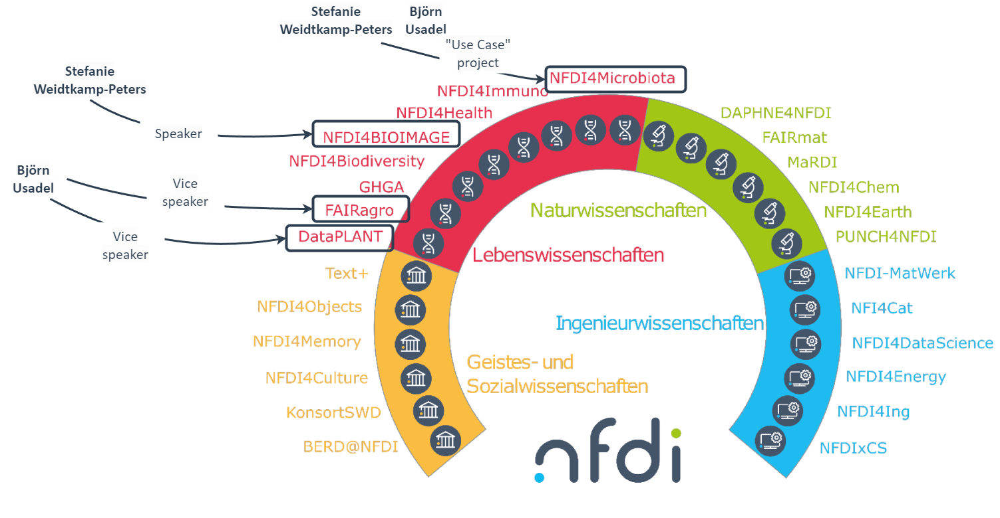
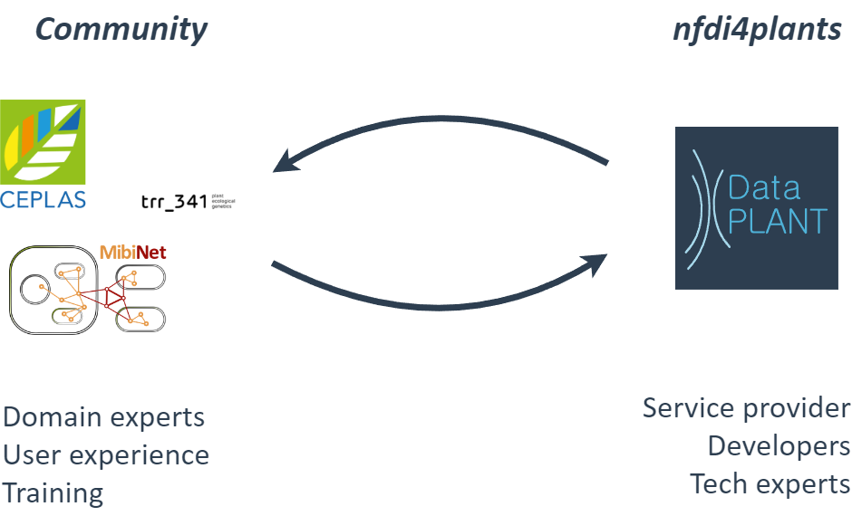

<!--
# Connection to the NFDI

---

# Data Stewardship between DataPLANT and the community <!-- fit 

---
-->

# The DataPLANT DataHUB &ndash; a GitLab ***Plus***

---

# On-premise DataHUBs

ARC services are available as on-premise option

---

# HHU-DataHUB

---

# HHU-DataHUB

- FAIR data along the research data cycle
- Structured exchange of (meta)data
- Local (long-term) storage, backup, version control
- Integration of existing services and infrastructure
- External collaboration

---

# HHU-DataHUB &ndash; Node for platforms

---

# Embedded into an RDM network

---

# CEPLAS collaborates with DataPLANT and NFDI4BIOIMAGE <!-- fit -->

<!--
---

# CEPLAS Research Data Policy

  

  
  
  
  

  

  
    
  

-->