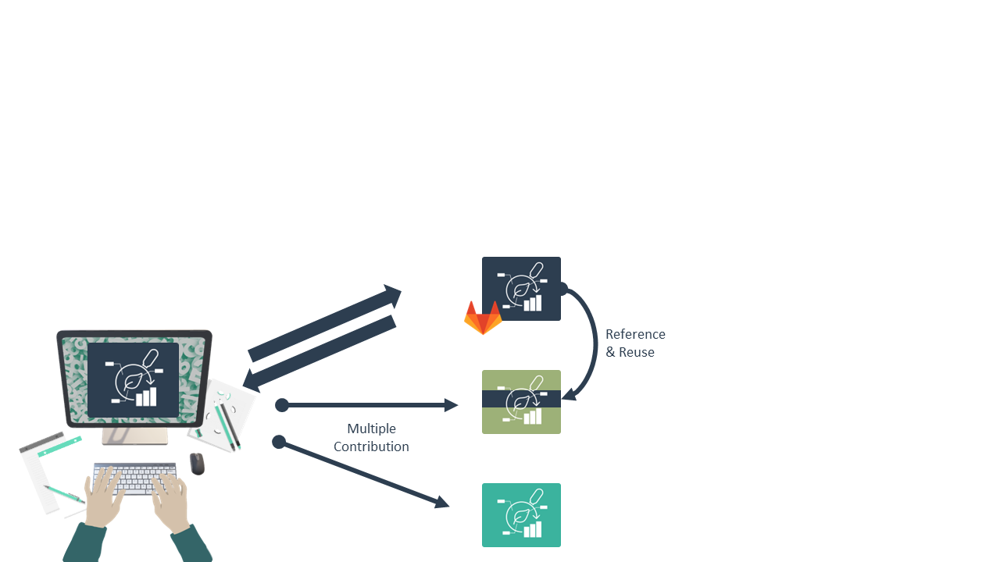
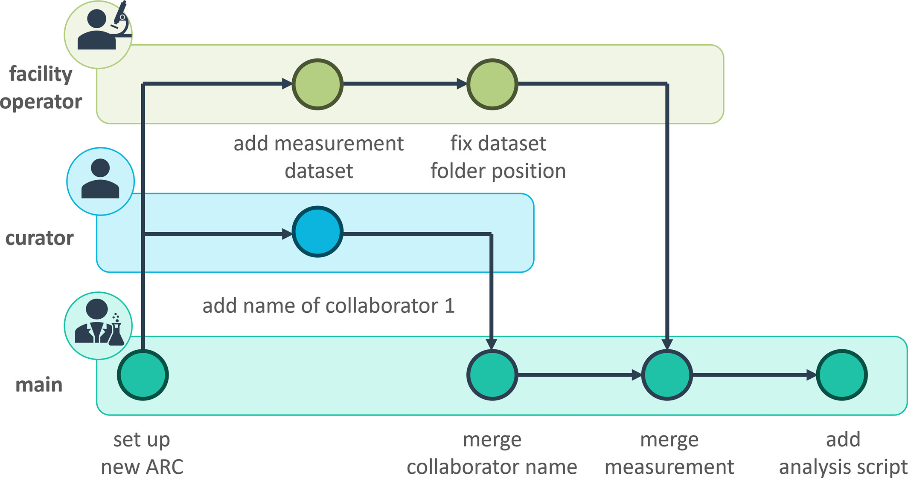
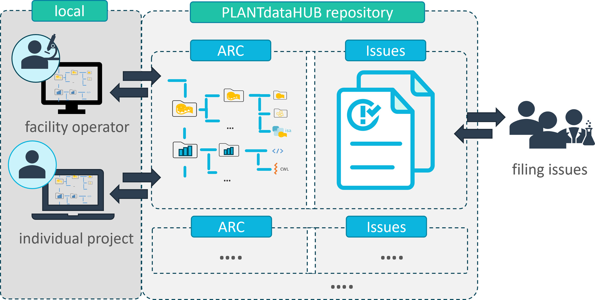
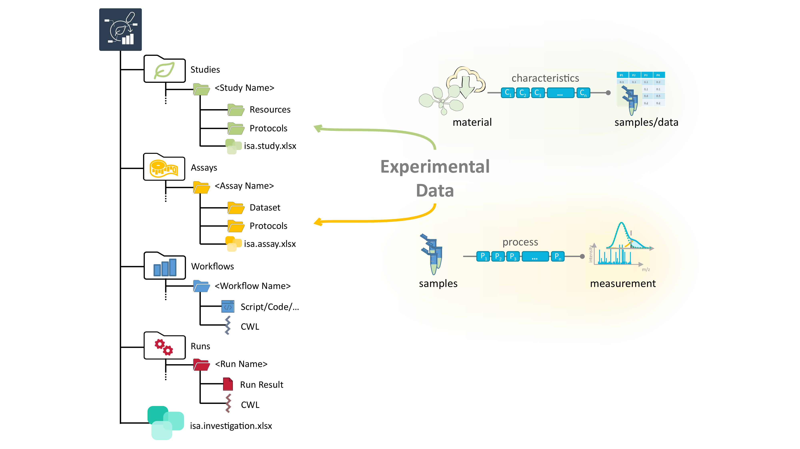
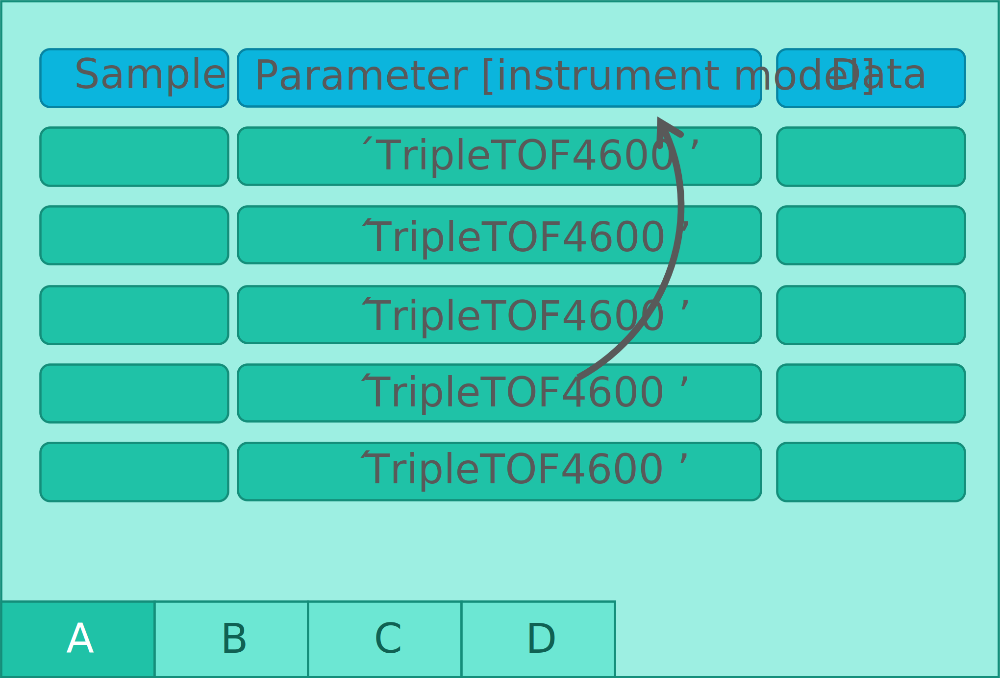
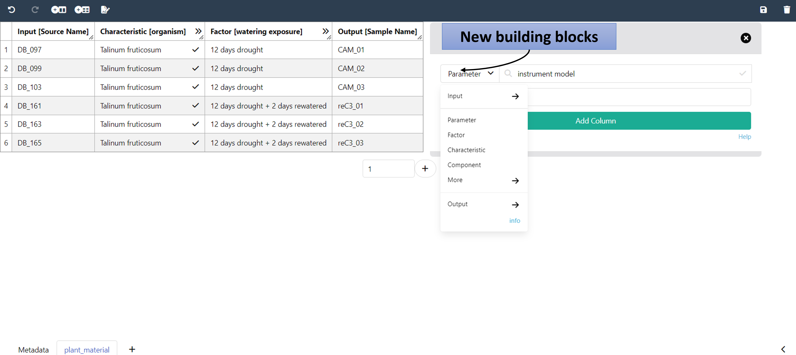
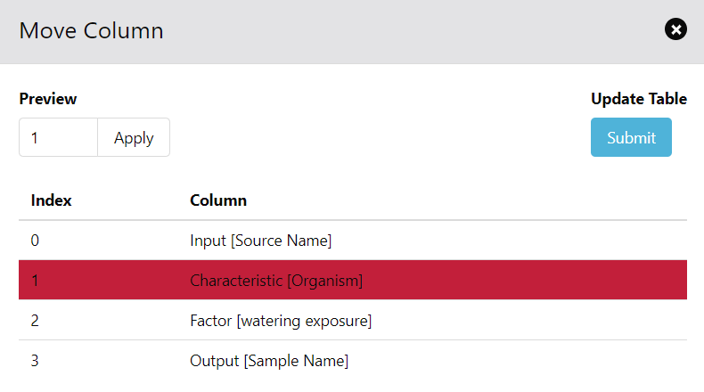
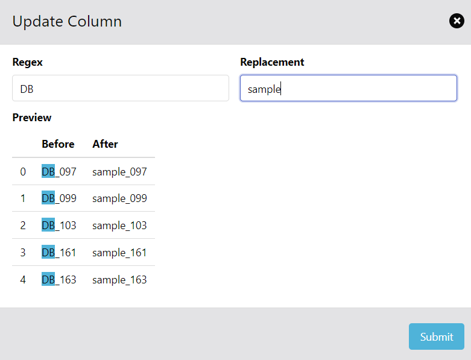

<!-- 
TODO before final
- update agenda

-->

# DataPLANT Tool-Workshop

<!--  _color: white; -->
<!-- _paginate: false -->
<style scoped>section {background: none; background-color: white;}</style>

<br>

April, 2024

Sabrina Zander, MibiNet
Dominik Brilhaus, CEPLAS


---

# Tentative agenda

<div class="two-columns" style="font-size: 18px">
<div class="columns-left">

### Morning

Time | Topics
-------- | --------
09:00 - 09:15 | Welcome, Intro RDM and NFDI
09:15 - 09:45 | Overview DataPLANT, and DataPLANT Tool chain
09:45 - 10:30 | Hands-on ARCitect
10:30 - 10:45 | *Short break* :coffee:
10:45 - 11:45 | Intro and Hands-on DataHUB
11:45 - 12:00 | Q & A

</div>

<div class="columns-right">

### Afternoon

Time | Topics
-------- | --------
12:00 - 13:00 | *Lunch break* :pizza:
13:00 - 14:00 | Intro and Hands-on Metadata annotation with SWATE
14:00 - 15:00 | Create your own ARC
15:00 - 15:15 | *Short break* :coffee:
15:15 - 16:30 | Create your own ARC
16:30 - 17:00 | Q & A and wrap-up

</div>
</div>

---

# House-keeping

<div class="two-columns">
  <div>

  - Use the pad to raise questions and feedback
  - Copy / paste links (hands-on)

  </div>

  <div>
  <a href="https://pad.hhu.de/gXvgd5yETWa3Ks34dM3KCw?view" target="_blank"> </a>
  </div>
</div>

---

# Training Materials

Slides are shared via [DataPLANT knowledge base](https://nfdi4plants.org/nfdi4plants.knowledgebase/docs/teaching-materials/events-2024/2024-04-11_MibiNet-CEPLAS-ARC-Trainings/)

---

# Resources &ndash; join the open source movement

###  DataPLANT (nfdi4plants)

Website: <a href="https://nfdi4plants.org/" target="_blank">https://nfdi4plants.org/</a>
Knowledge Base: <a href="https://nfdi4plants.org/nfdi4plants.knowledgebase/" target="_blank">https://nfdi4plants.org/nfdi4plants.knowledgebase/</a>
DataHUB: <a href="https://git.nfdi4plants.org" target="_blank">https://git.nfdi4plants.org</a>

GitHub: <a href="https://github.com/nfdi4plants" target="_blank">https://github.com/nfdi4plants</a>
HelpDesk: <a href="https://helpdesk.nfdi4plants.org" target="_blank">https://helpdesk.nfdi4plants.org</a>

:bulb: You can help us by raising issues, bugs, ideas...

---

# Continuous support

Data managers in Düsseldorf, Cologne, Jülich and close by (CEPLAS, MibiNet, TRR341) offer support.

1. Slack Workspace for ad hoc support
2. Monthly user meeting (2nd Friday of the month)

[&rarr; Details](https://nfdi4plants.org/nfdi4plants.knowledgebase/docs/teaching-materials/disseminations/ARC-user-support_HHU-Uoc-FZJ/arc-user-support.html).

<div>
  
  
  
</div>

---

# Introduce yourself

- Lab
- MibiNet / CEPLAS / TRR / ?
- Used code / programming language before
- Experience with Git / GitLab / GitHub?
- Have an ORCID
- My motivation / expectation
- My favorite lab assay

---

# Let's draw a typical lab workflow :pencil:


---


# BYOD &ndash; Goals

- Move existing datasets into ARCs
- Share them via the DataHUB
- First few steps into ARCs
- You or collaborators can pick them up from there


---


<!-- 
# Why research data management (RDM)?

- Increase transparency
- Make data accessible
- Save time (writing, reusing)
- Reduce the risk of data loss
- Optimize the costs
- Facilitate future reuse and sharing
- Improve citations


--- -->

# FAIR data stewardship

- **F**indable
- **A**ccessible
- **I**nteroperable
- **R**eusable

https://doi.org/10.1038/sdata.2016.18


---

# The FAIR principles

<style scoped>

section p img {
width: 1100px;
height: 450px;
object-fit: cover;
/* object-position: 100% 100%; */
}
</style>


---

# Is your data FAIR?

**F**indable | **A**ccessible | **I**nteroperable | **R**eusable

- Where do you store your data?
- How do you annotate your data?
- How do you share your data?
- What tools do you use to analyse your data?
- How do you reuse other people's data?


<!-- 
---

# The research data life cycle


<span class="footer-reference">https://rdmkit.elixir-europe.org, [CC BY 4.0](https://creativecommons.org/licenses/by/4.0/)</span> 

-->

---


# MibiNet &ndash; One SFB, six locations


---

# Data silos impede collaboration


---

# Missing interfaces impede collaboration


---


<!-- 

TODO 

- Galaxy
- ARC / metadata registry

-->
# MibiNet connection to NFDIs


---

# Data Stewardship between DataPLANT and the community <!-- fit -->


---

# Annotated Research Context (ARC)


Your entire investigation in a single unified bag

---

# You can store your ARC in the DataHUB


---

# ARCs are versioned


---

# You can invite collaborators


---

# Collaborate and contribute


---

# Reuse data in ARCs



---

# Publish your ARC


---

# ARC as single-entry point


---

# From ARC to repositories

<style scoped>

section p img {
width: 1000px;
height: 400px;
object-fit: cover;
object-position: 100% 80%;
/* display: block; */;
}
</style>


---

# Moving from paper to data publications


---

# Publish your ARC, get a DOI


---

# Metadata templates


Facilities and labs can define their common workflows as templates

---
<!-- 
# Validation


<span class="footer-reference"> adapted from Weil, H.L., Schneider, K., et al. (2023), PLANTdataHUB: a collaborative platform for continuous FAIR data sharing in plant research. Plant J. https://doi.org/10.1111/tpj.16474 </span>

---
-->
# Validate & publish


<span class="footer-reference"> Weil, H.L., Schneider, K., et al. (2023), PLANTdataHUB: a collaborative platform for continuous FAIR data sharing in plant research. Plant J. https://doi.org/10.1111/tpj.16474 </span>

---

# Learning from Open-Source-Software development


---

# Data analysis and workflows


<span class="footer-reference"> Weil, H.L., Schneider, K., et al. (2023), PLANTdataHUB: a collaborative platform for continuous FAIR data sharing in plant research. Plant J. https://doi.org/10.1111/tpj.16474 </span>

---

# Galaxy integration: Extra value for plant research

<div class="two-columns">
<div>


</div>

<div>

- Full ARC compatibility
- Automated metadata generation
- Specialized tools and workflows for ‘omics processing and analysis
- Public repository compatibility
- Galaxy teaching resource for data analysis

</div>
</div>


---

# Enabling platforms


<div class="two-columns">
  <div>
  
  - Streamlined exchange of (meta)data
  - Communication and project management
  
  </div><div>
  
  
  
  </div>
</div>


---

# Streamlined data exchange


---

# Meet your collaborators in an ARC


---
<!-- 
# Mutable data life cycle



<span class="footer-reference"> Weil, H.L., Schneider, K., et al. (2023), PLANTdataHUB: a collaborative platform for continuous FAIR data sharing in plant research. Plant J. https://doi.org/10.1111/tpj.16474 </span>

--- -->

# Project management



<span class="footer-reference"> Weil, H.L., Schneider, K., et al. (2023), PLANTdataHUB: a collaborative platform for continuous FAIR data sharing in plant research. Plant J. https://doi.org/10.1111/tpj.16474 </span>

---

# DataPLAN &ndash; a DataPLANT DMP generator

<span class="footer-reference">**Zhou *et al.* (2023)**, DataPLAN: a web-based data management plan generator for the plant sciences, bioRxiv 2023.07.07.548147; doi: https://doi.org/10.1101/2023.07.07.548147 </span>

https://dmpg.nfdi4plants.org


---

# Everything is a file

DataPLANT employs a **data-centric** approach to RDM


---

# No technical lock-in


(Meta)data transparency with tool assistance but **no technical lock-in**

---

# The ARC ecosystem


---

# What does an ARC look like?


---

# ARCs store experimental data



---

# Computations can be run inside ARCs


---

# ARCs come with comprehensive metadata


---

# ARC builds on standards

<div class="two-columns">
  <div>
  
  
  
  </div>
  <div>
  
  - RO-Crate: standardized exchange
  - ISA: structured, machine-readable metadata
  - CWL: reproducible, re-usable data analysis
  - Git: version control
  
  </div>
</div>

<span class="footer-reference">https://isa-tools.org/ | https://www.commonwl.org/
https://www.researchobject.org/ro-crate/ | https://git-scm.com</span>

<!-- 
---

# The DataPLANT DataHUB &ndash; a GitLab ***Plus***

 

-->

---

<!--
# Connection to the NFDI


---

# Data Stewardship between DataPLANT and the community <!-- fit 


---
-->

# The DataPLANT DataHUB &ndash; a GitLab ***Plus***


---

# On-premise DataHUBs


ARC services are available as on-premise option

---

# HHU-DataHUB


---

# HHU-DataHUB

- FAIR data along the research data cycle
- Structured exchange of (meta)data
- Local (long-term) storage, backup, version control
- Integration of existing services and infrastructure
- External collaboration


---

# HHU-DataHUB &ndash; Node for platforms


---

# Embedded into an RDM network


---

# CEPLAS collaborates with DataPLANT and NFDI4BIOIMAGE <!-- fit -->


<!--
---

# CEPLAS Research Data Policy

<div class="two-columns">
  <div>
  
  
  
  </div>
  <div>

  
    
  </div>
</div>

-->
---


<!-- TODO 

- more to remote?
- add Swate alpha examples in ARCitect ???
- check linking studies and assays

-->


# ARCitect Hands-on

<style scoped>section {background: none; background-color: white}</style>
<!-- _paginate: false -->

---

# ARCitect installation

Please install version **v0.0.31** (or later) of the ARCitect: https://github.com/nfdi4plants/ARCitect/releases/latest

---

## Download the demo data <!-- fit -->

https://uni-duesseldorf.sciebo.de/s/C7ms3QA6q7OZnU2 


---

# Sort Demo data in an ARC


---

# Open ARCitect

1. Login to DataHUB (1)
   
2. Select `git.nfdi4plants.org` as Host 
    
---

# Initiate the ARC folder structure


1. Create a **New ARC** (2)
2. Select a location and name it **TalinumPhotosynthesis**

---

# Your ARC's name

<style scoped>section {font-size: 25px;}</style>

💡 By default, your ARC's name will be used
   - for the ARC folder on your machine
   - to create your ARC in the DataHUB at `https://git.nfdi4plants.org/<YourUserName>/<YourARC>` (see next steps)
   - as the identifier for your investigation

💡 Make sure that no ARC exists at  `https://git.nfdi4plants.org/<YourUserName>/<YourARC>`. Otherwise you will sync to that ARC.


---

# Add a description to your investigation


---

# Add a contributor


- you could also add the contacts directly via ORCID
---

# Add a study

by clicking "Add Study" and entering an identifier for your study

Use **talinum_drought** as an identifier


---

# Study panel

In the study panel you can add

- general metadata,
- people, and
- publications
- data process information


<!-- TODO show connected assays -->
---


# Add an assay

by clicking "Add Assay" and entering an identifier for your assay

Add two assays with **rnaseq** and **metabolomics** as an identifier


---

# Link your assay to a study

You can either
- link your new assay to an existing study in your ARC or
- create a new one
  
Link your assays to your **talinum_drought** study


---

# Add information about your assay

In the assay panel you can define the assay's
 - measurement type
 - technology type, and
 - technology platform


---

# Add protocols

You can either
- directly write a **new protocol** within the ARCitect or
- import an existing one from your computer


---

# Add protocols and datasets

In the file tree you can
  - **import dataset files or folders** and 
  - **protocols** associated to that dataset.

:bulb: **Import Dataset** allows to import data from any location on your computer into the ARC.

:warning: Depending on the file size, this may take a while. Test this with a small batch of files first.


---

# Sort Demo Data to your ARC

💡 protocols and multiple datasets can directly be imported via ARCitect

---

# Explorer

The **Explorer (6)** button directly opens your ARC locally


---

# Commit panel (7)

You have to commit changes before you can upload to the DataHUB


---
If you are logged in, the **Commit panel** shows
- your DataHUB's *Full Name* and *eMail*

It allows you to
- track changes of the ARC with git
- add a commit message 
- use different branches 


---
# History panel (9)

In the History panel you can inspect your ARCs history with all commits 


---
# Upload your local ARC to the DataHUB

From the sidebar, navigate to **DataHUB Sync** (8)


---


# DataHUB Sync

The DataHUB Sync panel allows you to
- sync the changes to the DataHUB: **Push**
- sync from the DataHUB: **Pull**, and
- change the Remote for the synchronization


 

<!-- TODO more to remote?-->
---


# Check if your ARC is successfully uploaded

1. [sign in](https://auth.nfdi4plants.org/realms/dataplant/login-actions/registration?client_id=account&tab_id=4bQkU161waI) to the DataHUB 
2. Check your projects

---

# Your ARC is ready

<style scoped>

section p br {
   display: block;
   margin-top: 20px;
   content: "";
}
</style>

👩‍💻 Initiated an ARC
<br>
📂 Structured and ...  
<br>
 ... annotated experimental data
<br>
🌐 Shared with collaborators


---

---

# Received two emails from "GitLab" about a failed pipeline? <!-- fit -->


:fire: Don't worry :smile:

---

## Pipeline Failed


- a "continuous quality control" (CQC) pipeline validates your ARC
- This fails if one of the following metadata items is missing:

    ```bash
    Investigation Identifier
    Investigation Title
    Investigation Description
    Investigation Person Last Name
    Investigation Person First Name
    Investigation Person Email
    Investigation Person Affiliation
    ```  

---

## Pipeline Failed

If the pipeline has failed once, it is disabled by default


---

## Reactivate the CQC pipeline

<style scoped>
section {font-size: 22px;}
</style>

To reactivate it and let the DataHUB validate your ARC again:
  
  1. navigate to CI/CD setting `<arc-url>/-/settings/ci_cd`
  2. expand "Auto DevOps"
  3. check box "Default to Auto DevOps pipeline"
  4. Save changes


---


# DataHUB concepts and terminology

---

<!-- TODO 

# Terminology

- commit
- repository / repo
- push / pull
- branch / fork

# add comparison GitLab vs. Cloud Services

---
-->

# Where do I store my ARC?


---

# ARC storage and sharing


- DataHUB as "ground truth" / original clone
- You can sync and communicate all changes to your ARC via the DataHUB

<span style="font-size:0.8em"> :bulb: ARCitect and ARC commander provide options to avoid syncing large files (LFS = Large file storage) </span>

---

# Example setup to store and use ARCs

<div class=two-columns style="font-size: 25px">

  <div>
  
  ### Personal computer

  - work on small files
  - annotate metadata
  - add scripts, protocols
  
  ### Workstation / Server

  - work on large files
  - run computations
  
  </div>
  <div>

  ### FileShare
  
  - mount to local machine, sync ARC from there
  
  ### HPC

  - direct connection HPC to DataHUB (depends on security settings)
  - or mount to local machine and sync, ARC from there
  
  
  </div>

</div>

---


# **Projects** and **Groups** are not the same

- "Project" = ARC
- "Groups" = Group of users

---

## Project = ARC

- In the DataHUB, ARCs are called "projects"; they are the same.
- An ARC can be shared with individual users (invited as "members") or a group.

---

## DataHUB Groups

- A "Group" is a group of users with specific [permissions](#roles-and-permissions)
- A group can share ARCs
- A group can be invited to an ARC
- Groups can have subgroups

---

# Options to share an ARC via the DataHUB


---

# Namespaces

- Every user has a personal namespace, where they can upload or create new ARCs
- Every group and subgroup has its own namespace

<div class="table-container" style="font-size: 25px">

Type | URL | Namespace | Name
--- | --- | --- | --- 
A **personal** ARC | https://git.nfdi4plants.org/brilator/Facultative-CAM-in-Talinum | `brilator` | Dominik Brilhaus
An **group**-shared ARC | https://git.nfdi4plants.org/hhu-plant-biochemistry/Samuilov-2018-BOU-PSP | `hhu-plant-biochemistry` | HHU Plant Biochemistry

</div>

:bulb: **Personal** is not the same as **private**

---

# Visibility

The visibility of ARCs and groups can be managed individually for each ARC or group
  


:bulb: By default every ARC and every group is set to **private**.

---

# Permissions & Roles

When inviting new members to an ARC or group, you can choose between different levels.


:bulb: By default you are **Owner** of an ARC you create or upload to the DataHUB.

---

# ARC DataHUB members // ARC Investigation contacts <!-- fit -->


:bulb: Investigation contacts are not automatically invited as members to the ARC.

---


# DataHub Hands-On

---

# Navigation Bar


1. navigate directly to the [projects panel](./../../../../../../DataHUB-Manual/datahub-Manual/datahub-projectsPanel.html) via the icon in the top-left (1)
2. open the [hamburger Menu](#hamburger-menu) (2)
3. use the search field (3) to find ARCs, users and groups
4. open the [avatar Menu](#avatar-menu) (4)

---

# Hamburger Menu

<div class="two-columns">

<div style="padding: 100px 0;">

1. From the hamburger menu (1) you can
2. navigate to the [projects](./../../../DataHUB-Manual/datahub-projectsPanel.html) (2)
3. or [groups](datahub-groupsPanel.html) (3) panels

</div>

<div>


</div>
</div>

---

# Avatar Menu

<div class="two-columns">

<div>

1. In the avatar menu (1) you can
2. find your profile name and user name (2), 
3. navigate to the [user settings](./../../../DataHUB-Manual/datahub-userSettings.html) (3)
4. or sign out (4) of the DataHUB.

</div>

<div>


</div>
</div>

---

# Projects Panel


1. Choose a tab (1) to see only your ARCs, or explore other publicly available ARCs. 
2. The main panel (2) lists all ARCs
3. Here you can also see, the visibility level (3), and 
4. your permission or role (4) for the listed ARC. 
5. You can create a **New Project** in the top-right corner (5).

---

# ARC Panel

The ARC Panel is the main working area for your ARC.


---

# ARC Panel &ndash; sidebar


<div class="two-columns">

<div>

1. access the project information (1), e.g. invite members to the ARC
2. follow the progress of your ARC repository (2),
3. organize tasks in issue lists and boards (3),
4. take notes in a wiki to your ARC (4),
5. adapt the [settings (5) of the ARC](datahub-ARCSettings.html).

</div>

<div>


</div>
</div>


---

# ARC Panel &ndash; main panel

<div class="two-columns">

<div>

6. see the ARC's name and visibility level (6),
7. follow the ARC's commit history (7),
8. see files contained in your ARC just like on your computer (8),
9. add new files or directories (9), and
10. download or clone your ARC (10).

</div>

<div>


</div>
</div>

---

# Collaborate and share


---

# Invite collaborators

* Unless changed, your ARC is set to private by default.
* To collaborate, you can invite lab colleagues or project partners to your ARC by following the steps on the subsequent slides. 
* To get started [sign in](https://auth.nfdi4plants.org/realms/dataplant/login-actions/registration?client_id=account&tab_id=4bQkU161waI) to the DataHUB and open the ARC you want to share.

---

1. Click on **Project Information** in the left navigation panel


---

2. Click on **Members**


---

3. Click on **Invite members**


---

4. Search for potential collaborators


---

5. Select a role


---

# Choosing the proper role

<style scoped> section{font-size: 22px;}</style>

<u>Guests</u>
Have the least rights. They will not be able to see the content of your ARC (only the wiki page).

<u>Reporters</u>
Have **read access** to your ARC. This is recommended for people you ask for consultancy.

<u>Developers</u>
The choice for most people you want to invite to your ARC. Developers have **read and write access**, but cannot maintain the project on the DataHUB, e.g. inviting others.

<u>Maintainers</u> 
Gives the person the same rights as you have (except of removing you from your own project). This is recommended for inviting PIs or group leaders allowing them to add their group members for data upload or analysis to the project as well.

*A detailed list of all permissions for the individual roles can be found [here](https://docs.gitlab.com/ee/user/permissions.html)*

---

# <div align="center">Congratulations!</div>
<div align="center">You have just shared your ARC with a collaborator.</div>

<style scoped>

section p img {
width: 1000px;
height: 300px;
object-fit: cover;
object-position: 100% 45%;
/* display: block; */;
}
</style>


---


# Version control

Check out the **commit history** of your ARC via Repository (2) or directly via commits (7)


---

# Project Management

Add issues to your ARC (3)


---

# ARCs come with their own wiki space

<div class="two-columns">

<div style="font-size: 27px">

- directly associated to your ARC
- same access rights as your ARC
- share meeting minutes or ideas with collaboration partners
- keep ARC clean of files that are not considered "research data"

</div>

<div>


</div>
</div>

---

# Publish your ARC with a few clicks


---


# Receive a DOI


---


# ARCs come with comprehensive metadata


---

# ARC builds on standards


<span class="footer-reference">https://isa-tools.org/ | https://www.commonwl.org/
https://www.researchobject.org/ro-crate/ | https://git-scm.com</span>

---
 
# ARC builds on ISA


<span class="footer-reference">ISA Tools: https://isa-tools.org/format/specification.html</span>

---

# ARC builds on ISA to connect data


---

# ARC builds on ISA to link data

<div class="two-columns">

  <div>

  - Samples are linked study-to-assay, assay-to-assay
  - Raw data is linked to assays
  - Protocols can be referenced
  - ...

  </div>

  <div>
  
  
  
  </div>
</div>


---

# Annotation by flattening the knowledge graph


- Low-friction metadata annotation
- Familiar spreadsheet, row/column-based environment

---

# Annotation principle



- Low-friction metadata annotation
- Familiar spreadsheet, row/column-based environment

---

# Adding new building blocks



Swate can be used for the annotation of **isa.study.xlsx and isa.assay.xlsx** files

---

# Annotation Building Block types

<div class="two-columns" style="font-size: 25px">
  
  <div>
  
- Input (e.g. Source Name, Sample Name)
- Protocol columns
- Characteristic // Parameter // Factor // Component
- Output (e.g. Sample Name, Raw Data File, Derived Data File)

</div>
  
  <div>
  
  
    
  </div>
</div>


Let's take a detour on [Annotation Principles](https://nfdi4plants.org/nfdi4plants.knowledgebase/docs/teaching-materials/units/AnnotationPrinciples/isa_AnnotationPrinciples-slides.html)

---

# Ontology term search

<style scoped>
h1{
  text-align: left
}
section {
  text-align: center;
}
</style>


Enable **related term directed search** to directly fill cells with child terms

---

# Fill your table with ontology terms


---

# Hierarchical combination of ontologies


---

# Checklists and Templates


Metadata standards or repository requirements can be represented as templates

---

# Realization of lab-specific metadata templates


Facilities can define their most common workflows as templates

<style scoped>
h1{
  text-align: left
}
section {
  text-align: center;
}
</style>

---

# Directly import templates via Swate

- DataPLANT curated
- Community templates


---


# Swate hands-on with demo data

---

# Goals

- Get familiar with ISA metadata and Swate
- Annotate data in your ARC

---

# Download the demo data


1. Open the ARCitect
2. Login (1) to your DataHUB account
3. Navigate to **Download ARC** (4)

---

# Download the demo data

4. Search for **Talinum-CAM-Photosynthesis**
5. Click the download button, select a location and open the ARC.
6. Open the downloaded ARC


:bulb: This is basically the ARC we created in the last session.

---

# Alternative: Use Swate standalone

Open [Swate standalone](https://swate-alpha.nfdi4plants.org) in web browser

:bulb: Alternatively, you can use Swate as [Excel Plugin](./../../../SwateManual/Docs01-Installing-Swate.html), but this is outdated

---

# Swate Overview


---

# Let's annotate the plant samples first

1. Check out the lab notes `studies/talinum_drought/protocols/plant_material.txt`

<div class="two-columns">

<div>

*ARCitect*

2. Select the study `talinum_drought`
3. Add a new table

</div>

<div>

*Swate standalone*

Import the empty `studies/talinum_drought/isa.study.xlsx`


</div>

</div>

---

## Create an annotation table

Create a Swate annotation table by adding **Building blocks** via the widget (A) or the sidebar (B)

:bulb: Each table can contain only one *Input* and one *Output* column  

:bulb: different *Input* and *Output* options: `Source Name`, `Sample Name`, `Material`, `Raw Data File`, `Derived Data File`, `Image File`


---

## Add more Building blocks

1. Add an *Input* (`Source Name`) and *Output* (`Sample Name`) column
2. Select *Characteristic* from the drop-down menu
3. Enter `organism` in the search bar. This search looks for suitable *Terms* in our *Ontology* database.
4. Select the Term with the id `OBI:0100026` and, 
5. Click Add Column

:bulb: This adds four columns to your table, one visible and **three** hidden.


---

## Insert values to annotate your data

1. Insert values by selecting any cell below `Characteristic [organism]`
2. Use free text or use the magnifying glass to activate *Term* search
3. Write "Talinum fruticosum" and enable *Term* search
4. Select the hit 


---

## Add a Building block with a unit

1. In the *Building Blocks* widget, select *Parameter*, search for `light intensity exposure` and select the term with id `PECO:0007224`.
2. Check the box for *Unit* and search for `microeinstein per square meter per second` in the adjacent search bar.
3. Select `UO:0000160`.
4. Click Add Column.

:bulb: This also adds four columns to your table, one visible and **three** hidden.


---

## Insert unit-values to annotate your data

In the annotation table, select any cell below `Parameter [light intensity exposure]` and add "425" as light intensity.

:bulb: You can see the numbers being complemented with the chosen unit, e.g. `425 microeinstein per square meter per second`

---

## Showing ontology reference columns

Use double pointed quotation mark to un-hide hidden columns. 

:bulb: You can see that your organism of choice was added with id and source Ontology in the reference (hidden) columns.


---

## Your ISA table is growing

At this point. Your table should look similar to this:


---

## Exercise :pencil:

Try to add suitable *Building Blocks* for other pieces of metadata from the plant growth protocol (`studies/talinum_drought/protocols/plant_material.txt`).

---

## Add a factor building block

1. In the *Building Blocks* widget, select *Factor*, search for `watering exposure` and select the term with id `PECO:0007383`.
2. Click <kbd>Add Column</kbd>.
3. Add the drought treatment ("no water for 12 days", "re-water for 2 days") to the respective samples

:bulb: There are different options to add the drought treatment.

---

## Link the protocol to the isa table

1. In the *Building Blocks* tab, select *More* -> *Protocol REF*.
2. Click <kbd>Add Column</kbd>.
3. Add the name of the protocol file (plant_material.txt) to the *Protocol REF* column.

:bulb: This allows you to reference the free-text, human-readable protocol.

---

## Fill out source name and sample name

Transfer the sample ids from the protocol.

1. Invent names for `Source Name` (we do not have this information)
2. Use the sample names (DB_*) as `Sample Name`

---

## Let's annotate the RNA Seq data

1. Navigate to the demo ARC. 
2. Open the lab notes `assays/rnaseq/protocols/RNA_extraction.txt` in a text editor.
3. Import the empty `assays/rnaseq/isa.assay.xlsx` workbook in Swate.

---

## Use a template

1. Open the *Templates* widget in the Bar 

:bulb: Here you can find DataPLANT and community created workflow annotation templates

1. Search for `RNA extraction` and click <kbd>select</kbd> 
    - You will see a preview of all *Building Blocks* which are part of this template.
2. Click <kbd>Add template</kbd> to add all *Building Blocks* from the template to your table, which <u>do not exist yet</u>.


---

## Remove Building blocks

If there are any *Building Blocks* which do not fit to your experiment you can use right click --> "Delete Column" to remove it including all related (hidden) reference columns.

---

## Move Building blocks
If the order of the *Building Blocks* should be adjusted you can use right click --> "Move Column"


---

## Replace multiple names 

Right click --> "Update Column" can be used to replace names in batches
:bulb: this only works on Input columns


---

## New process, new worksheet

1. Add a new sheet to the `assays/rnaseq/isa.assay.xlsx` workbook.
2. Add the template "RNASeq Assay"

---

## Exercise :pencil:

Try to fill the two sheets with the protocol details:
  - `assays/rnaseq/protocols/RNA_extraction.txt` and
  - `assays/rnaseq/protocols/Illumina_libraries.txt`

---

## Link samples across studies and assays

1. Use the `Output [Sample Name]` of studies/talinum_drought/isa.study.xlsx as the `Input [Sample Name]` to **rna-extraction**.
1. Use the `Output [Sample Name]` of **rna-extraction** as the `Input [Sample Name]` to **illumina-libraries**.

**Seeds** &mdash;*Plant growth*&#x21FE; **Leaves** &mdash;*RNA Extraction*&#x21FE; **RNA** &mdash;*Illumina*&#x21FE; **fastq files**


---

## Link dataset files to samples

1. In the *Building Blocks* widget select *Output* -> *Raw Data File*.
2. Click <kbd>Add Column</kbd>.

:bulb: You see a warning about a changed output column.

3. Click <kbd>Continue</kbd>.
4. Go to the *File Picker* tab and click <kbd>Pick file names</kbd>.
5. Select and open the *fastq.gz files from the dataset folder.
6. Copy / paste them to the `Raw Data File`. 

:bulb: This allows you to link your samples to the resulting raw data files.

---

## Your ISA table is ready 🎉

Go ahead, adjust the *Building Blocks* you want to use to describe your experiment as you see fit.
Insert values using Swate Term search and add input and output.
<!-- 

---

## File Export 

- Click **save** button to download the file 
- file can also be exported as [ISA-JSON](https://isa-specs.readthedocs.io/en/latest/isajson.html#) file  
---

## Re-use a protocol (process.json)

1. Import the empty `assays/metabolomics/isa.assay.xlsx)` workbook in Swate.
2. Navigate to *Templates* in the Navbar and scroll down to "Add template(s) from file."
3. Click <kbd>Upload protocol</kbd>
4. Select the file "swate_agilent_gc.json" from the demo data.
5. Click <kbd>Insert json</kbd>


:bulb: This adds not only an empty template, but a filled out table with keys (headers) and values (cells).

---

## A small detour on "Excel Tables"

Swate uses Excel's "table" feature to annotate workflows. Each table represents one *process* from input (e.g. plant leaf material) to output (e.g. leaf extract).

Example workflows with three *processes* each:

- Plant growth &rarr; sampling &rarr; extraction
- Measured data files  &rarr; statistical analysis  &rarr; result files

:bulb: Excel tables allow to group data that belongs together inside one sheet. This is not to be confused with a (work)sheet or workbook.
> ```bash
> workbook              (e.g. "isa.assay.xlsx")
>  └─── worksheet       (e.g. "plant_growth")
>           └─── table  (e.g. "annotationTable")

---

-->

---

# :construction: Known issues with ARCitect and Swate (April 2024)

:bulb: Swate Desktop outdated

---


# NFDI &ndash; Nationale Forschungsdaten Infrastruktur


---

# NFDI consortia


---

# NFDI sections


---

# Base4NFDI


<span class="footer-reference">adapted from https://base4nfdi.de/</span>

---


# Electronic Lab Notebooks (ELNs)

---

# ELN ≈ Digital Protocol Editors

- Documenting daily lab routine
- Lab methods & protocols
- Lab inventory (biologicals, chemicals, instruments)
- Local sharing & collaboration
- Backup (locally)

✅ ELNs help to digitalize research documentation


---

<!-- 
# Are ELNs FAIR?

- Version control / Track changes
- Transparent contributions
- Use of IDs / PIDs
- External sharing / access
- (Long term) data storage
- Analyses
  - is code reproducible
- Metadata
  - standards
  - schemata

--- -->

# Are ELNs FAIR?

FAIR indicator* | ELN
-------------- | ---
**Findable**
F1. (Meta)data are assigned a globally unique and persistent identifier.
F2. Data are described with rich metadata (defined by R1 below).
F3. Metadata clearly and explicitly include the identifier of the data they describe.
F4. (Meta)data are registered or indexed in a searchable resource.
**Accessible**
A1. (Meta)data are retrievable by their identifier using a standardised communications protocol
A1.1 The protocol is open, free, and universally implementable
A1.2 The protocol allows for an authentication and authorisation procedure, where necessary
A2. Metadata are accessible, even when the data are no longer available
**Interoperable**
I1. (Meta)data use a formal, accessible, shared, and broadly applicable language for knowledge representation.
I2. (Meta)data use vocabularies that follow FAIR principles.
I3. (Meta)data include qualified references to other (meta)data.
**Reusable**
R1. (Meta)data are richly described with a plurality of accurate and relevant attributes
R1.1. (Meta)data are released with a clear and accessible data usage license
R1.2. (Meta)data are associated with detailed provenance
R1.3. (Meta)data meet domain-relevant community standards

<span class="footer-reference">*FAIR classified by https://www.go-fair.org/fair-principles/<span>

---

# Findable

| FAIR indicator*                                                                       | elabFTW |
|---------------------------------------------------------------------------------------|---------|
| F1. (Meta)data are assigned a globally unique and persistent identifier.              | 🟠 / 🔴 |
| F2. Data are described with rich metadata (defined by R1 below).                      | 🔴      |
| F3. Metadata clearly and explicitly include the identifier of the data they describe. | 🟠 / 🔴 |
| F4. (Meta)data are registered or indexed in a searchable resource.                    | 🔴      |

<span class="footer-reference">*FAIR classified by https://www.go-fair.org/fair-principles/<span>

--- 

# Accessible

| FAIR indicator*                                                                                 | elabFTW |
|-------------------------------------------------------------------------------------------------|---------|
| A1. (Meta)data are retrievable by their identifier using a standardised communications protocol | 🔴
| A1.1 The protocol is open, free, and universally implementable                                  | 🟢 / 🟠
| A1.2 The protocol allows for an authentication and authorisation procedure, where necessary     | ❓
| A2. Metadata are accessible, even when the data are no longer available                         | ❓

<span class="footer-reference">*FAIR classified by https://www.go-fair.org/fair-principles/<span>

--- 

# Interoperable

| FAIR indicator*                                                                                                | elabFTW |
|----------------------------------------------------------------------------------------------------------------|---------|
| I1. (Meta)data use a formal, accessible, shared, and broadly applicable language for knowledge representation. | 🔴
| I2. (Meta)data use vocabularies that follow FAIR principles.                                                   | 🔴
| I3. (Meta)data include qualified references to other (meta)data.                                               | 🔴

<span class="footer-reference">*FAIR classified by https://www.go-fair.org/fair-principles/<span>

---

# Reusable

| FAIR indicator*                                                                          | elabFTW |
|------------------------------------------------------------------------------------------|---------|
| R1. (Meta)data are richly described with a plurality of accurate and relevant attributes | 🔴
| R1.1. (Meta)data are released with a clear and accessible data usage license             | 🔴
| R1.2. (Meta)data are associated with detailed provenance                                 | 🔴
| R1.3. (Meta)data meet domain-relevant community standards                                | 🔴

<span class="footer-reference">*FAIR classified by https://www.go-fair.org/fair-principles/<span>

---


# Creating Swate Templates

---

# Create or open a Swate template

Open [Swate-alpha](https://swate-alpha.nfdi4plants.org/). To create a new template click "New File" and select "Template". If you want to edit an existing template, click "Import" and select the respective file.


---

# Add Template Metadata

- Once you open a new template, you will see a "Metadata" sheet.
- Enter a name for the template
- Add a description about the template

:warning: Do not change the **Identifier**

---

# Template Metadata

<style scoped>
table {
  width: 100%;  
  height: 400;
}
</style>

Key | Definition | Tip :bulb:
------- | ------- | -------
**Identifier** |   | Do not change this field. It maps your template to a database entry :warning:
**Name** |  This is the first info Swate users see about your template  |  Try using a short, descriptive and human readable name. Capitalize the first letter of the first word.
**Description** |  Here you can describe your template. |  Users interested in your template can read this in Swate, but not search by it.
**Organisation** |  The name of an organisation or community you create this template for. This facilitates searching for relevant templates in a specific organisation or community. |  Templates with the organisation "DataPLANT" are listed as `curated` in the Swate template database. All other templates are listed as `community`.
**Version** |  The version of the template following the [SemVer](https://semver.org/) convention.  |  For a new template use `1.0.0`. Raise the version number when updating an existing template.
**Tags** |  You can add any number of tags here. These tags are the basis to search for your template. | If possible add them as ontology terms with source ontology (TSR) and unique identifier (TAN). If similar tags already exist, consider reusing the existing ones.
**Endpoint Repositories** |  If your template complies with the requirements of an endpoint repository, you can add the respective repository here. | You may want to add them as ontology terms with source (TSR) and identifier (TAN).
**Authors** |  Add your name/alias here with as much information as you like.

---

# Template Metadata Example

Example template metadata and how it helps in Swate's template search


---

# Add building blocks

- To add building blocks to the actual template, switch from the "Metadata" sheet to the "New Table" sheet on the bottom left.
- Using the "Add Building Block" button, you can add your desired building blocks with or without a unit.


---

# Recommendations for template design

- Keep the template as concise as possible
- If you miss a term or ontology, please follow the [DPBO contribution guide](https://github.com/nfdi4plants/nfdi4plants_ontology) to let us know
- If you add a template to address a missing method, try to add building blocks that cover experimental procedures (as Parameters) and features of the sample (as Characteristics) that the experimenter would use when working on an experiment of that type
- The typical order of the columns is: **Input** -> (all the Parameters and Characteristics in between in chronological order) -> **Output** -or- **Raw Data File** -or- **Derived Data File**. Try to think about in which order the experimenter in the lab will do their work. Try to match this chronological order from left to right. This step is optional and only meant to increase readability.

---

# Recommendations for template design (continued)

- Avoid using the building block type `Factor` in templates. Any given characteristic or parameter in one study or assay can become a factor in another study or assay depending on the experimental context or scientific question.
- Background info on your template can be shared alongsides the template via the [Swate-templates GitHub repository](https://github.com/nfdi4plants/Swate-templates/tree/main/background%20information)

---

# Recommendations for endpoint repository templates

- Please follow the following naming pattern: "Repository" - "Assay", e.g. MetaboLights - MS measurement
- The endpoint repository tag should be added ONLY in the "Endpoint repository" category in the metadata sheet
- By default repository templates should contain **only mandatory** information. In this case, please add "mandatory" as a tag.
- Optional or recommended information can be added with an extension template that contains only the optional/recommended information. In this case, please add "-extension" to the template name.
- If applicable, templates should be split into different assays.
- Templates should be checked for validity of requirements every ~ 6 months.

---

# Save your template

- You can download and save your template as xlsx-file by clicking on the disc symbol in the top right corner.
- Please adjust the name of the file to correspond to the name of the template, but use underscores instead of spaces.
- Save the file in a suitable folder within your local clone of the Swate templates repository.

---

# Your template is ready for upload :tada:

- Well done! You created a new template.
- You can now submit your template via GitHub
- Once your pull request is merged, you will receive an Email from "Swobup Commit Report"

---

# GitHub Workflow to add or edit templates

1. (Recommended) [Create an issue](https://github.com/nfdi4plants/Swate-templates/issues/new/choose) with background information about the template you want to add. This also serves as a place for discussion.
2. [Fork](https://docs.github.com/en/get-started/quickstart/fork-a-repo) the [Swate-templates repository](https://github.com/nfdi4plants/Swate-templates).
3. (Recommended) Create a feature branch (e.g. "template-xy") on your fork.
4. [Clone](https://docs.github.com/en/repositories/creating-and-managing-repositories/cloning-a-repository) your fork-branch
5. Add/update **ONE** template ([see steps below](#creating-a-new-swate-template))
6. Commit, push and [sync your branch](https://docs.github.com/en/pull-requests/collaborating-with-pull-requests/working-with-forks/syncing-a-fork).
7. Open a [pull request](https://docs.github.com/en/pull-requests/collaborating-with-pull-requests/proposing-changes-to-your-work-with-pull-requests/about-pull-requests)
   > 👀 You can **reference your issue** typing `#` in the pull request's commenting dialog

---

## Known pitfalls with Swate Templates

- Opening and saving a Swate template .xlsx file with a program other than Microsoft Excel (e.g. LibreOffice, python script, R script) often destroys the template (backend). Please, avoid to upload this file into the GitHub repository.

---


# Contributors

<style scoped> section{font-size:20px}</style>

If not referenced otherwise, figures and slides presented here were created by members of DataPLANT (https://nfdi4plants.org).
Additional slides were contributed by

- name: Dominik Brilhaus
  github: https://github.com/brilator
  orcid: https://orcid.org/0000-0001-9021-3197
- name: Cristina Martins Rodrigues
  github: https://github.com/CMR248
  orcid: https://orcid.org/0000-0002-4849-1537
- name: Kevin Frey
  github: https://github.com/Freymaurer
  orcid: https://orcid.org/0000-0002-8493-1077
- name: Sabrina Zander
  orcid: https://orcid.org/0009-0000-4569-6126
- name: Martin Kuhl
  github: https://github.com/Martin-Kuhl
  orcid: https://orcid.org/0000-0002-8493-1077

---

