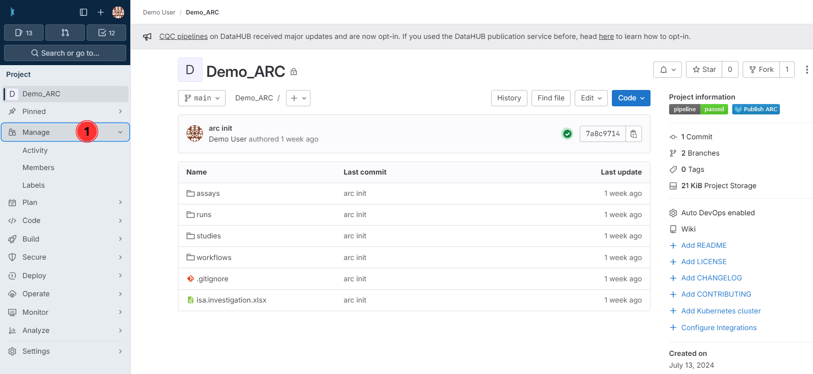
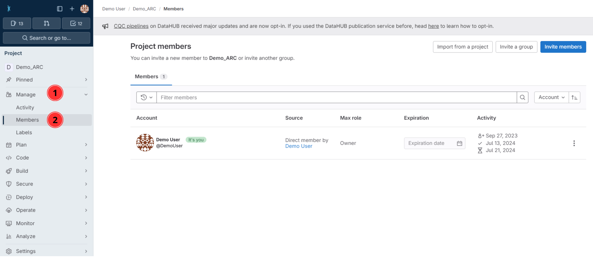
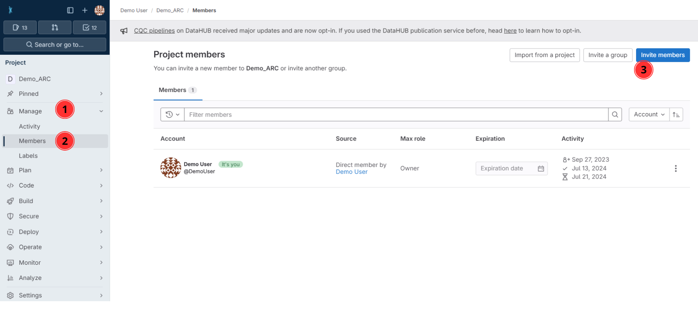
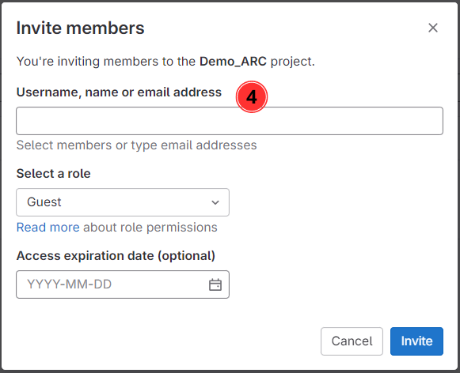
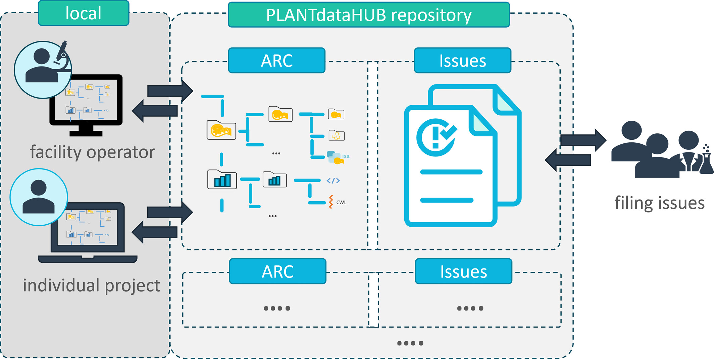
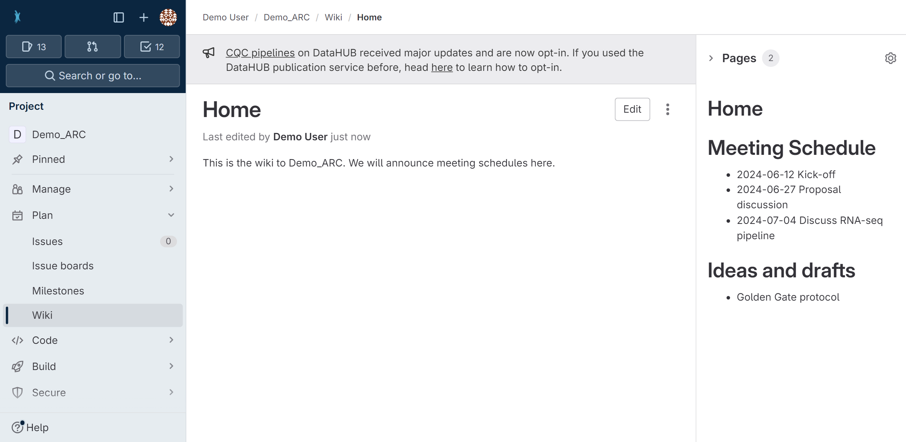
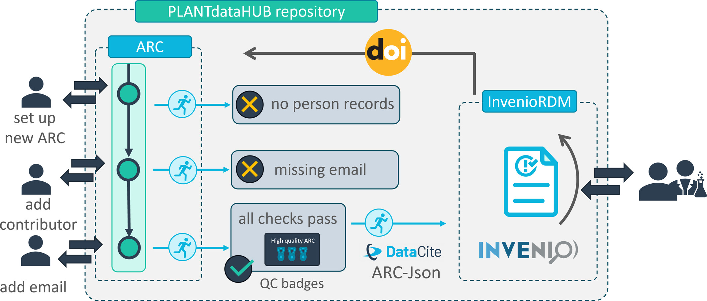

## DataHub Hands-On

---

DataHUB

## Navigation Bar

1. navigate directly to the [projects panel](./../../../../../../DataHUB-Manual/datahub-Manual/datahub-projectsPanel.html) via the icon in the top-left (1)
2. open the [hamburger Menu](#hamburger-menu) (2)
3. use the search field (3) to find ARCs, users and groups
4. open the [avatar Menu](#avatar-menu) (4)

---

DataHUB

## Hamburger Menu

1. From the hamburger menu (1) you can
2. navigate to the [projects](./../../../DataHUB-Manual/datahub-projectsPanel.html) (2)
3. or [groups](datahub-groupsPanel.html) (3) panels

---

DataHUB

## Avatar Menu

1. In the avatar menu (1) you can
2. find your profile name and user name (2), 
3. navigate to the [user settings](./../../../DataHUB-Manual/datahub-userSettings.html) (3)
4. or sign out (4) of the DataHUB.

---

DataHUB

## Projects Panel

1. Choose a tab (1) to see only your ARCs, or explore other publicly available ARCs. 
2. The main panel (2) lists all ARCs
3. Here you can also see, the visibility level (3), and 
4. your permission or role (4) for the listed ARC. 

---

DataHUB

## ARC Panel

The ARC Panel is the main working area for your ARC.

---

DataHUB

## ARC Panel &ndash; sidebar

1. access the project information (1), e.g. invite members to the ARC
2. follow the progress of your ARC repository (2),
3. organize tasks in issue lists and boards (3),
4. take notes in a wiki to your ARC (4),
5. adapt the [settings (5) of the ARC](datahub-ARCSettings.html).

---

DataHUB

## ARC Panel &ndash; main panel

6. see the ARC's name and visibility level (6),
7. follow the ARC's commit history (7),
8. see files contained in your ARC just like on your computer (8),
9. add new files or directories (9), and
10. download or clone your ARC (10).

---

## Collaborate and share

---

DataHUB

1. Click on **Project Information** in the left navigation panel

---

DataHUB

2. Click on **Members**

---

DataHUB

3. Click on **Invite members**

---

DataHUB

4. Search for potential collaborators

---

DataHUB

5. Select a role

---

DataHUB

## Choosing the proper role

When inviting new members to an ARC or group, you can choose between different levels.

:bulb: By default you are **Owner** of an ARC you create or upload to the DataHUB.

---

## **Projects** and **Groups** are not the same

- "Project" = ARC
- "Groups" = Group of users

---

## Project = ARC

- In the DataHUB, ARCs are called "projects"; they are the same.
- An ARC can be shared with individual users (invited as "members") or a group.

---

## DataHUB Groups = Group of members (e.g. lab)

- A "Group" is a group of users with specific [permissions](#roles-and-permissions)
- A group can share ARCs
- A group can be invited to an ARC
- Groups can have subgroups

---

## Options to share an ARC via the DataHUB

---

## Namespaces

- Every user has a personal namespace, where they can upload or create new ARCs
- Every group and subgroup has its own namespace

Type | URL | Namespace | Name
--- | --- | --- | --- 
A **personal** ARC | https://git.nfdi4plants.org/brilator/Facultative-CAM-in-Talinum | `brilator` | Dominik Brilhaus
An **group**-shared ARC | https://git.nfdi4plants.org/hhu-plant-biochemistry/Samuilov-2018-BOU-PSP | `hhu-plant-biochemistry` | HHU Plant Biochemistry

:bulb: **Personal** is not the same as **private**

---

## Visibility

The visibility of ARCs and groups can be managed individually for each ARC or group
  

:bulb: By default every ARC and every group is set to **private**.

---

## ARC DataHUB members // ARC Investigation contacts <!-- fit -->

:bulb: Investigation contacts are not automatically invited as members to the ARC.

---

DataHUB

## Version control

Check out the **commit history** of your ARC via Repository (2) or directly via commits (7)

---

DataHUB

## Collaboration Workflows

---

DataHUB

## Project management

 Weil, H.L., Schneider, K., et al. (2023), PLANTdataHUB: a collaborative platform for continuous FAIR data sharing in plant research. Plant J. https://doi.org/10.1111/tpj.16474 

---

DataHUB

## Project Management

Add issues to your ARC (3)

---

DataHUB

## ARCs come with their own wiki space

- directly associated to your ARC
- same access rights as your ARC
- share meeting minutes or ideas with collaboration partners
- keep ARC clean of files that are not considered "research data"

---

# Moving from paper to FAIR data publication

---

# Publish your ARC, get a DOI

---

# Validate & publish

 Weil, H.L., Schneider, K., et al. (2023), PLANTdataHUB: a collaborative platform for continuous FAIR data sharing in plant research. Plant J. https://doi.org/10.1111/tpj.16474 

---

DataHUB

## Validation towards publication

---

## Receive a DOI

