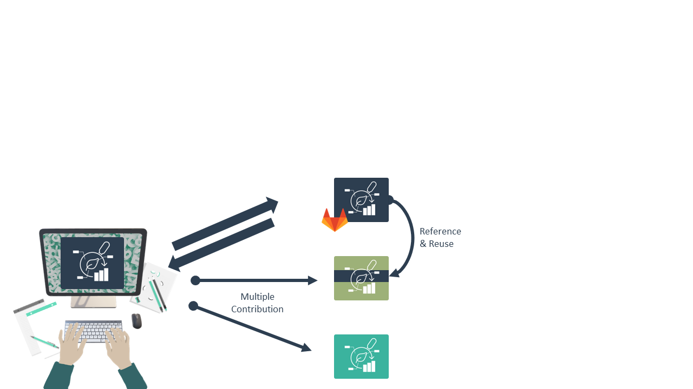
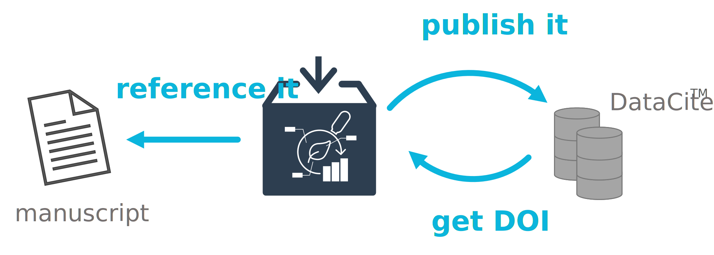

# Data Stewardship between DataPLANT and the community <!-- fit -->

---

# Annotated Research Context (ARC)

Your entire investigation in a single unified bag

---

# You can store your ARC in the DataHUB

---

# ARCs are versioned

---

# You can invite collaborators

---

# Collaborate and contribute

---

# Reuse data in ARCs

---

# Publish your ARC

---

# Publish your ARC, get a DOI

---

# ARC as single-entry point

---

# Data analysis and workflows

 Weil, H.L., Schneider, K., et al. (2023), PLANTdataHUB: a collaborative platform for continuous FAIR data sharing in plant research. Plant J. https://doi.org/10.1111/tpj.16474 

---

# Galaxy integration: Extra value for plant research

- Full ARC compatibility
- Automated metadata generation
- Specialized tools and workflows for ‘omics processing and analysis
- Public repository compatibility
- Galaxy teaching resource for data analysis

---

# Enabling platforms

  

  
  - Streamlined exchange of (meta)data
  - Communication and project management
  
  

  
  
  
  

---

# Streamlined data exchange

---

# Meet your collaborators in an ARC

---

# The ARC ecosystem

---

# What does an ARC look like?

---

# ARCs store experimental data

---

# Computations can be run inside ARCs

---

# ARCs come with comprehensive metadata

---

# ARC builds on standards

  

  
  
  
  

  

  
  - RO-Crate: standardized exchange
  - ISA: structured, machine-readable metadata
  - CWL: reproducible, re-usable data analysis
  - Git: version control
  
  

https://isa-tools.org/ | https://www.commonwl.org/
https://www.researchobject.org/ro-crate/ | https://git-scm.com
