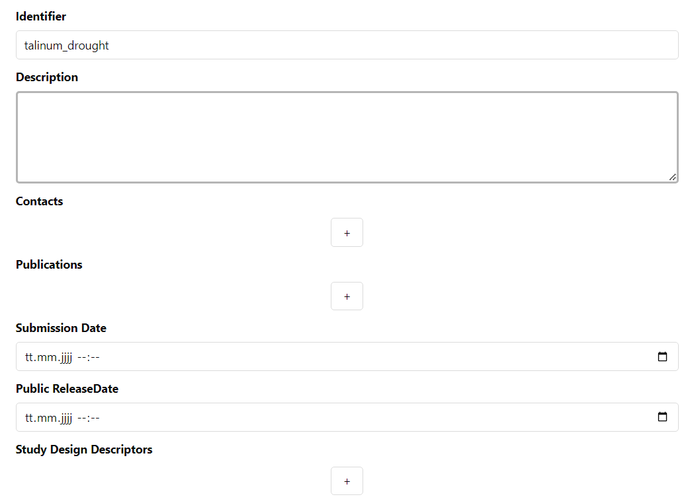
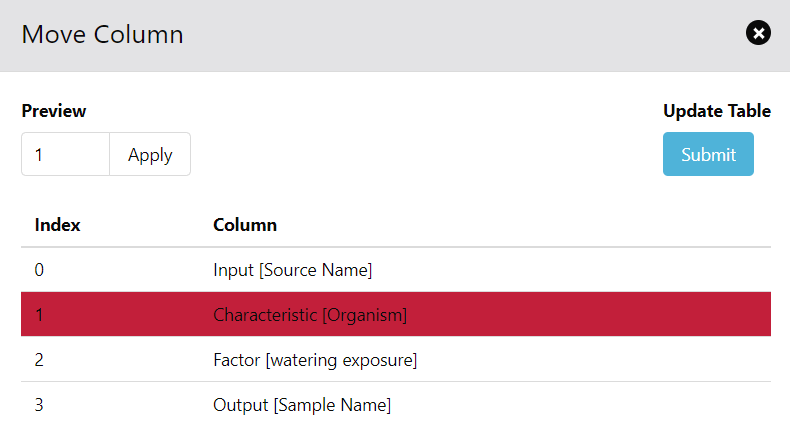
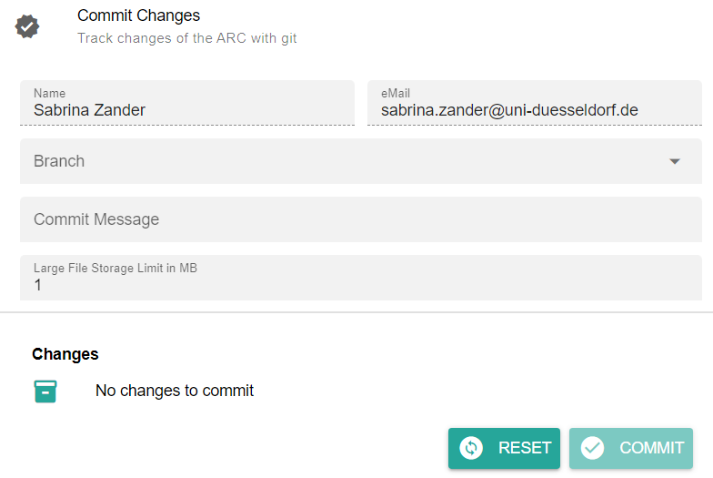

## ARCitect Hands-on

<!-- _paginate: false -->

---

## ARCitect installation

Please install version **v0.0.48** (or later) of the ARCitect: https://github.com/nfdi4plants/ARCitect/releases/latest

---

## Download the demo data

https://uni-duesseldorf.sciebo.de/s/C7ms3QA6q7OZnU2 

---

## A small prototypic project

---

## ARC: Annotated research context

---

## The ARC scaffold structure

---

## Sort Demo data in an ARC <!-- fit -->

---

## Initiate the ARC folder structure

1. Open ARCitect
2. Create a **New ARC** (2)
3. Select a location and name it **TalinumPhotosynthesis**

---

## Your ARC's name

💡 By default, your ARC's name will be used
   - for the ARC folder on your machine
   - to create your ARC in the DataHUB at `https://git.nfdi4plants.org/<YourUserName>/<YourARC>` (see next steps)
   - as the identifier for your investigation

💡 Make sure that no ARC exists at  `https://git.nfdi4plants.org/<YourUserName>/<YourARC>`. Otherwise you will sync to that ARC.

---

## Add a description to your investigation

---

## Add contributors

- you could also add the contacts directly via ORCID

---

## Divide and conquer for reproducibility

---

## Identifying the ‘study’ part

---

## Add a study

by clicking "Add Study" and entering an identifier for your study

Use **talinum_drought** as an identifier

---

## Study panel

In the study panel you can add

- general metadata,
- people, and
- publications
- data process information

---

## Let's annotate the plant samples

1. Check out the lab notes `studies/talinum_drought/protocols/plant_material.txt`
2. Select the study `talinum_drought`
3. Add a new table sheet at the bottom

---

## Create an annotation table

1. Create a annotation table by adding **Building blocks** via the widget (A) or the sidebar (B)
1. Add an *Input* (`Source Name`) and *Output* (`Sample Name`) column

:bulb: Each table can contain only one *Input* and one *Output* column  

---

## A table-based organization schema

---

## Fill out source name and sample name

Transfer the sample ids from the protocol.

1. Invent names for `Source Name` (we do not have this information)
2. Use the sample names from the protocol (DB_*) as `Sample Name`

---

## Add protocols

You can either
- directly write a **new protocol** within the ARCitect or
- import an existing one from your computer

---

## Link the protocol to the isa table

1. In the *Building Blocks* tab, select *More* -> *Protocol REF*.
2. Click <kbd>Add Column</kbd>.
3. Add the name of the protocol file (plant_material.txt) to the *Protocol REF* column.

---

## Referencing a protocol

This allows you to reference the free-text, human-readable protocol.

:bulb: It is recommended that the protocol is in an open format (.md|.txt|.docx|…)
:bulb: But everything is possible also an URI to an electronic lab notebook

---

## Parameterizing the ‘study’

---

## Finding the right metadata vocabulary

  

  
  ### Parameters []
  
  - Light intensity 200 µEinstein
  - Temperature 6°C / 25°C
  - Growing 4d
  
  
  
  

  
  ### Characteristics []
  
  - Arabidopsis thaliana
  - Leaf
  - Hydroponic culture
  - Columbia
  
  

---

## OLS: Finding the right metadata vocabulary

---

## Finding the metadata vocabulary and descriptors

---

## Finding the metadata vocabulary and descriptors

  

  
  ### Parameters []
  
  - 
    -  Light intensity 200 µEinstein
  -   
    -  Temperature 6°C / 25°C
  - 
    -  Growing 4d
  
  
  

  

  
  ### Characteristics []
  
  - 
    -  Arabidopsis thaliana
  - 
    -  Leaf
  - 
    -  Hydroponic culture
  - 
    -  Columbia
  
  

---

## Finding the metadata vocabulary and descriptors

  

  
  ### Parameters []
  
  -  Light intensity
    -  200 µEinstein
  -  Temperature  
    -  6°C / 25°C
  -  Growth time
    -  4d
  
  

  

  
  ### Characteristics []
  
  -  Organism
    -  Arabidopsis thaliana
  -  Tissue
    -  Leaf
  -  Growth medium
    -  Hydroponic culture
  -  Ecotype
    -  Columbia
  
  

---

# Annotation Building Block types

  
  

  
- Input (e.g. Source Name, Sample Name)
- Protocol columns
- Characteristic // Parameter // Factor // Component
- Output (e.g. Sample Name, Raw Data File, Derived Data File)

  
  

  
  
    
  

Let's take a detour on [Annotation Principles](https://nfdi4plants.org/nfdi4plants.knowledgebase/docs/teaching-materials/units/AnnotationPrinciples/isa_AnnotationPrinciples-slides.html)

---

## Add Characteristics

1. Select *Characteristic* from the drop-down menu
1. Enter `organism` in the search bar. This search looks for suitable *Terms* in our *Ontology* database.
1. Select the Term with the id `OBI:0100026` and, 
1. Click <kbd>Add Column</kbd>

:bulb: This adds four columns to your table, one visible and **three** hidden.

---

## Insert ontology terms

1. Insert values by selecting any cell below `Characteristic [organism]`
2. Use free text or use the magnifying glass to activate *Term* search
3. Write "Talinum fruticosum" and enable *Term* search
4. Select the hit

---

## Add a Parameter building block with a unit

1. In the *Building Blocks* widget, select *Parameter*, search for `light intensity exposure` and select the term with id `PECO:0007224`.
2. Check the box for *Unit* and search for `microeinstein per square meter per second` in the adjacent search bar.
3. Select `UO:0000160`.
4. Click Add Column.

:bulb: This also adds four columns to your table, one visible and **three** hidden.

---

## Insert unit-values

In the annotation table, select any cell below `Parameter [light intensity exposure]` and add "425" as light intensity.

:bulb: You can see the numbers being complemented with the chosen unit, e.g. `425 microeinstein per square meter per second`

---

## Your annotation table is growing

At this point. Your table should look similar to this:

---

## Exercise :pencil:

Try to add suitable *Building Blocks* for other pieces of metadata from the plant growth protocol (`studies/talinum_drought/protocols/plant_material.txt`).

---

## Add a factor building block

1. In the *Building Blocks* widget, select *Factor*, search for `watering exposure` and select the term with id `PECO:0007383`.
2. Click <kbd>Add Column</kbd>.
3. Add the drought treatment ("no water for 12 days", "re-water for 2 days") to the respective samples

:bulb: There are different options to add the drought treatment.

---

## Showing ontology reference columns

Use double pointed quotation mark to un-hide hidden columns. 

:bulb: You can see that your organism of choice was added with id and source Ontology in the reference (hidden) columns.

---

## Identifying assays

---

## Add an assay

by clicking "Add Assay" and entering an identifier for your assay

Add two assays with **rnaseq** and **metabolomics** as an identifier

---

## Add information about your assay <!-- fit -->

In the assay panel you can define the assay's
 - measurement type
 - technology type, and
 - technology platform

---

## Assay for sugar measurement

---

## Separating different assay elements

---

## Parametric description of the lab process

---

## Parametric description of the lab process

---

## Isolating the lab processes in an assay

---

## Save time using standard methods and SOPs

---

## Save time using standard methods and SOPs

---

## Applying standard procedures to sample record

---

# Realization of lab-specific metadata templates

Facilities can define their most common workflows as templates

---

# Import templates from a database

- DataPLANT curated
- Community templates

---

## Let's annotate the RNA Seq assay

Open the lab notes `assays/rnaseq/protocols/`

---

## Use a template

1. Open the *Templates* widget in the Bar 

:bulb: Here you can find DataPLANT and community created workflow annotation templates

2. Search for `RNA extraction` and click <kbd>select</kbd> 
    - You will see a preview of all *Building Blocks* which are part of this template.
3. Click <kbd>Add template</kbd> to add all *Building Blocks* from the template to your table

---

## Remove Building blocks

If there are any *Building Blocks* which do not fit to your experiment you can use right click --> "Delete Column" to remove it including all related (hidden) reference columns.

---

## Move Building blocks
If the order of the *Building Blocks* should be adjusted you can use right click --> "Move Column"

---

## Replace multiple names 

Right click --> "Update Column" can be used to replace names in batches
:bulb: this only works on Input columns

---

## New process, new worksheet

1. Add a new sheet to the `assays/rnaseq/isa.assay.xlsx` workbook.
2. Add the template "RNASeq Assay"

---

## Exercise :pencil:

Try to fill the two sheets with the protocol details:
  - `assays/rnaseq/protocols/RNA_extraction.txt` and
  - `assays/rnaseq/protocols/Illumina_libraries.txt`

---

# ARC builds on ISA to connect data

---

# ARC builds on ISA to link data

  

  - Samples are linked study-to-assay, assay-to-assay
  - Raw data is linked to assays
  - Protocols can be referenced
  - ...

  

  

  
  
  
  

---

## Link samples across studies and assays

1. Use the `Output [Sample Name]` of studies/talinum_drought/isa.study.xlsx as the `Input [Sample Name]` to **rna-extraction**.
1. Use the `Output [Sample Name]` of **rna-extraction** as the `Input [Sample Name]` to **illumina-libraries**.

**Seeds** &mdash;*Plant growth*&#x21FE; **Leaves** &mdash;*RNA Extraction*&#x21FE; **RNA** &mdash;*Illumina*&#x21FE; **fastq files**

---

## Link dataset files to samples

1. In the *Building Blocks* widget select *Output* -> *Raw Data File*.
2. Click <kbd>Add Column</kbd>.

:bulb: You see a warning about a changed output column.

3. Click <kbd>Continue</kbd>.
4. Go to the *File Picker* tab and click <kbd>Pick file names</kbd>.
5. Select and open the *fastq.gz files from the dataset folder.
6. Copy / paste them to the `Raw Data File`. 

:bulb: This allows you to link your samples to the resulting raw data files.

---

# Everything is a file

The ARC is a **data-centric** approach to RDM

---

# No technical lock-in

(Meta)data transparency with tool assistance but **no technical lock-in**

---

## Explorer

The **Explorer (6)** button directly opens your ARC locally

---

## Using the DataHUB to collaborate

---

## Login to DataHUB

1. Login to DataHUB (1)
   
2. Select `git.nfdi4plants.org` as Host 
    

---

## Commit panel (7)

You have to commit changes before you can upload to the DataHUB

---

## Commit your changes

If you are logged in, the **Commit panel** shows
- your DataHUB's *Full Name* and *eMail*

It allows you to
- track changes of the ARC with git
- add a commit message 
- use different branches 

---

## History panel (9)

In the History panel you can inspect your ARCs history with all commits 

---

## Upload your local ARC to the DataHUB

From the sidebar, navigate to **DataHUB Sync** (8)

---

## DataHUB Sync

The DataHUB Sync panel allows you to
- sync the changes to the DataHUB: **Push**
- sync from the DataHUB: **Pull**, and
- change the Remote for the synchronization

 

---

## Check if your ARC is successfully uploaded

1. [sign in](https://auth.nfdi4plants.org/realms/dataplant/login-actions/registration?client_id=account&tab_id=4bQkU161waI) to the DataHUB 
2. Check your projects
