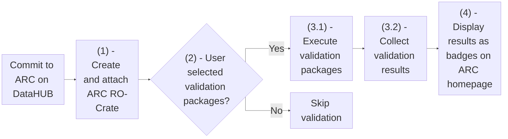

import Mermaid from '@components/mdx/Mermaid.astro';
import { Steps } from '@astrojs/starlight/components';

**Continuous Quality Control (CQC) pipelines** are automated processes that run on every commit to an ARC on the DataHUB. They combine the automatic attachment of the ARC RO-Crate to the commit with optional, user-selected validation steps. Users can specify which validation packages their ARC should be tested against, and the results are displayed as badges on the ARC homepage.

**CQC on the DataHUB consist of 4 steps:**

<Steps>

  1. 
      <details>
        <summary>Generation and attachment of the ARC RO-Crate</summary>
        The ARC RO-Crate is the machine-readable representation of the ARC at the given commit. It is generated via [arc-export](https://github.com/nfdi4plants/arc-export) and available via the ARCs package registry page. Read more about the ARC-RO-Crate [here](https://arc-rdm.org/details/arc-representation/#two-sides-of-the-same-coin)
      </details>
  2. 
      <details>
        <summary>Check for user-selected validation packages</summary>
        Users can opt-in to validate their ARC against any validation package available on the [ARC Validation Package Registry (AVPR)](https://avpr.nfdi4plants.org/packages). 

        [Read more below](/nfdi4plants.knowledgebase/arc-validation/cqc-pipelines/#use-validation-packages-in-your-cqc-pipeline).
      </details>
  4. 
      <details>
        <summary>Execute validation packages (optional)</summary>
        - 3.1: For each validation package selected in step 2, a pipeline step is created that executes the package. 
        - 3.2: Results are collected and committed to the ARCs `cqc` branch.
        - [Read more about validation package output](http://localhost:4321/nfdi4plants.knowledgebase/arc-validation/authoring-validation-packages/#validation-output).
        - [Read more about authoring validation packages](/nfdi4plants.knowledgebase/arc-validation/authoring-validation-packages).
      </details>
  3. 
      <details>
        <summary>Display validation results as badges on ARC homepage</summary>
        Each validation package creates a badge representing the result of the package execution. These badges are displayed on the ARC homepage, providing a quick overview of the ARC's compliance with the selected validation packages.
      </details>
</Steps>

<Mermaid>

</Mermaid>

## ARC Validation Package Registry (AVPR)

The [ARC Validation Package Registry (AVPR)](https://avpr.nfdi4plants.org/packages) is the central DataPLANT service for browsing, submitting, and installing ARC validation packages. The AVPR is a community-driven platform that allows users to share and discover validation packages for their ARCs. It provides an overview containing all metadata about an validation packages, such as authors, summary, and even a full package code preview. Additionally, each package page prominently displays the necessary information to use it in CQC pipelines.

## Use Validation packages in your CQC pipeline

Users can choose to validate against any validation package available on the AVPR. To include a validation package in a PLANTDataHUB CQC pipeline, it has to be referenced in the `validation_packages.yml` file located in the `.arc` directory in the ARC's root directory. The CQC pipeline will then automatically validate the ARC against the selected packages on every commit. The file can be created manually or by DataPLANT tooling such as the [ARCitect](/nfdi4plants.knowledgebase/arcitect).

A `validation_packages.yml` file includes the following keys and values:

- `arc_specification`: The version of the ARC specification the ARC should be validated against (e.g., `2.0.0-draft`).
- ``validation_packages``: A list of validation packages to use for validation. Each package is specified by its `name` and `version`, which can be retrieved from the AVPR.

Example:

```yaml
arc_specification: 2.0.0-draft
validation_packages:
  - name: invenio
    version: 3.1.0
```
