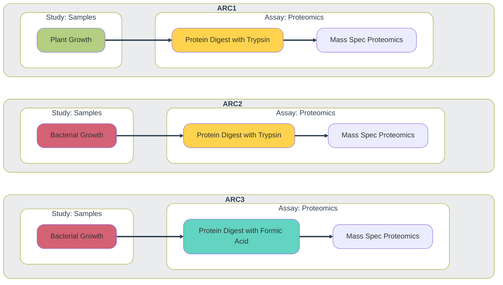

import { Steps } from '@astrojs/starlight/components';
import { Code } from '@astrojs/starlight/components'
import { Tabs, TabItem } from '@astrojs/starlight/components';
import Mermaid from '@components/mdx/Mermaid.astro'
import DownloadLink from '@components/scripts/DownloadLink.tsx?client:load'

This guide demonstrates how to use ARCtrl to generate an ARC from previously created SOP annotation tables.

## Use-case

Labs or facilities frequently combine identical types of studies and assays into new ARCs in a modular fashion. These studies and assays following routine methods are called **standard operating procedures (SOPs)**. Consider a lab that routinely uses mass spectrometry to assess the proteome from various samples. The lab might maintain a pool of SOPs, e.g. for different sample sources (e.g. plants or bacteria) or protein digestion methods (e.g. trypsin or formic acid).

<Mermaid>

</Mermaid>

### Study SOP: Plant Growth

<Tabs syncKey="pl">

<TabItem label="Tabular View">

The SOP holds the following template table to be filled with the information about how the plant samples were grown:

Input [Source Name] | Protocol REF | Characteristic [organism] | Characteristic [Tissue] | Characteristic [Growth Medium] | Characteristic [ecotype] | Parameter [Light intensity] | Factor [temperature] | Parameter [growth time] | Output [Sample Name]
--------------------|--------------|---------------------------|-------------------------|--------------------------------|--------------------------|-----------------------------|----------------------|-------------------------|---------------------| 
  |  |  |  |  |  |  |  |  |  | 

</TabItem>

<TabItem label="ARCtrl.json">

The SOP in json format looks like this

import PlantGrowth from '/arctrl/use-cases/create-arc-template/PlantGrowth.arctrl.json?url&raw'

<Code 
  title="PlantGrowth.arctrl.json"
  code={ PlantGrowth } 
  lang="json"/
>

</TabItem>
</Tabs>

### Assay SOP: Protein Digest with Trypsin

<Tabs syncKey="pl">

<TabItem label="Tabular View">

This SOP contains the already filled out annotation table with the information about the SOP to trypsin-digest extracted proteins.

Input [Sample Name] | Parameter [sample mass] | Parameter [Protein Precipitation] | Parameter [alkylating agent] | Parameter [reducing agent] | Parameter [cleavage agent name] | Parameter [Tryptic Digestion] | Parameter [sample preparation] | Output [Sample Name]
--------------------|-------------------------|-----------------------------------|------------------------------|----------------------------|---------------------------------|-------------------------------|--------------------------------|---------------------
|  | 10 | acetone | Chloroacetamide | TCEP | Trypsin | in-solution digestion | reversed-phase solid-phase extraction | 

</TabItem>

<TabItem label="ARCtrl.json">

The SOP in json format looks like this

import ProtDigest from '/arctrl/use-cases/create-arc-template/ProtDigest-Trypsin.arctrl.json?url&raw'

<Code 
  title="ProtDigest-Trypsin.arctrl.json"
  code={ ProtDigest } 
  lang="json"
/>

</TabItem>
</Tabs>

## Example script

The following script is split in two parts.

### Define inputs and outputs

The first part includes the variable information, that needs to be adapted per ARC as highlighted, i.e.
  - the path to the ARC (`arcPath`)
  - the `persons` to be added
  - the ARC's `title` and `identifier`
  - the paths to existing SOPs (`studyJsonPaths` and `assayJsonPaths`)

In this example, the script uses only the two SOPs ("PlantGrowth" and "ProtDigest-Trypsin") introduced above, and it adds two contact persons. Both of these variables could be extended to add more SOPs or more persons one per line, respectively.

import rawCode from '/arctrl/use-cases/create-arc-template/create-arc-template.fsx?url&raw'

<Code
  code={rawCode.split('\n').slice(0, 34).join('\n')}
  lang="fsharp"
  mark={[8, 12, 13, 18, 19, 26, 32]}
/>

### Combine and write the ARC

The second part of the script creates the ARC based on the provided information and SOPs.

<Code
  code={rawCode.split('\n').slice(34, 66).join('\n')}
  lang="fsharp"
/>

## Download Example

You can download the example script and SOPs <a href="/nfdi4plants.knowledgebase/arctrl/use-cases/create-arc-template.zip">here</a> to adapt them to your needs.
