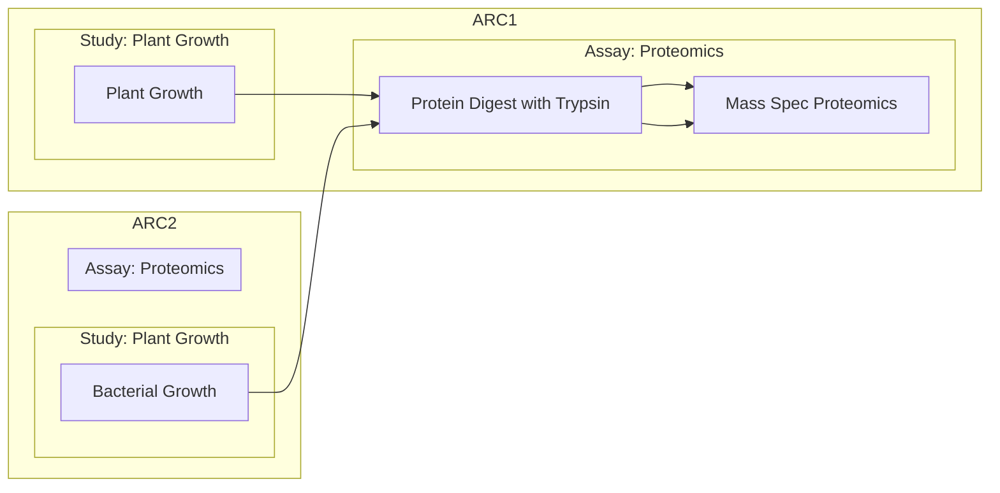

import { Steps } from '@astrojs/starlight/components';
import { Code } from '@astrojs/starlight/components'
import { Tabs, TabItem } from '@astrojs/starlight/components';
import Mermaid from '@components/mdx/Mermaid.astro'

This guide demonstrates how to use ARCtrl to generate an ARC from previously created SOP annotation tables.

## Use-case

Labs or facilities frequently combine study and assay SOPs into new ARCs in a modular fashion.

<Mermaid>

</Mermaid>

A locally stored pool of templates or SOPs, such as one for a study on "Plant Growth" and another for the "protein digest with trypsin" assay.

## Example SOPs

import PlantGrowth from './PlantGrowth.arctrl.json?raw'

  
Study: PlantGrowth.arctrl.json

  <Code code={ PlantGrowth } lang="json"/>

import ProtDigest from './ProtDigest-Trypsin.arctrl.json?raw'

  
Assay: ProtDigest-Trypsin.arctrl.json

  
  <Code code={ ProtDigest } lang="json"/>

## Example script

import rawCode from './create-arc-template.fsx?raw';

The following script is split in two parts:

The first part includes the variable information, that needs to be adapted per ARC as highlighted, i.e.
  - the path to the ARC (`arcPath`)
  - the `persons` to be added
  - the ARC's `title` and `identifier`
  - the paths to existing SOPs (`studyJsonPaths` and `assayJsonPaths`)

The second part creates the ARC based on the provided information and SOPs.

In this example, the script uses the two SOPs introduced above, and it adds two contact persons. Both of these types could be extended to add more SOPs or more persons one per line, respectively. 

### Define inputs and outputs

<Code
  code={rawCode.split('\n').slice(0, 34).join('\n')}
  lang="fsharp"
  highlight={[8, [12, 13], [18, 19], 26, 32]}
/>

### Combine and write the ARC

<Code
  code={rawCode.split('\n').slice(34, 66).join('\n')}
  lang="fsharp"
/>