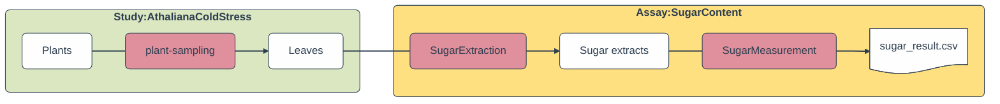
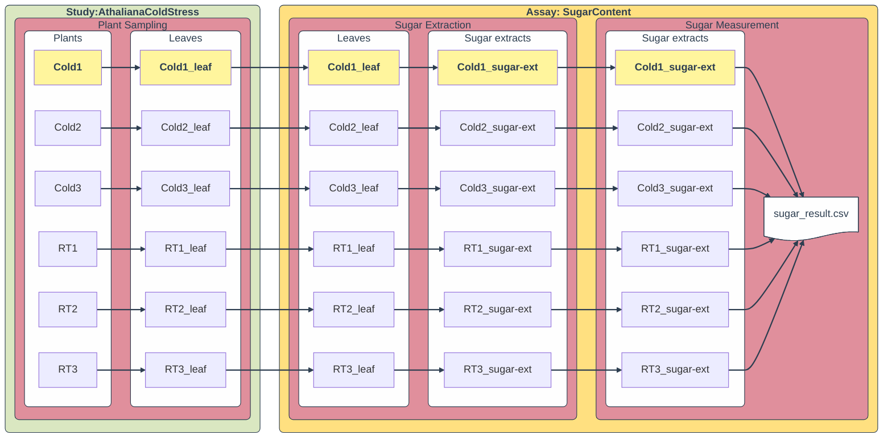

import { FileTree } from '@astrojs/starlight/components';
import { Tabs, TabItem } from '@astrojs/starlight/components';
import Mermaid from '@components/mdx/Mermaid.astro'
import NoWrapTable from "@components/NoWrapTable.astro"

A key objective of the ARC is to trace each finding or result back to its specific biological experiment. Achieving this requires linking dataset files to their corresponding individual samples. To accomplish this, we follow a sequence of processes with defined **inputs** and **outputs**.

## Example

Consider the example experiment from the [Start Here guide](/nfdi4plants.knowledgebase/start-here) where six *Arabidopsis thaliana* plants were exposed to cold stress, and the sugar content was measured as a response. The ARC structure for this experiment could look like this:

<FileTree>
- AthalianaColdStressSugar
  - studies
    - AthalianaColdStress
      - protocols
        - plant-sampling.md
  - assays
      - SugarContent
          - dataset
              - sugar_result.csv
          - protocols
              - sugar_extraction.md
              - sugar_measurement.md
          - isa.assay.xlsx
          - README.md
  - ...

</FileTree>

The ARC contains one study (`AthalianaColdStress`) and one assay (`SugarContent`). The study includes a protocol for plant sampling describing how the plants were grown and treated, while the assay contains protocols for sugar extraction and sugar measurement. The dataset file `sugar_result.csv` holds the measured sugar content data.

## Annotation tables describe processes

The following three annotation tables describe the three consecutive processes:
  - Plant Sampling (part of the Study `AthalianaColdStress`),
  - Sugar Extraction (part of the Assay `SugarContent`), and
  - Sugar Measurement (part of the Assay `SugarContent`). 

Each table starts with an `Input` column specifying the input entity (sample, material or data) for the respective process, followed by a `ProtocolREF` column indicating the protocol used, and ends with an `Output` column specifying the output entity resulting from the process.
 
The annotation tables (and effectively the studies and assays) are linked by reusing the respective identifiers of the `Input` and `Output` entities (samples, materials or dataset files) across the different processes – i.e. the `Output` of one process becomes the `Input` of the next process.

export const Highlight = ({ children }) => (
  
    {children}
  
)

In this example we follow <Highlight>one line of highlighted samples</Highlight> through the processes:

<Tabs>

  <TabItem label="1. Plant Sampling">

    | `Input`[Source Name] |  `ProtocolREF`                | [...] | `Output`[Sample Name] | 
    | -------------------- |  ---------------------------  | ----  |  -------------------- | 
    | <Highlight>Cold1</Highlight> |  ./protocols/plant-sampling.md  | ...   |  <Highlight>Cold1_leaf</Highlight>           | 
    | Cold2                |  ./protocols/plant-sampling.md  | ...   |  Cold2_leaf           | 
    | Cold3                |  ./protocols/plant-sampling.md  | ...   |  Cold3_leaf           | 
    | RT1                  |  ./protocols/plant-sampling.md  | ...   |  RT1_leaf             | 
    | RT2                  |  ./protocols/plant-sampling.md  | ...   |  RT2_leaf             | 
    | RT3                  |  ./protocols/plant-sampling.md  | ...   |  RT3_leaf             | 

  </TabItem>

  <TabItem label="2. Sugar Extraction">

    | `Input`[Sample Name] | `ProtocolREF`                   | [...] | `Output`[Sample Name] | 
    |  -------------------- | -----------------------------  | ----  |  -------------------- | 
    |  <Highlight>Cold1_leaf</Highlight>            | ./protocols/sugar_extraction.md  | ...   |  <Highlight>Cold1_sugar-ext</Highlight>       | 
    |  Cold2_leaf           | ./protocols/sugar_extraction.md  | ...   |  Cold2_sugar-ext      | 
    |  Cold3_leaf           | ./protocols/sugar_extraction.md  | ...   |  Cold3_sugar-ext      | 
    |  RT1_leaf             | ./protocols/sugar_extraction.md  | ...   |  RT1_sugar-ext        | 
    |  RT2_leaf             | ./protocols/sugar_extraction.md  | ...   |  RT2_sugar-ext        | 
    |  RT3_leaf             | ./protocols/sugar_extraction.md  | ...   |  RT3_sugar-ext        | 

  </TabItem>

  <TabItem label="3. Sugar Measurement">

    <NoWrapTable>

    | `Input` [Sample Name] | `ProtocolREF`                 | [...] | `Output` [Data]                                    |
    | --------------------- | ----------------------------- | ---   | -------------------------------------------------- |
    | <Highlight>Cold1_sugar-ext</Highlight>       | ./protocols/sugar_measurement.md | ...   | <Highlight>./assays/SugarMeasurement/dataset/sugar_result.csv</Highlight> |
    | Cold2_sugar-ext       | ./protocols/sugar_measurement.md | ...   | ./assays/SugarMeasurement/dataset/sugar_result.csv |
    | Cold3_sugar-ext       | ./protocols/sugar_measurement.md | ...   | ./assays/SugarMeasurement/dataset/sugar_result.csv |
    | RT1_sugar-ext         | ./protocols/sugar_measurement.md | ...   | ./assays/SugarMeasurement/dataset/sugar_result.csv |
    | RT2_sugar-ext         | ./protocols/sugar_measurement.md | ...   | ./assays/SugarMeasurement/dataset/sugar_result.csv |
    | RT3_sugar-ext         | ./protocols/sugar_measurement.md | ...   | ./assays/SugarMeasurement/dataset/sugar_result.csv |

    </NoWrapTable>

  </TabItem>

</Tabs>

:::note
For simplicity, only the relevant columns to introduce the linking concept are shown here. The `[...]` indicates that there are additional columns in the actual tables, which would typically include other necessary metadata and annotations from the protocols.
:::

## Linking samples to data

Following the simple approach of reusing sample and data identifiers in different parts of the ARC, we were able to concisely link the samples through the different lab processes in studies and assays to the data produced from those samples. 

The tables above contain all information visualized in the following flowchart to show how the study and assay processes are connected:

<Mermaid>

</Mermaid>

Zooming in on the sample level, we can follow the samples through the processes from their biological origin to the data:

<Mermaid>

</Mermaid>

## Tracing back the data to its biological origin

Using this approach, we can trace back the dataset file to its specific biological origin. For example, the sugar content measurement for the sample `Cold1_sugar-ext` can be traced back through the processes to the original plant sample `Cold1`. Looking at it from this other perspective (i.e. starting from the data): all metadata enriched in the preceding annotation tables aid in contextualizing the data in `sugar_result.csv`, such as the protocols used, conditions applied, and sample origins. Hence, this linkage is crucial for understanding the context of the data and ensuring its reliability and reproducibility in scientific research.

:::note
In order to go a level deeper, and trace each **data point** in the `sugar_result.csv` to the sample, the ARC employs the concept of [fragment selectors and DataMAPs](/nfdi4plants.knowledgebase/arctrl/datamap).
:::
