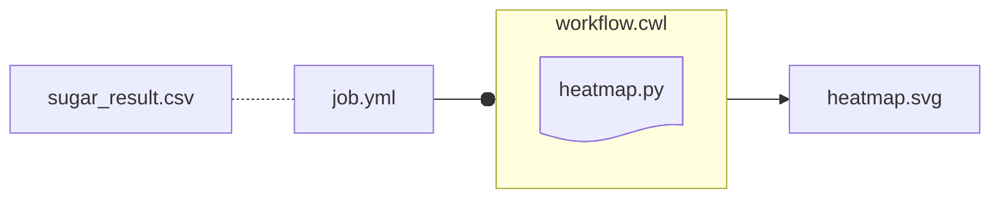

import { FileTree } from '@astrojs/starlight/components';
import { Steps } from '@astrojs/starlight/components';
import { Tabs, TabItem } from '@astrojs/starlight/components';
import ViolasARCFinal from '@components/mdx/ViolasARC-final.mdx'
import Mermaid from '@components/mdx/Mermaid.astro'

Here we wrap a minimal example script into a [CWL](/nfdi4plants.knowledgebase/cwl) document. We use a python script (`heatmap.py`), that creates a heatmap file (`heatmap.svg`) based on an input table containing sugar abundance assay data (`sugar_result.csv`).
Wrappig the script in CWL makes it reusable in another ARC to generate the same type of heatmap based on another input table. For more details, checkout the introduction to [CWL](/nfdi4plants.knowledgebase/cwl).

## Example Data

This guide builds on the ARC created in the [Start here](/nfdi4plants.knowledgebase/start-here/) guide. 
If you have not yet followed the guide, you can download the ARC (e.g. via [ARCitect](/nfdi4plants.knowledgebase/arcitect)) from the [DataHUB](https://git.nfdi4plants.org/training/AthalianaColdStressSugar).

<details>
<summary>This is what the ARC looks like</summary>

<ViolasARCFinal />

</details>

## Isolate run parameters and workflow

We add the following three files to the ARC. You can <a href="/nfdi4plants.knowledgebase/violas-cwl.zip">**download the files here**</a>. 

<Tabs syncKey="os">
<TabItem label="heatmap.py" icon='seti:python'>

```python
import pandas as pd
import plotly.express as px
import sys

# Read command line arguments
MeasurementTableCSV=sys.argv[1]
FigureFileName=sys.argv[2]

# Read the CSV file
data = pd.read_csv(MeasurementTableCSV, index_col=0, on_bad_lines='skip')

# Create a heatmap
fig = px.imshow(data, 
                labels=dict(x="Columns", y="Rows", color="Value"),
                x=data.columns, 
                y=data.index)

# Save heatmap to file
fig.write_image(FigureFileName + ".svg")
```

{/* TODO: import CWL icon from simple-icons */}

</TabItem>
<TabItem label="workflow.cwl" icon='simple-icons:commonworkflowlanguage'>


```yaml
#!/usr/bin/env cwl-runner

cwlVersion: v1.2
class: CommandLineTool
requirements:
  - class: InitialWorkDirRequirement
    listing:
      - entryname: heatmap.py
        entry:
          $include: heatmap.py
  - class: NetworkAccess
    networkAccess: true
baseCommand: [python3, heatmap.py]
inputs:
  MeasurementTableCSV:
    type: File
    inputBinding:
      position: 1
  FigureFileName:
    type: string
    inputBinding:
      position: 2

outputs:
  output:
    type: File
    outputBinding:
      glob: "*.svg"
```

</TabItem>
<TabItem label="job.yml" icon='seti:yml'>

```yaml
MeasurementTableCSV:
    class: File
    path: ../../assays/SugarMeasurement/dataset/sugar_result.csv
FigureFileName: heatmap
```

</TabItem>
</Tabs>


Briefly summarized,

- the `heatmap.py` is the example data analysis script, which creates a heatmap based on a CSV table input
- the `workflow.cwl` is a CWL document binds the `heatmap.py`
  - It requires two `inputs`
    1. `MeasurementTableCSV`: the file name of the CSV table
    2. `FigureFileName`: how the user wants to name the output file
  - And it generates one `output`: an `.svg` file named according to `FigureFileName`
- the `job.yml` provides the required `input` parameters for `workflow.cwl`
  - the relative path to the CSV table input: `sugar_result.csv`
  - the desired file name: `heatmap`

<Mermaid>



</Mermaid>

## Using the workflow in your ARC

<Steps>

1. Open the [example ARC](#example-data)
1. Add a folder "heatmap" to `workflows`
   - Import `workflow.cwl` into `workflows/heatmap`
   - Import `heatmap.py` into `workflows/heatmap`
2. Add a folder "heatmap-run" to `runs` 
   - Import `job.yml` into `runs/heatmap-run`

</Steps>

The ARC should now look like this:

<FileTree>
- assays
  - SugarMeasurement
    - dataset
      - **sugar_result.csv**
    - ...
- isa.investigation.xlsx
- runs
    - heatmap-run
        - **job.yml**
- studies
- ...
- workflows
  - heatmap
    - **heatmap.py**
    - **workflow.cwl**
</FileTree>


<Steps>

3. In the ARC, navigate to the `heatmap-run` folder:

    ```bash
    cd runs/heatmap-run
    ```

4. Use the `cwltool` to run the workflow:

    ```bash
    cwltool ../../workflows/heatmap job.yml
    ```
    
    :::note[CWL]
    This assumes that [cwltool](/nfdi4plants.knowledgebase/cwl/cwl-runner-installation) is installed on your system.
    :::

</Steps>
