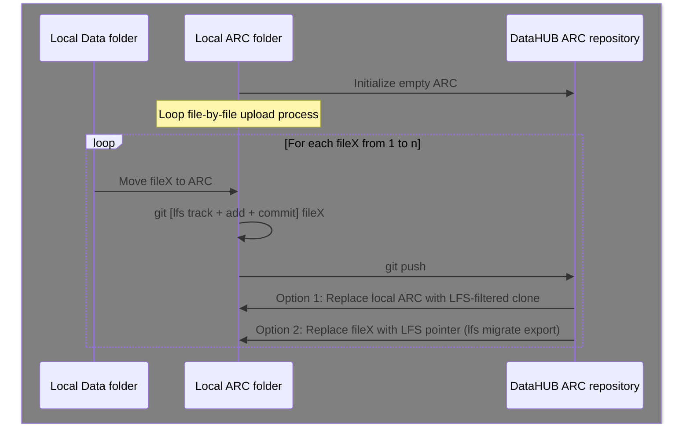

import { Steps } from '@astrojs/starlight/components';
import { Tabs, TabItem } from '@astrojs/starlight/components';
import Mermaid from '@components/mdx/Mermaid.astro'

### Use-case

- very large data that wants to be uploaded (pushed) as early as possible to the DataHUB

### Challenge

- limited local storage, git by design duplicates data

### Considerations

- file processing location (local vs. remote)
- are the files still needed locally? Or are they already processed?

<Mermaid>

</Mermaid>