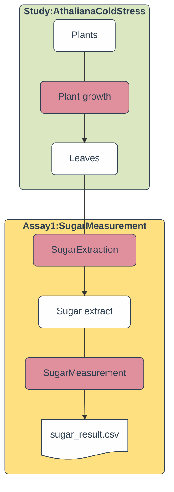

import ViolaSays from '@components/ViolaSays.astro'
import { Steps } from '@astrojs/starlight/components';
import { Card } from '@astrojs/starlight/components';
import { FileTree } from '@astrojs/starlight/components';
import Mermaid from '@components/mdx/Mermaid.astro'
import Icons from '@components/swate/Icons';
import QIcon from "@components/QIcon.astro"
import NoWrapTable from "@components/NoWrapTable.astro"

<ViolaSays>
Ok, I think I understand. The study is used to describe the overall experiment and the sample generation. Then the assays are used to describe the individual lab processes and the data generation!
</ViolaSays>

Right! In **assays** you can store data and metadata from measurements.

You can have multiple assays in one ARC. Each assay can have its own metadata, data, and protocols. How you structure your assays is up to you.

In general it is a good approach to describe each logical process in a separate assay. 

<ViolaSays>
Then let's start with the "Sugar Measurement" assay.
</ViolaSays>

## Assay: Sugar Measurement

### Add a new assay

<Card icon="pen" title="ARCitect">
    <Steps>

    1. Click on the plus icon <QIcon name="add" /> next to <QIcon name="storage" /> `assays` to add a new assay.
    2. Enter a name for the `New Assay`.

        <ViolaSays>
            SugarMeasurement
        </ViolaSays>

    3. Click `New Assay`.
    4. ARCitect adds the assay `SugarMeasurement` including the folders `dataset` and `protocols` as well as a `README.md` and the `isa.assay.xlsx` workbook. You can display the file structure created by ARCitect by clicking on `SugarMeasurement` as shown below.
    
        <FileTree>
        - assays
            - **SugarMeasurement**
                - dataset
                    - ...
                - protocols
                    - ...
                - isa.assay.xlsx
                - README.md
            - ...
        </FileTree>

        :::note
        The `isa.assay.xlsx` is not displayed inside ARCitect.
        :::

    5. Click on the assay's name (`SugarMeasurement`) in the file tree to edit the assay metadata in the right panel.
    6. Here you can add metadata about your assay.

        <ViolaSays>
            Ok, so my **measurement type** is "sugar measurement". 
            And to specify the device I used for my measurement, I add "photometry" and "Infinite M200 plate reader (Tecan)" as the **technology type** and **technology platform**, respectively.
        </ViolaSays>

    </Steps>
</Card>

### Separate different assay elements

Just as with studies, the individual assay elements (protocols, data, metadata) find a specific place in the assay subfolders. 
This enhances the reusability and identification of each element. 

import IMG2 from "@images/start-here/arc-prototypic-assay-modular2.svg"

### Add assay data and protocols

<Card icon="pen" title="ARCitect">
  <Steps>

  1. Right-click on the `dataset` folder and select `Import Files`.
  2. Select the file `sugar_result.csv` from the demo data and click `Open`.
  3. Right-click on the `protocols` folder and select `Import Files`.
  4. Select the file `sugar_extraction_protocol.md` from the demo data and click `Open`.
  5. The files are added to your ARC.
    
        <FileTree>
        - assays
            - SugarMeasurement
                - dataset
                    - **sugar_result.csv**
                - protocols
                    - **sugar_extraction_protocol.md**
                - isa.assay.xlsx
                - README.md
        - ...
        </FileTree>

  </Steps>
</Card>

### Isolate the lab processes in an assay

In order to separate the metadata, we can add one annotation table for each isolated process.

import IMG from "@images/start-here/arc-prototypic-assay-modular1.svg"

<Card icon="pen" title="ARCitect">
    <Steps>

    1. Click on the assay's name (`SugarMeasurement`) in the file tree.
    2. At the bottom of the right panel, click on the `+` right next to the `Assay` sheet to add one sheet for each lab process.
        
        <ViolaSays>
            I add two tables: one for "SugarExtraction" and one for "SugarMeasurement"
        </ViolaSays>

    3. After adding the tables, right-click on each sheet's tab to rename them accordingly.
    </Steps>
</Card>

### Use templates to describe the lab processes

#### Sugar extraction

We annotate the **Sugar extraction** process first.

Similar to the study example, we can parameterize the individual process steps, for instance:

import {ParentChild} from '@components/mdx/ParentChild.mdx'

- <ParentChild parent="Vortex Mixer" child="3 seconds"/>
- <ParentChild parent="Temperature" child="95 degree celsius"/>

Instead of adding each individual building block to the table, we can use a generic template for a sugar extraction.

<Card icon="pen" title="ARCitect">
    <Steps>

    1. Click on the assay's name (`SugarMeasurement`) in the file tree.
    2. Select the "SugarExtraction" table added in the previous step.
    3. In the `New Table!` widget, click <Icons.Templates /> to `Start with template!`. This will show you all DataPLANT curated templates.
    4. To select a template from a different community click <Icons.Institution />.
    6. From the dropdown, select "Training" and deselect "DataPLANT".
    7. Click on the template `Training - Sugar extraction`.
    8. Click `Import Templates`.
    8. Configure `Import Type` to `..With Units` and `SugarExtraction` to `Append to active table`. 
    9. You can expand `Preview Selected Columns` to view all building blocks of the template. 

        <ViolaSays>
            This shows me that the template has an **Input**, **Output** as well as two **Parameter** columns: "Vortex Mixer" and "Temperature"
        </ViolaSays>

    10. Click `Submit` to use the template.

        <NoWrapTable>

            Input [Sample Name]	| Parameter [Vortex Mixer] | Parameter [Temperature] | Output [Sample Name] 
            --- | --- | --- | --- 
                |     |     |   

        </NoWrapTable>

    9. At the bottom of the table, type `5` in the text field and click `+` to add 6 rows to your table for a total of 6 since one was added automatically.
    10. Transfer the sample names of your study's `Output [Sample Name]` to the `Input [Sample Name]` column.

        <NoWrapTable>
            
            Input [Sample Name]	| Parameter [Vortex Mixer] | Parameter [Temperature] | Output [Sample Name] 
            --- | --- | --- | --- 
            Cold1_leaf
            Cold2_leaf
            Cold3_leaf
            RT1_leaf
            RT2_leaf
            RT3_leaf
        
        </NoWrapTable>

        :::note
        Select multiple cells by clicking once on the first and the last cell while holding the `Shift` key. You can copy and paste multiple cells by right-clicking on the selected cells.
        :::

    11. Add information of the `sugar_extraction_protocol.md` into the table, e.g. 

        <NoWrapTable>

            Input [Sample Name]	| Parameter [Vortex Mixer] | Parameter [Temperature] | Output [Sample Name] 
            --- | --- | --- | --- 
            Cold1_leaf  | 3 seconds | 95 degree celsius | 
            Cold2_leaf  | 3 seconds | 95 degree celsius | 
            Cold3_leaf  | 3 seconds | 95 degree celsius | 
            RT1_leaf    | 3 seconds | 95 degree celsius | 
            RT2_leaf    | 3 seconds | 95 degree celsius | 
            RT3_leaf    | 3 seconds | 95 degree celsius | 

        </NoWrapTable>

    12. Fill the `Output [Sample Name]` column: 
        - Select the six cells from `Input`, and copy the sample names (right-click -> Copy)
        - Select the cells below `Output [Sample Name]` and paste the sample names (right-click -> Paste)
        - Right-click a cell in the column `Output [Sample Name]`. Then select `Edit` and `Update Rows` in the opened field to update all rows at once.
        - Type "leaf" in the `Regex` and "sugar-ext" in the `Replacement` fields
        - Click `Submit`

        <NoWrapTable>

            Input [Sample Name]	| Parameter [Vortex Mixer] | Parameter [Temperature] | Output [Sample Name] 
            --- | --- | --- | --- 
            Cold1_leaf  | 3 seconds | 95 degree celsius | Cold1_sugar-ext
            Cold2_leaf  | 3 seconds | 95 degree celsius | Cold2_sugar-ext
            Cold3_leaf  | 3 seconds | 95 degree celsius | Cold3_sugar-ext
            RT1_leaf    | 3 seconds | 95 degree celsius | RT1_sugar-ext
            RT2_leaf    | 3 seconds | 95 degree celsius | RT2_sugar-ext
            RT3_leaf    | 3 seconds | 95 degree celsius | RT3_sugar-ext  
        
        </NoWrapTable>

    </Steps>
</Card>

#### Sugar measurement

We follow the same steps to fill the **Sugar Measurement** table.

<Card icon="pen" title="ARCitect">
    <Steps>
    1. Select the "SugarMeasurement" table.
    2. Click `Utilize prior output` and `Import selected output column` to use the (*_sugar-ext) values of the "SugarExtraction" table.
    3. Click on the <Icons.Templates /> button in the top bar and import the template `Training - Sugar measurement`, following the same steps as before. this will not replace the existing input column.
    4. Fill the parameter columns
        - Parameter [`technical replicate`] of 1,2,3,1,2,3
        - Parameter [`sample volume`] of 10 `microliter`
        - Parameter [`buffer volume`] of 190 `microliter`
        - Parameter [`cycle count`] of 5
    5. Use the `File Picker` feature <Icons.FilePicker /> to import the results of sugar measurement (`sugar_result.csv`) into `Output [Data]`

        <NoWrapTable>

            Input [Sample Name]	| Parameter [technical replicate] | Parameter [...] | Output [Data] 
            ---                 | ------------------------------- | --------------- | --- 
            Cold1_sugar-ext     | 1                               | ...             | ./assays/SugarMeasurement/dataset/sugar_result.csv
            Cold2_sugar-ext     | 2                               | ...             | ./assays/SugarMeasurement/dataset/sugar_result.csv
            Cold3_sugar-ext     | 3                               | ...             | ./assays/SugarMeasurement/dataset/sugar_result.csv
            RT1_sugar-ext       | 1                               | ...             | ./assays/SugarMeasurement/dataset/sugar_result.csv
            RT2_sugar-ext       | 2                               | ...             | ./assays/SugarMeasurement/dataset/sugar_result.csv
            RT3_sugar-ext       | 3                               | ...             | ./assays/SugarMeasurement/dataset/sugar_result.csv

        </NoWrapTable>

    </Steps>
</Card>

## Linking samples to data – across studies and assays

Following the simple approach of reusing sample and data identifiers in different parts of the ARC, we were able to concisely link the samples through the different lab processes in studies and assays to the data produced from those samples. 

<Mermaid>

</Mermaid>
