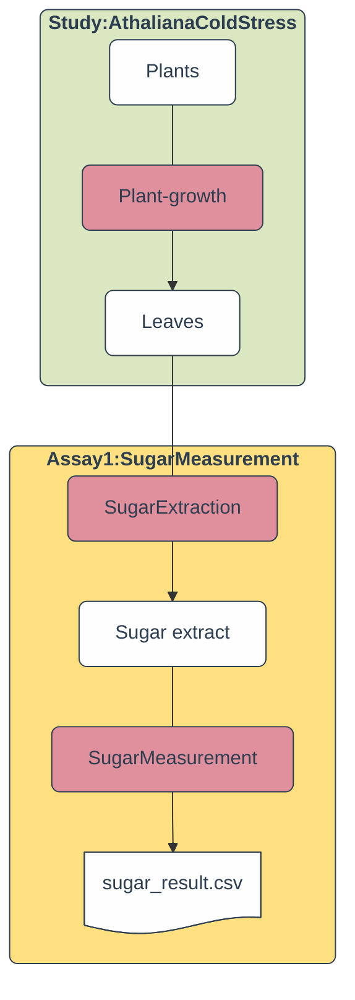

{/* Import components */}

import ViolaSays from '@components/ViolaSays.astro'
import { Card } from '@astrojs/starlight/components';
import Mermaid from '@components/mdx/Mermaid.astro'
import {ParentChild} from '@components/mdx/ParentChild.mdx'

{/* Import contents */}

import ArcitectAddAssay from "@kb/start-here/arcitect/arcitect-add-assay.mdx"
import ArcitectAddDatasetProtocol from "@kb/start-here/arcitect/arcitect-add-dataset-protocol.mdx"
import SwateAddAnnotationTable from "@kb/start-here/swate/swate-table-add.mdx"
import SwateUseTemplate from "@kb/start-here/swate/swate-use-template.mdx"
import SwateUseTemplate2 from "@kb/start-here/swate/swate-use-template2.mdx"

<ViolaSays>
Ok, I think I understand. The study is used to describe the overall experiment and the sample generation. Then the assays are used to describe the individual lab processes and the data generation!
</ViolaSays>

Right! In **assays** you can store data and metadata from measurements.

You can have multiple assays in one ARC. Each assay can have its own metadata, data, and protocols. How you structure your assays is up to you.

In general it is a good approach to describe each logical process in a separate assay. 

<ViolaSays>
Then let's start with the "Sugar Measurement" assay.
</ViolaSays>

## Assay: Sugar Measurement

### Add a new assay

<Card icon="pen" title="ARCitect">
    <ArcitectAddAssay />
</Card>

### Separate different assay elements

Just as with studies, the individual assay elements (protocols, data, metadata) find a specific place in the assay subfolders. 
This enhances the reusability and identification of each element. 

import IMG2 from "@images/start-here/arc-prototypic-assay-modular2.svg"

### Add assay data and protocols

<Card icon="pen" title="ARCitect">
    <ArcitectAddDatasetProtocol />
</Card>

### Isolate the lab processes in an assay

In order to separate the metadata, we can add one annotation table for each isolated process.

import IMG from "@images/start-here/arc-prototypic-assay-modular1.svg"

<Card icon="pen" title="ARCitect">
    <SwateAddAnnotationTable />
</Card>

### Use templates to describe the lab processes

#### Sugar extraction

We annotate the **Sugar extraction** process first.

Similar to the study example, we can parameterize the individual process steps, for instance:

- <ParentChild parent="Vortex Mixer" child="3 seconds"/>
- <ParentChild parent="Temperature" child="95 degree celsius"/>

Instead of adding each individual building block to the table, we can use a generic template for a sugar extraction.

<Card icon="pen" title="ARCitect">
    <SwateUseTemplate />    
</Card>

#### Sugar measurement

We follow the same steps to fill the **Sugar Measurement** table.

<Card icon="pen" title="ARCitect">
    <SwateUseTemplate2 />    
</Card>

## Linking samples to data – across studies and assays

Following the simple approach of reusing sample and data identifiers in different parts of the ARC, we were able to concisely link the samples through the different lab processes in studies and assays to the data produced from those samples. 

<Mermaid>

```mermaid
flowchart TD
classDef studyStyle fill:#dae7c1,rx:.4em,ry:.4em,color:#2d3e50,stroke:#2d3e50,font-weight:bold;
classDef assayStyle fill:#ffe080,rx:.4em,ry:.4em,color:#2d3e50,stroke:#2d3e50,font-weight:bold;
classDef processStyle fill:#E08F9C,rx:.4em,ry:.4em,color:#2d3e50,stroke:#2d3e50,font-weight:normal;
classDef sampleStyle fill:#FEFEFE,rx:.4em,ry:.4em,color:#2d3e50,stroke:#2d3e50,font-weight:normal;
classDef dataStyle fill:#FEFEFE,rx:.4em,ry:.4em,color:#2d3e50,stroke:#2d3e50,font-weight:normal;
subgraph study1["Study:AthalianaColdStress"]
    s1[Plants] ---p1[Plant-growth]--> s2[Leaves]
end
subgraph assay1[Assay1:SugarMeasurement]
    s2 ---p2[SugarExtraction]--> s3[Sugar extract]
    s3 ---p3[SugarMeasurement]--> d1@{ shape: doc, label: sugar_result.csv}
end
class study1 studyStyle;
class assay1 assayStyle;
class p1,p2,p3 processStyle;
class s1,s2,s3 sampleStyle;
class d1 dataStyle;
```

</Mermaid>
