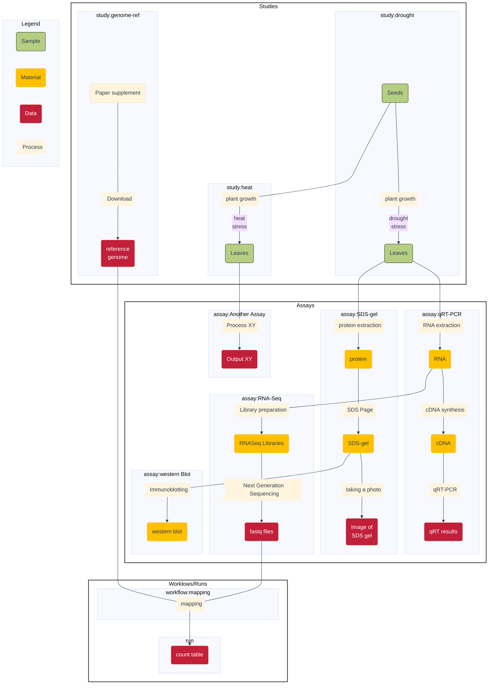

<!-- http://127.0.0.1:8080/docs/guides/ARC-practical-entry.html -->

## About this guide

In this guide we collect recommendations and considerations on creating an ARC based on your current project and datasets

<a href="./index.html">
  UserAdvanced
  ModeTutorial
</a>

 
 

## Before we can start

This guide assumes you know

- :ballot_box_with_check: the concept of the [ARC](./../implementation/AnnotatedResearchContext.html)
- :ballot_box_with_check: the different [ISA file types](./isa_FileTypes.html)
- :ballot_box_with_check: which tools to use (e.g. [ARC Commander](./../ArcCommanderManual/index.html), [ARCitect](./../ARCitect-Manual/index.html), [DataHUB](./../DataHUB-Manual/index.html)) and how.

 

## Convert your project into an ARC

- you have files and folders
- they are stored somewhere
- pack them / decorate them in an ARC.

## Sketch your laboratory workflows

One goal of the ARC is to be able to tell, which finding or result originated from which biological experiment. This would ultimately require to link the dataset files back to the individual sample. To do so, we essentially follow a path of *processes* with *inputs* and *outputs*. Some of the inputs and outputs want to be reused or reproduced, some of the processes want to be applied to other inputs.

Before creating an ARC for an existing dataset, it might help to visualize what was done in the lab. The following is very simplified example that most plant biologists can hopefully relate to.

:bulb: On a side note, the above is a very wet-lab heavy example. However, conceptually the same applies to computational workflows. Coders oftentimes design their scripts, workflows and pipelines in successive modules with defined inputs and outputs.

## Now action

Once 

## Work with identifiers

The ARC and the ISA metadata model offer determined places to 

- `Input` and `Output` fields such as Source Name, Sample Name, Data File Names
- `Protocol REF`

### Every file (name) is an identifier
