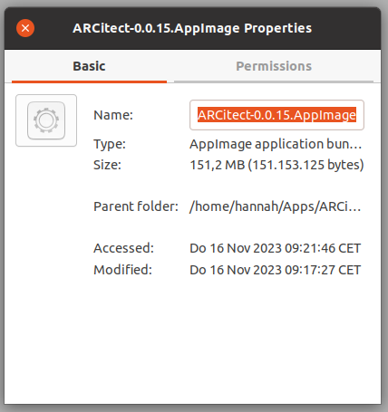
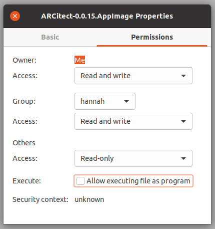
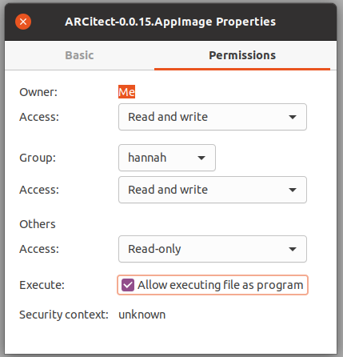

## Install Git

Please install <a href="https://git-scm.com/downloads" target="_blank">Git</a> and <a href="https://git-lfs.github.com/" target="_blank">Git LFS</a> before using the ARCitect.

:bulb: For Linux we recommend to install via homebrew as described on the site above.

## Install ARCitect via installer

1. Head to the ARCitect's GitHub <a href="https://github.com/nfdi4plants/ARCitect/releases/latest" target="_blank">release page</a>.
2. Download the Linux AppImage ARCitect-x.x.x.AppImage
3. (optional) If you run Ubuntu 22.04 you need to download an additional library. Ubuntu 22.04 can't run AppImage files without the not natively installed FUSE library. To fix this, install the necessary library. To do this you need root permissions.
```
sudo apt install libfuse2
```

### Make the ARCitect executable

#### (A) with the user interface

- open the folder where the AppImage is currently saved (likely in Downloads)
- (optional) move the file to a location where you want it saved
- right-click the file and select properties



- go to the "permissions" tab and tick the field "execute"



- now double-clicking the AppImage should start the ARCitect



#### (B) from the command line (you might need specific rights for this)

- open a terminal
- move to the directory where you have saved your AppImage (e.g. Downloads)
```
cd Downloads
```
- make the file executable (use the appropriate name of the file)
```
chmod u+x ARCitect-x.x.x.AppImage
```
- now double-clicking the AppImage or running the following command (with the appropriate file name) should start the ARCitect

```
./ARCitect-x.x.x.AppImage
```
