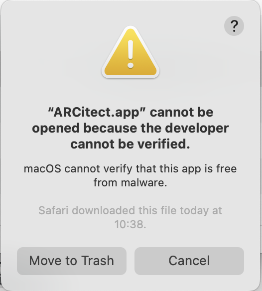
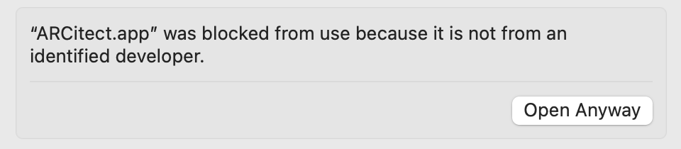
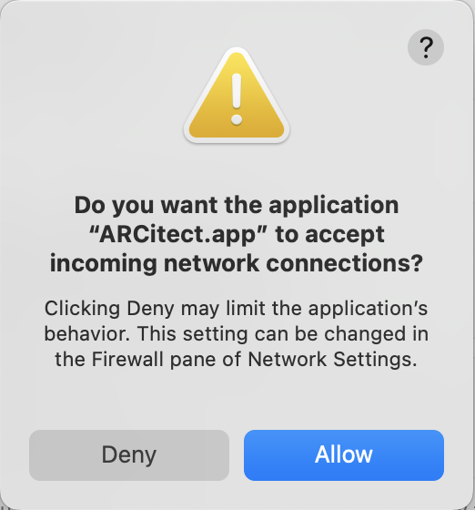
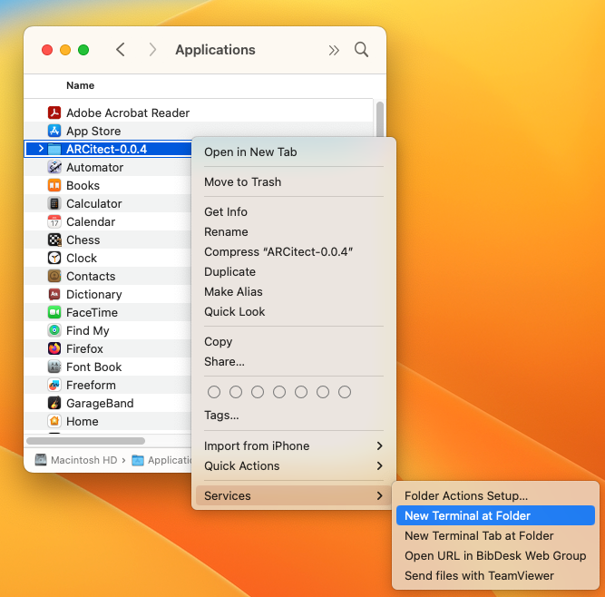
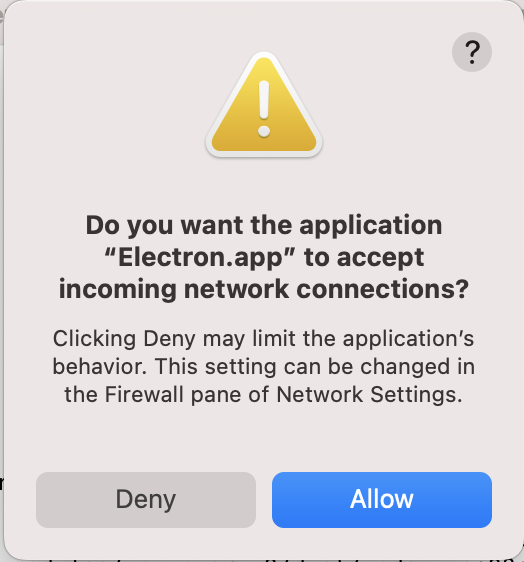

## Install ARCitect via installer

1. Head to the ARCitect's GitHub <a href="https://github.com/nfdi4plants/ARCitect/releases/latest" target="_blank">release page</a>.
2. Download the macOS installer ARCitect-x.x.x.dmg
3. Double-click the installer ARCitect-x.x.x.dmg and move the app to your Applications folder.

## Starting the ARCitect for the first time

When starting the ARCitect for the first time, you are warned about an unidentified developer



Please navigate to the Privacy & Security panel in your System Settings to "Open Anyway".



## Incoming network connections

Every time you start the ARCitect, you are asked to allow



This enables communication with the DataHUB.


## Alternative installation from source

:bulb: If the installation via installer does not work or the app seems buggy, please 

<details>
<summary>install ARCitect from source</summary>

Installation from source requires Git, Git LFS and Node.js

## Install Git and Git LFS

Please install <a href="https://git-scm.com/downloads" target="_blank">Git</a> and <a href="https://git-lfs.github.com/" target="_blank">Git LFS</a> before using the ARCitect.

:bulb: For macOS we recommend to install via homebrew as described on the site above.

### Install Node.js

Please install the latest version of [Node.js](https://nodejs.org/en/download).

1. Download the installer for your operating system (e.g. macOS Installer)
2. Once downloaded, open the `node-x.x.x.pkg` from your downloads folder and follow the "Install Node.js" instructions.

### Install ARCitect

1. Head to the ARCitect's GitHub [release page](https://github.com/nfdi4plants/ARCitect/releases/latest).
2. Under "Assets" download the latest source code archive (`Source code (zip)`).
3. In Finder, open the folder where you downloaded the ARCitect
4. Unzip the folder (`ARCitect-x.x.x.zip`). You can move this folder to another location (e.g. `Applications`).

5. Open the folder in a terminal (right click -> services -> `New Terminal at Folder`)



1. In the terminal, check that node.js is installed by executing

```bash
node -v
```

:bulb: This should display your installed version of node.js, e.g.
> v18.17.0

7. In the terminal, execute the following command to **install** the ARCitect

```bash
npm install
```

:bulb: This may take some seconds to minutes depending on your internet connection.

### Start the ARCitect

1. In the terminal, execute the following command to **start** the ARCitect

```bash
npm run debug
```

or

```bash
npm start
```




:bulb: A window will pop-up asking whether you want to accept incoming network connections. This needs to be allowed for communication with the [DataHUB](./../implementation/DataHub.html).

1. You can leave the terminal running in the background. Once you close the terminal, the ARCitect quits.

2. Switch to the ARCitect app.

:bulb: You might have to select the app from your dock.
</details>


