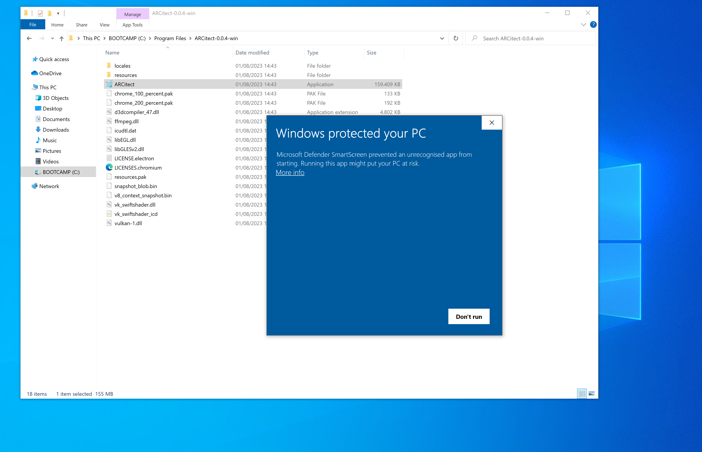
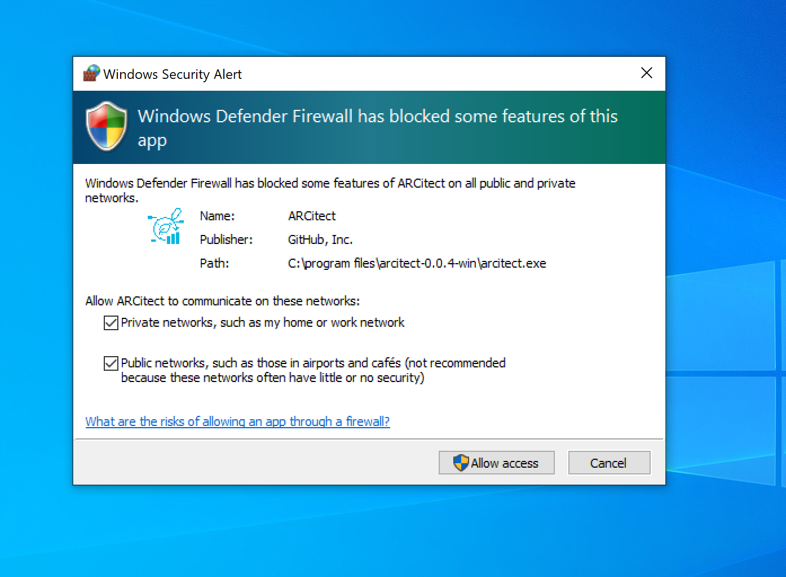

## Install ARCitect via installer

1. Head to the ARCitect's GitHub [release page](https://github.com/nfdi4plants/ARCitect/releases/latest).
2. Under "Assets" Download the latest release for Windows (`ARCitect-x.x.x-win.zip`).
3. In Windows Explorer, open the folder where you downloaded the ARCitect
4. Unzip (`Right click` ➞ `Extract All..`) the folder (`ARCitect-x.x.x-win.zip`). You can move this folder to another location (e.g. `Program files`).
5. Start the ARCitect, by clicking the `ARCitect` application.

6. Once started, you see a Windows Defender warning. To proceed, click "More info" and then "Run anyway".

7. Windows Defender Firewall further asks you to allow network communication. This enables communication with the [DataHUB](./../implementation/DataHub.html).

:bulb: You might have to select the app from your taskbar.
