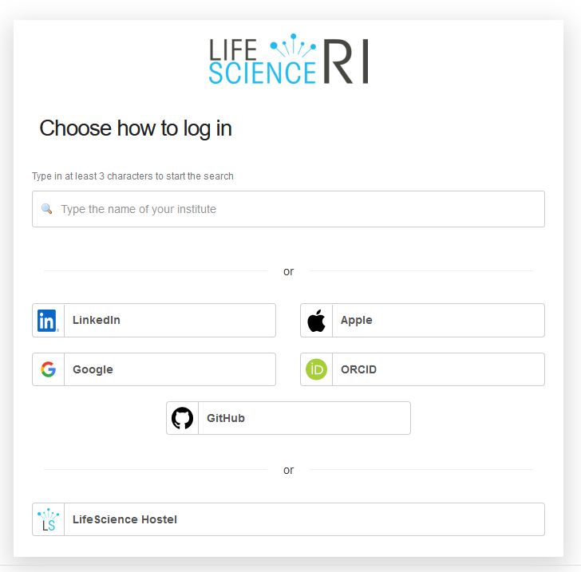

## Logging in

To be able to use the [ARCmanager](https://nfdi4plants.de/arcmanager/app/index.html), you need to have registered to one of the DataHUBs. Information on the different DataHUBs can be found [here](https://www.nfdi4plants.de/content/datahub.html).

Clicking on the the `DataHUB` button (Fig. 1) brings you to the drop down menu of available DataHUBs. The currently selected DataHUB is shaded in grey (Fig. 2).

  
**Fig. 1** Open the drop-down menu to select a DataHUB.

  
**Fig. 2** List of available DataHUBs.

At present, there are three different DataHUBs available for managing research data. The DataHUBs "reference" and "federated" are available to all researchers, whereas the TRR356 PlantMicrobe DataHUB is only available for members of the project.  Members of the TRR356 project are advised to use this DataHUB. 

<!--Collaborators of TRR356 research are welcome to the TRR356 PlantMicrobe DataHUB and will be admitted upon request to (**whose email?**).-->

After selecting a DataHUB that you want to access, click on the `Login` button to begin the login process:

  
**Fig. 3** Logging into the selected DataHUB.

If you are using the ARCmanager for the first time, you will see a window (Fig. 4) asking you to authorize the ARCmanager application to authenticate you and edit files of your projects on your behalf. Use the `Authorize` button to proceed.

  
**Fig. 4** Authorization screen for ARCmanager to use a DataHUB user account.

For the login process, you are presented with a selection of login options. Select one that you have used before in the registration process and enter your credentials (Fig. 5). 
    
Different login option can be used for the same DataHUB user, if the logins of the different providers have been merged. This process is mediated by Life Science RI. If are not presented with the option to merge your identities during the registration of an additional identity via another provider, you will have to get in touch with support@aai.lifescience-ri.eu for merging the identities. "Unmerged" identities will be treated as two different users in the DataHUB. Having different users complicates working with GitLab projects locally on your computer and is not recommended.

  
**Fig. 5** Login options.

After successful login, you see the former lilac Login button change to a pink Logout button (Fig. 6).

  
**Fig. 6** Welcome screen after login. The presence of the pink Logout button (arrow) is a useful indicator for showing that you are logged in.

### Searching for and in ARCs

  
**Fig. 7** Searching for published ARCs.

Without logging onto any DataHUB, the ARC search button (Fig. 1) provides a list of published ARCs that can be searched using the ISA Metadata Search via the [ARC Metadata Registry](https://arc-metadata-registry.readthedocs.io/en/latest/), a service under construction.

