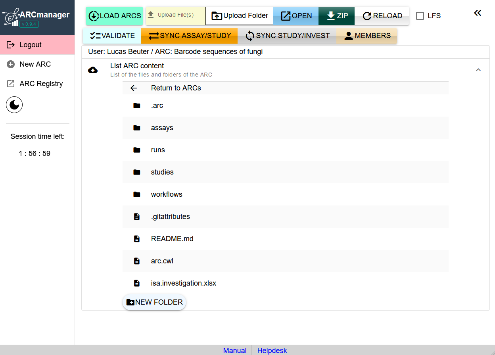

For the sake of simplicity, we are here using the term "ARC" for (DataHUB) "Project", because the DataHUB does not make any distinction between Projects that have the ARC folder and file structure and those that have not. Both are initially shown in the ARCmanager, but the ARCmanager has not been created for manipulating Projects which are not ARCs.

The ARCmanager is for viewing and editing ARCs.

### List and filter ARCs

Once you are logged in, you have several options for selecting which ARCs to view:

With the `LOAD ARC` button (Fig. 1), all ARCs on the DataHUB will be listed for which you have at least viewing rights. This includes ARCs that are set to public, ARCs to which you were added as a member, and ARCs owned by you. Your own ARCs are additionally highlighted in color.

---

**Fig. 1** Get a list of all publicly visible ARCs and your private ARCs with the `LOAD ARCS` button.

---

Use the `Your Arcs` check-box (Fig. 2) to filter the list of ARCs for those in which you are member and your own ARCs. Your own ARCs are again highlighted in yellow. 

---

**Fig. 2** Only show your own ARCs and those to which you were added as a member by using the `Your Arcs` check-box.

---

By default, the ARCs are sorted by the date of the last changes in descending order from latest to earliest.

If you are looking for a specific ARC, use the search bar above the ARC list to search for the title of the ARC.

Next to each listed ARC are two buttons to access the following functions:

- the lense button (Fig. 3, 1) will open the DataHUB page of your ARC in a new browser window

- the downward arrow button (Fig.3, 2) expands the ARC and allows you to browse its contents and interact with it

---

**Fig. 3** List of ARCs and buttons to interact with them. (1) Open DataHUB page of the ARC in a new browser window, (2) View ARC contents inside ARCmanager.

---

### View ARC contents

After expanding an ARC, you will see a list of directories and files that are included in the ARC (Fig. 4), as well as buttons to access additional functions. The additional functions are explained in detail later in this manual. For now, we will focus on the files and directories included in the ARC.

---

**Fig. 4** Detailed view of ARC contents after expanding an ARC with the corresponding button (Fig. 3, 2). Files and directories can be accessed with a left-click.

---

You can hide the ARC contents by clicking inside the `List ARC content` field above the list of files and directories (Fig. 5).

---

**Fig. 5** A Left-click inside the highlighted area hides ARC contents. Click again to bring back the list of files and directories.

---

Navigate through the ARC directories with a left-click. After clicking a directory, its contents will be displayed. You can go back one level in the directory hierarchy by using the `Return` field above the list of files (Fig. 6).

---

**Fig. 6** Use the `Return` field to go back one step in the directory hierarchy of your ARC.

---

When you click on a file instead of a directory, another panel on the right side will open that allows you to edit the selected file (Fig. 7). Plain text files (.md, .txt or similar) can be changed directly in this editor. Do not forget to save your changes and synchronize with the DataHUB by using the `SAVE` button when you are done.

---

**Fig. 7** When selecting a text file with a left-click, a text editor panel will open on the right side of the browser window. Here, you can edit the file directly and save changes.

---

When selecting an ISA file, the editor panel will open as well, but instead of a text editor you will see a form that allows you to add metadata entries to the ISA file (Fig. 8). To learn more about adding metadata using the ARCmanager, visit the corresponding [Manual page](./06_adding_metadata.html).

---

**Fig. 8** Opening an ISA file with a left-click will bring up a form that can be used to add metadata entries to the file.

---

You can hide/view the editor panel by clicking on the double arrow symbol at the top of the panel (Fig. 9).

---

**Fig. 9** The panel on the right side of the browser window can be hidden/displayed with the double arrow symbol.

---

When you expand the editor window without selecting a file to be edited first, a list of recent changes to the ARC will be shown instead.