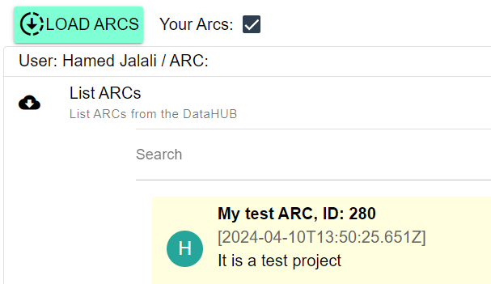
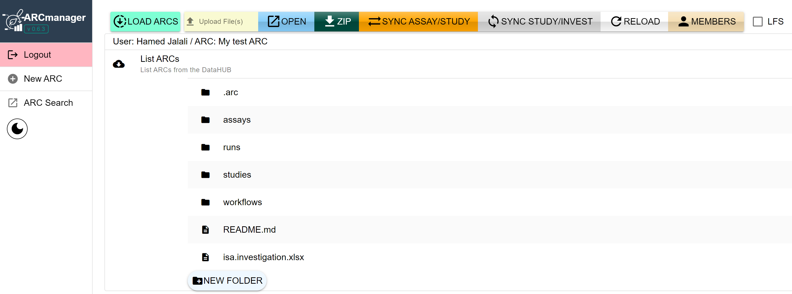

## Create ARCs in ARCmaanger

To create an ARC in ARCmanager, you can follow the below steps:

1. On the left side of the homepage, click on `New ARC` bottom:
    

        
    

2. In the new page, there are some fields that should be filled out:
     

        
    

- `Name of the ARC`: A name for your project in the datahub
- `Description of the ARC`: A short descritpion about the project you are creating  
- `Name of the ARC`: An identifier for your ARC (without space between the characters)

 

3. After submiting the form, you can see the new ARC in the `Your ARCs` window.
     
    

        
    

     
    Click on the created project to explore it.

4. The created ARC has contains four folders: *studies*, *assays* , *workflows*, and *runs*.  To get familiar with these folders, visit the [Annotated Research Context](https://www.nfdi4plants.de/nfdi4plants.knowledgebase/docs/implementation/AnnotatedResearchContext.html).

     
    

        
    

     

5.  To add/remove/edit members in the project, use the `MEMBERS` tab: 
    

        
    

     
    For instance, new users and their roles can be added in `Add User` option:  
    

        
    

     

6. By clicking on the `OPEN` bottom on the top of the page, you can open the related  `GitLab` page of the projec:
     
    

        
    

     

