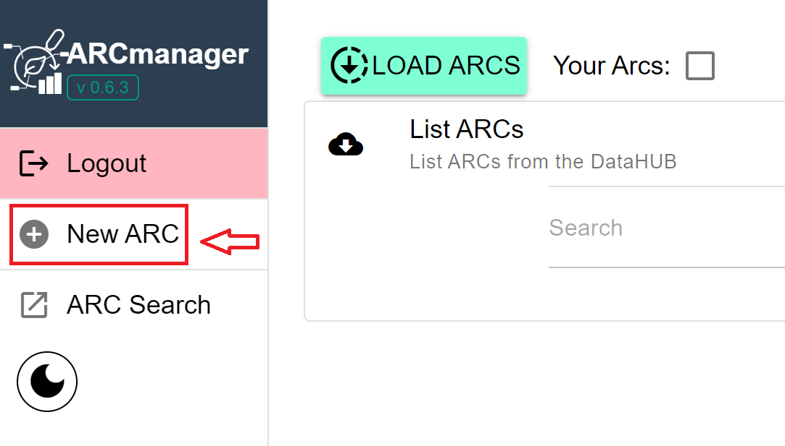
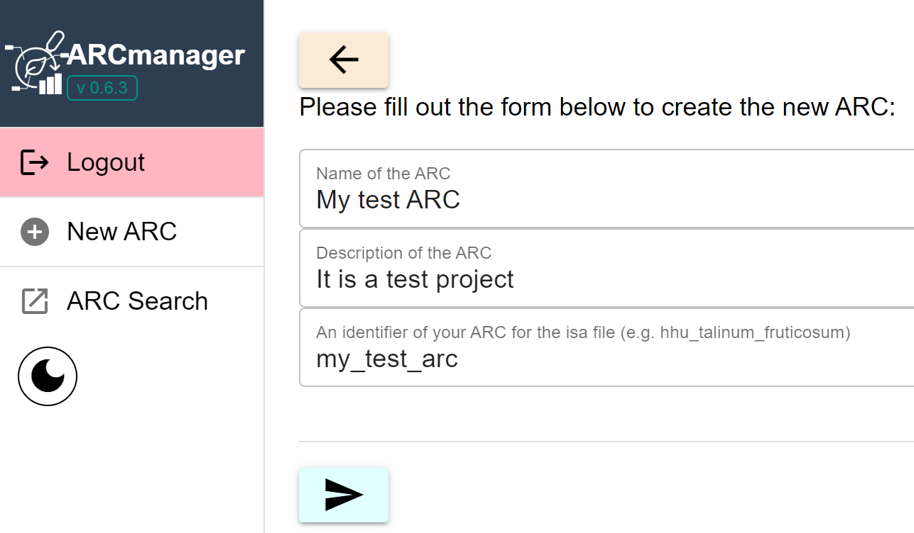
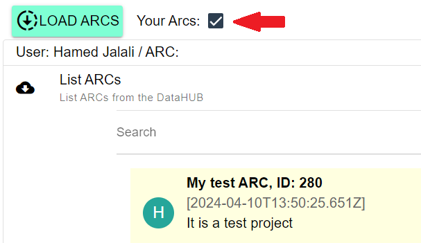
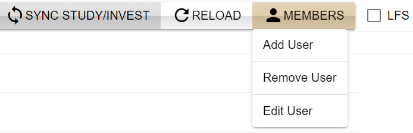
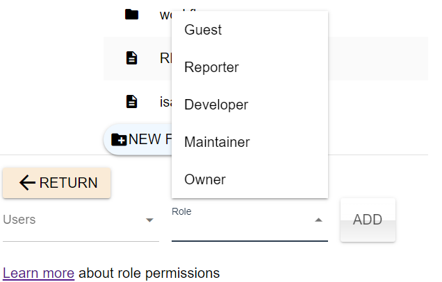
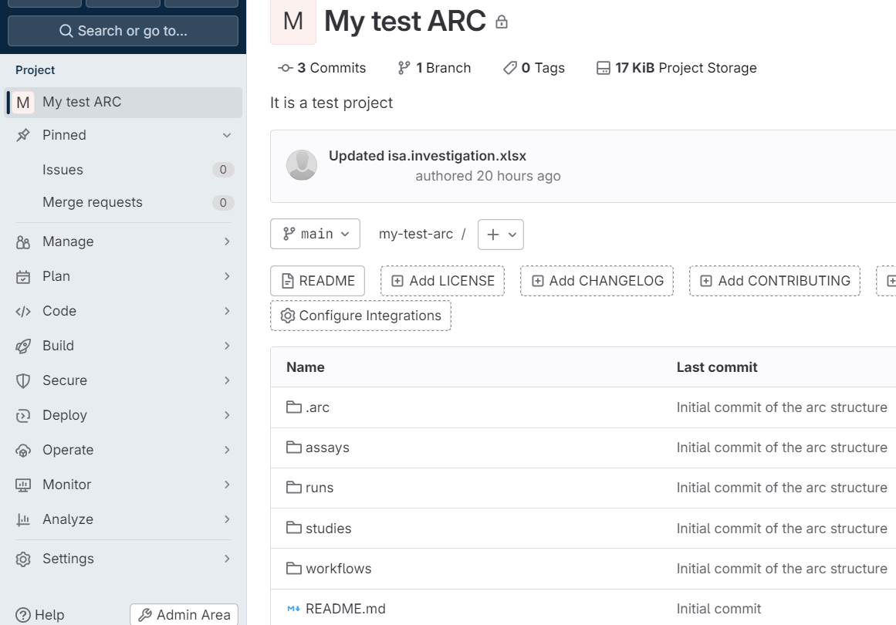

To create a new ARC in ARCmanager, follow the steps below:

1. On the left side of the homepage, click on the `New ARC` button:

    

        
    

2. In the new page, there are some fields that should be filled out:

     

        
    

- `Name of the ARC`: A name for your project in the DataHUB
- `Description of the ARC`: A short description about the project you are creating  
- `Name of the ARC`: An identifier for your ARC (without space between the characters)

---

:bulb: Note:

By default ARCs are created under your user name, i.e. in your namespace. If you wish to create an ARC in a group (or subgroup) tick the box `Group?` and select the group name from the drop down menu that is shown after ticking the box. 

Be aware that you need at least the [maintainer role](https://docs.gitlab.com/ee/user/permissions.html#roles) in a (sub)group to be able to create new ARCs with all necessary files in the groups namespace. 

---

3. After submitting the form, you can see the new ARC when selecting `Your ARCs` in the List ARCs window.

    

        
    

    Click on the created project to explore it.

4. The created ARC contains four folders: *studies*, *assays* , *workflows*, and *runs*.  To get familiar with these folders, visit the [Annotated Research Context knowledge base article](./../implementation/AnnotatedResearchContext.html).

    

        
    

5.  To add/remove/edit members in the project, use the `MEMBERS` tab: 

    

        
    

    For instance, new users and their roles can be added in `Add User` option:

    

        
    

6. By clicking on the `OPEN` button at the top of the page, you can open the new ARC directly in the respective DataHUB:

    

        
    

