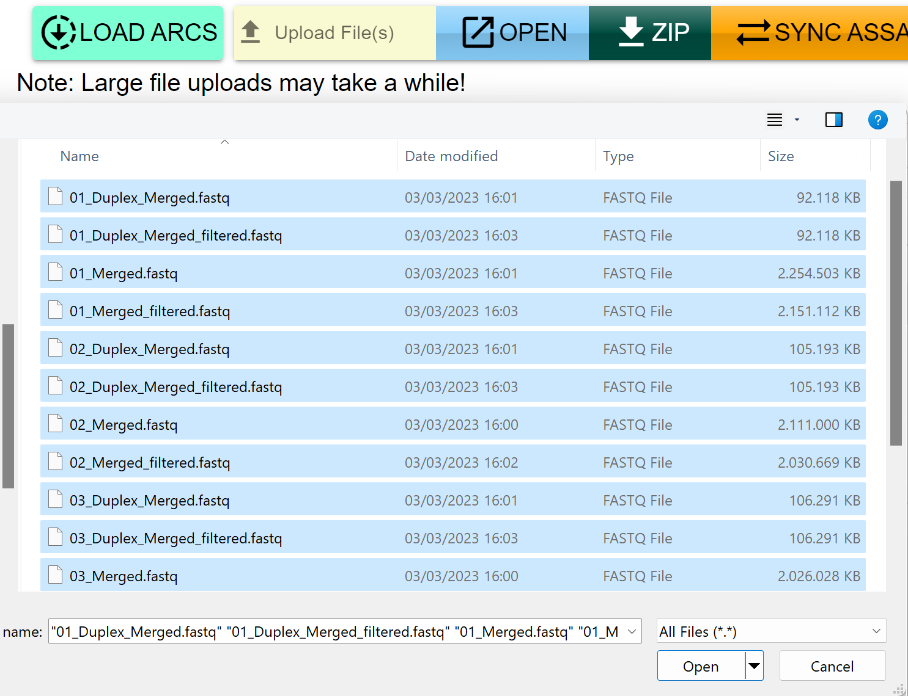

According to the  [ISA Metadata Model](https://www.nfdi4plants.de/nfdi4plants.knowledgebase/docs/ArcCommanderManual/arc_isa.html), each `study` is connected to an `Investigation` and can contain several `assays`.  Generally the raw data should be uploaded into  `assay` folder. Therefore, we need to first create the  `study`  folder and its relevant `assays`.  

1. In the `studies` folder, click on the `ADD` button to create a study. Then, follow the same procedure in the `assays` folder.
    
    

         
    

      

        
    
  

2. Now according to the ISA model, the investigation, studies, and assays should be linked to each other, studies to investigation and assays to studies. The **SYNC** functions perform these tasks. 

    In the project folder, click on `SYNC STUDY/INVEST` and choose the study created before.  Then click on `SYNC ASSAY/STUDY` and link the relevant studies and assays.  

    

         
    

    

    
    

3. Assume we need to add some raw data in the assay folder. Then, in the relevant assay, go to the `dataset` folder and use the `UPLOAD File(s)` button. Then, in the local system, select the data files.

    

         
    

    

        
    

If the size of the data files is large (>100Mb), the  large file system package in Git is needed. To use this function for an upload, check the  `LFS` option:

        
    

