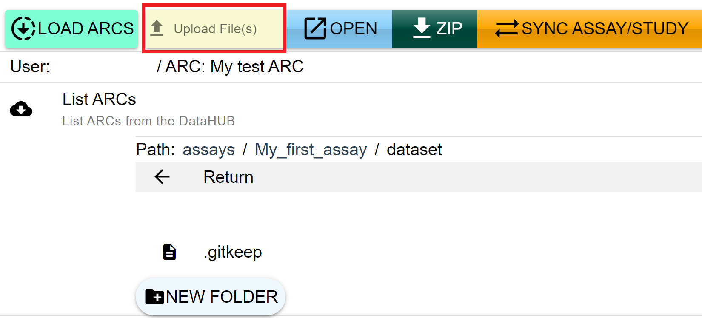
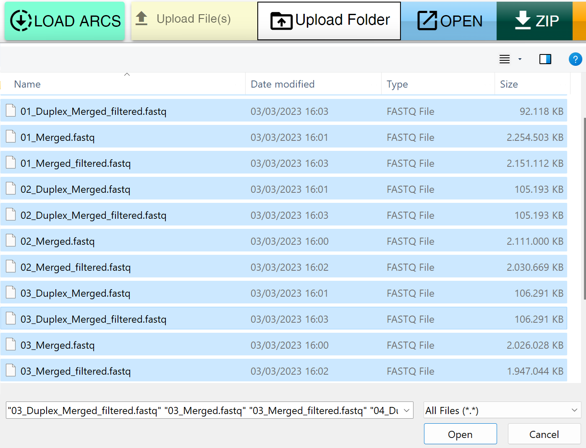
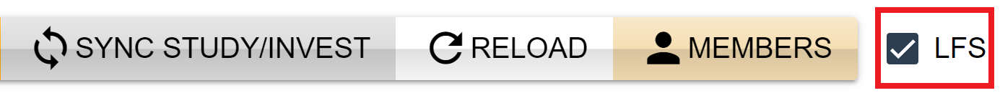

You can upload raw data from your local computer directly to the remote copy of your ARC on any DataHUB by using the ARCmanager. Assume we need to add some raw data to the dataset directory of an existing assay. To do so, first navigate to the `dataset` folder and use the `UPLOAD File(s)` button at the top of the screen. Then, select the files you want to upload from your local file system, and click `Open` to begin with the upload.

     

If you want to upload a whole folder instead of single files, use the `Upload Folder` button:

    

If the size of the data files is large (>100Mb), the  large file system package in Git is needed. To use this function for an upload, check the  `LFS` option and then start the upload as described before.

        

