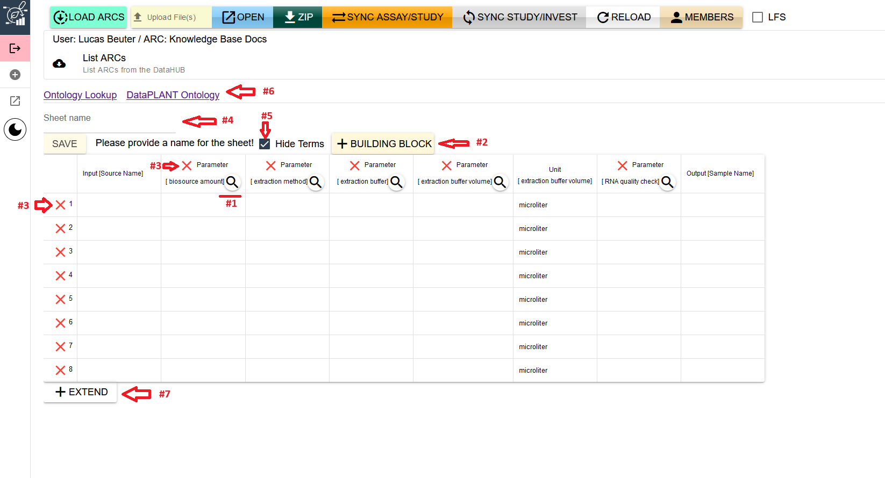

## Adding Metadata

Two different types of metadata are stored in ISA files: administrative and experimental metadata. Administrative metadata covers IDs, descriptions, contact details, connected publications and more, while experimental metadata is describing experimental procedures and similar processes. ISA files are normally stored in an Excel format (.xlsx) but can also be edited directly through the ARCmanager.

A typical ISA file has the administrative metadata recorded in the first sheet of the Excel file. In addition, every isa.study.xlsx and isa.assay.xlsx file should have at least one more sheet where the experimental metadata is annotated, that is maintained through SWATE. Both types of metadata can be edited with the ARCmanager.

### Administrative Metadata

When you left-click on an ISA file, the right side will open up and show the administrative metadata:

The metadata is separated into three parts:

1. Main information
2. Publications
3. Contact details

The **main information** part contains mandatory data like the title, identifier and description of the respective fields ISA file.\
In isa.assay.xlsx files, it contains information about measurement types and technology types, instead:

The **publication** part contains information about DOIs, publication titles, authors, etc. of publications that are associated with the experimental data stored inside the study/investigation.

Isa.assay.xlsx files do not contain publication data, which is instead recorded in the connected study. 

The **contact details** part contains data bout researchers associated with the investigation/study/assay. It contains information like first and last name, email, work address, and affiliation. Every ISA file has a contact section.

You can fill out the metadata fields gradually as the research progresses. Make sure to keep the metadata record as complete as possible to enhance findability and reusability of your data.

When you are done with your changes, just click the `SAVE` button on the bottom to save your data and send it to the respective DataHUB.

#### Alternative view

To edit any not field not listed in the main view, you can click the checkmark on the top right named "alternative" to open up a different view of the data stored inside.

Here you have every row listed similar to excel. With this view you are able to edit rows like "Comment[ORCID]".\
To edit the row simply click on it.
On the main part in the middle a new input field will open up.

For every column inside of the isa file there will be an input field. So if you, for example, have filled out five contacts already and you want to add the respective ORCIDs for these contacts, you will have five rows of input.\
You can extend these by pressing the "+" button which in return will add a new column to the isa file.\
When you are done filling out the data, again simply press the "save" button below to save your data.

Every time you press "save" the data will be written into the excel file and afterwards be uploaded to your ARC inside the DataHUB.

### Experimental Metadata

When you want to edit/create experimental metadata, you need to go into either an assay or a study folder.
Inside you have your ISA file as usual, but with the additional fields called "ADD SHEET" and "EDIT SHEET".

If you already have some annotation sheets in your study/assay you can click "EDIT SHEET" and select the sheet from the list on the right side.\
Otherwise you need to click "ADD SHEET". This will open up a list of templates on the right side.

Here you can select any desired template. Use the search bar on top to find any template you are looking for.\
If you want to start from scratch select the "Empty Template", the first entry in the list.\

Every Template is listed with its title, the organisation where its originating from, as well as the current version. \
When you expand a template you also can read the description and the author list.

If you found your desired template, press the "IMPORT" button after expand it (simply click on it).

After importing the template you will see a table similar to the picture below.

In this case it's the template "RNA extraction (DataPLANT) 1.2.0", extended to eight rows.\
The following will explain the different interfaces:

<ol>
<li>Search term: When you click the magnifying glass a search bar opens above the sheet name bar. With it you can search for a specific term regarding this parameter. Or you can get suggestion terms fitting for this parameter</li>
<li>Add building block: By clicking this button you open up additional input fields above. These are for when you want to add a new column to the table, a new "building block". They also support the search for terms like mentioned before, this time for building blocks.</li>
<li>Delete row/column: By clicking the "X" mark you can either delete the row or the column (depending on the mark you clicked). After clicking the "X" a popup menu will show up and asks for confirmation regarding the deletion. After confirming, the respective row/column will be deleted.</li>
<li>Sheet name: This input field allows you to name your sheet. It is mandatory to fill this field before saving, otherwise it can't be written into the excel file. (Try avoiding whitespace when naming the sheet)</li>
<li>Hide Terms: This checkbox is enabled by default and hides the "Term Source REF" and "Tern Accession Number" column for every parameter, thus enabling better visibility and overview of the table. By unchecking the box you can see these columns.</li>
<li>Ontology links: These links will direct you to either the ontology lookup site or the Dataplant ontology stored on github.</li>
<li>Extend the table: This button simply adds a new row to table.</li>
</ol>

When clicking the search term button mentioned with "#1" you can start searching for specific terms.

In this case we are searching for a "library strategy". (from the template "RNASeq Assay (DataPLANT) 1.2.0")

When you press the button "GET SUGGESTIONS" (#2) you will get a list of terms on the right side filled with fitting terms.

You can import a term by clicking on it and pressing the "INSERT" button, similar to how it is done with the list of templates.

If you want to search for a specific term you can fill out the search bar (#3) and click the "SEARCH" button afterwards. \
This will search for every fitting term with that given name. (Or for any type of term with that name if you check the "extended search" box)

Per default the term will be inserted into row number 1 of the corresponding column. But if you want to add the term to another row you need to select the row first from the selector. Afterwards when you press the "INSERT" button from the terms list, the term will be added to the selected row.

When you uncheck the "Hide Terms" box you can also see, that the term columns are filled out properly after inserting the term.

You can also fill out the cells manually of course with terms and names. Just as it is possible in excel.

The first column of the table is always the "input" column. In the squared brackets behind is a placeholder named "source name", indicating that the input is a general source. You can change that field to something more fitting, like "Extract Material" or "Image File".

Same goes for the output column. The output is always at the end of the table and has the placeholder "Sample name", indicating a general sample. \
You can read more about this in the [ARC-specification](https://github.com/nfdi4plants/ARC-specification/blob/main/ISA-XLSX.md#inputs-and-outputs).

When you press the "Building Block" button mentioned before, a new input view will open up.\
It includes a selector for you to select the fitting type, like "Parameter" or "Characteristic". (#1)\
Below it is a search bar. Here you can search for any name for the parameter similar to the search for terms. (#2)
There will also be a list of terms for the building block on the right side.\
If your parameter is a type of unit, then check the "Unit?" checkbox (#3) above.\
This will add a second search bar where you can search the name of the unit, like "liter" for the parameter "volume".

As usual you can add the selected term on the right by clicking the "SELECT" button. (You must first add the parameter column before adding the unit column. So first search for "volumne", select it and then search for "liter")

When you are done filling out the table with all the data you have, name your sheet and press the "SAVE" button.\
This will create a new sheet and table in the excel file. The table will be filled out accordingly and afterwards be uploaded to the ARC in the DataHUB.

When you now press the "EDIT SHEET" button mentioned in the beginning you should now be able to see and edit your newly created sheet. (if the creation and upload was successful)
