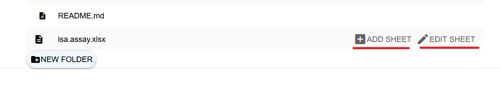

Two different types of metadata are stored in ISA files: administrative and experimental metadata. Administrative metadata covers IDs, descriptions, contact details, connected publications and more, while experimental metadata is describing experimental procedures and similar processes. ISA files are normally stored in an Excel format (.xlsx) and need to adhere to the [ISA-XLSX specification](https://github.com/nfdi4plants/ARC-specification/blob/main/ISA-XLSX.md).

A typical ISA file has the administrative metadata recorded in the first sheet of the Excel file (top-level metadata sheet). In addition, every _isa.study.xlsx_ and _isa.assay.xlsx_ file should have at least one more sheet where the experimental metadata is annotated (annotation table sheets), that is maintained through Swate. Both types of metadata can be edited with the ARCmanager. You can find more information about ISA file types and metadata sheets in the corresponding [knowledge base article](./../guides/isa_FileTypes.html) and the [ISA-XLSX specification](https://github.com/nfdi4plants/ARC-specification/blob/main/ISA-XLSX.md).

#### Contents:

- [Administrative metadata (top-level metadata sheets)](#administrative-metadata-top-level-metadata-sheets)
   * [Alternative view](#alternative-view) 
- [Experimental metadata (annotation table sheets)](#experimental-metadata-annotation-table-sheets)
   * [Add new annotation table sheets](#add-new-annotation-table-sheets)
   * [Import annotation table templates](#import-annotation-table-templates)
   * [Edit annotation table sheets](#edit-annotation-table-sheets)
   * [Ontology term search](#ontology-term-search)
   * [Adding new building blocks to annotation tables](#adding-new-building-blocks-to-annotation-tables)

### Administrative Metadata (top-level metadata sheets)

When you left-click on an ISA file, the right side will open up and a form to edit administrative metadata is shown:

---

**Fig. 1** Default view of administrative metadata inside _isa.investigation.xlsx_ files displayed in the ARCmanager web application. (1) General information, (2) related publication information, (3) contact details of associated persons.

---

The metadata is separated into three parts:

1. General Information
2. Publications
3. Contact details

The **general information** part contains mandatory data like the title, identifier and description of the respective investigation/study.

In assay metadata files (_isa.assay.xlsx_), it contains information about measurement types and technology types, instead:

---

**Fig. 2** Default view of top-level metadata sheet inside an _isa.assay.xlsx_ file displayed in ARCmanager.

---

The **publication** part contains information about DOIs, publication titles, authors, etc. of publications that are associated with the experimental data stored inside the study/investigation.

_isa.assay.xlsx_ files do not contain publication data, which is instead recorded in the connected study. 

The **contact details** part contains data about researchers associated with the investigation/study/assay. It contains information like first and last name, email, work address, and affiliation. Every ISA file has a contact section.

You can fill out the metadata fields gradually as the research progresses. Make sure to keep the metadata record as complete as possible to enhance findability and reusability of your data.

When you are done with your changes, just click the `SAVE` button in the bottom to save your data and send it to the respective DataHUB.

[Back to table of contents](#contents) 

#### Alternative view

To edit additional metadata entries not listed in the main view, you can click the checkmark on the top right named `alternative` to open up a different view of the data stored inside.

---

**Fig. 3** Alternative view of ISA file contents which can be used to edit additional fields not displayed in the default view. (1) General information, (2) related publication information, (3) contact details of associated persons.

---

In this alternative view, all metadata fields that are included in the original .xlsx file are shown. This allows adding additional information, like the ORCID of associated persons (`Comment[ORCID]`)

To edit a metadata field, select it with a left-click. This will open a new input field in the main part in the middle of the browser window:

---

**Fig. 4** Input field to add data to ISA files using the alternative view. The `+` button adds additional fields, while `SAVE` is used to apply changes to the ISA file.

---

For every column inside of the ISA file there will be an input field. So if you, for example, have added five contacts to an investigation file already and want to add the respective ORCIDs for these contacts, you will have five rows of input. You can add new entries by clicking the `+` button which will add a new column to the ISA file in return.

When you are done filling out the data, click the `SAVE` button below to add the changes to the ISA file.

Every time you click `SAVE`, the data is written into the excel file and changes are synchronized with your ARC on the corresponding DataHUB.

[Back to table of contents](#contents) 

### Experimental Metadata (annotation table sheets)

#### Add new annotation table sheets

When you want to edit/create experimental metadata, you need to go into either an assay or a study folder.
Inside you have your ISA file as usual, but with the additional fields called `ADD SHEET` and `EDIT SHEET`.

---

**Fig. 5** Buttons to add additional metadata sheets to ISA files and to access editing of existing sheets.

---

If you already have some annotation sheets in your study/assay you can click `EDIT SHEET` and select the sheet from the list on the right side.

[Back to table of contents](#contents) 

#### Import annotation table templates

To add additional metadata sheets, click `ADD SHEET`. This will open up a list of templates on the right side.

---

**Fig. 6** List of existing templates for annotation table sheets. Clicking on the template displays additional information. The `IMPORT` button loads the selected template into the metadata sheet.

---

Here, you can select any desired template. Use the search bar on top to find any template you are looking for. If you want to start from scratch select the "Empty Template", the first entry in the list.

Every Template is listed with its title, the organisation where its originating from, as well as the current version. When you expand a template you also can read the description and the author list.

If you found your desired template, click on the `IMPORT` button after expand it.

[Back to table of contents](#contents) 

#### Edit annotation table sheets

After importing a template, you will see a table similar to the picture below. In this case it's the template "RNA extraction (DataPLANT) 1.2.0", extended to eight rows.

---

**Fig. 7** Metadata sheet editing view inside ARCmanager.

---

The following will explain the different interfaces:

1. **Search term:** A click on the magnifying glass symbols opens a search bar above the sheet name bar (4). The search bar allows you to search for specific ontology terms or to get suggestions for terms that fit the parameter.

2. **Add building block:** Clicking this button will open up additional input fields above that allow adding new columns to the metadata table.

3. **Delete row/column:** Clicking the red "X" will delete the corresponding row or building block. The deletion of elements has to be confirmed in a pop-up menu before the action takes effect.

4. **Sheet name:** This input field allows you to name your metadata sheet. It is mandatory to fill this field in before saving a newly created metadata sheet. Do not use whitespace characters when naming the sheet.

5. **Hide Terms:** This checkbox is enabled by default and hides the "Term Source REF" and "Term Accession Number" column for every parameter/characteristic. Hiding these columns is meant to improve readability of annotation tables. By unchecking the box, the otherwise hidden columns will be displayed.

6. **Ontology links:** These links will direct you to either the ontology lookup site or the DataPLANT ontology repository on GitHub.

7. **Extend the table:** This button adds a new row to table.

[Back to table of contents](#contents) 

#### Ontology term search

---

**Fig. 8** Ontology term look-up functions of the annotation table editing view in ARCmanager. (1) Access ontology term search function, (2) Get ontology term suggestions, (3) Search bar for finding specific terms.

---

By clicking on the magnifying glass (Fig. 8, 1) you can start searching for ontology terms for the corresponding building block. In the example shown in Fig.8, we are searching for a "library strategy" inside the "RNASeq Assay (DataPLANT) 1.2.0" template.

Clicking the `GET SUGGESTIONS` button (Fig. 8, 2) will display a list of terms on the right side of the browser window with terms that are connected to the higher level term of the building block (Fig. 9).

---

**Fig. 9** List of suggested ontology terms related to "library strategy". (1) Ontology term and link to the corresponding ontology entry, (2) drop-down menu to choose annotation table row where the term will be added, (3) button to insert the selected term into the table.

---

When expanding a term from the suggestion list by clicking on it, a short definition and additional options are shown. You can insert the selected term into the metadata annotation table with the `INSERT` button (Fig. 9, 3).

If you want to search for a specific term you can type it directly in the search bar (Fig. 8, 3) and click the `SEARCH` button afterwards. In this default search mode only terms connected to the higher level ontology term of the building block are considered. If you want to expand the search to all possible terms, check the box labeled "Extended search".

By default, the term will be inserted into the first row of the corresponding column. If you want to add the term to another row, select the row number with the drop-down menu (Fig. 9, 2). Clicking the `INSERT` button will add the term to the annotation table sheet.

---

**Fig. 10** Additional columns with ontology term information will be displayed when unchecking the "Hide Terms" box.

---

Every cell of the annotation table sheets can also be filled out manually, instead of using the integrated ontology term search function. To do so, click inside a cell and start typing.

[Back to table of contents](#contents) 

#### Adding new building blocks to annotation tables

The first and last column of each annotation table sheet must be "Input" and "Output" columns, respectively. These columns should contain distinct descriptors of entities that served as an input and output of the workflow described in the annotation table sheet.

By default, input columns have the type "Source Name" and output columns have the type "Sample Name". The type of input and output columns can be changed manually by clicking into the respective header field and changing the text between the squared brackets. Valid column types for input and output columns are: [Source Name], [Sample Name], [Material Name], and [Data]. You can find more details about this in the [ISA-XLSX specification](https://github.com/nfdi4plants/ARC-specification/blob/main/ISA-XLSX.md#inputs-and-outputs).

---

**Fig. 11** Interface for adding new building blocks to annotation table sheets. (1) Drop-down menu for selection of column type, (2) Ontology term search bar, (3) Check-box for adding a unit to a building block and search bar for unit terms.

---

To add additional attribute columns to the annotation sheet, click the `+BUILDING BLOCK` button. A new input area (Fig. 11) will open above the annotation table that assists you in designing the attribute column according to the ISA-XLSX specifications. 

First, select a type for the new column from the drop-down menu (Fig. 11, 1). Available column types are [Characteristic](https://github.com/nfdi4plants/ARC-specification/blob/main/ISA-XLSX.md#characteristics), [Factor](https://github.com/nfdi4plants/ARC-specification/blob/main/ISA-XLSX.md#factors), [Component](https://github.com/nfdi4plants/ARC-specification/blob/main/ISA-XLSX.md#components), [Parameter](https://github.com/nfdi4plants/ARC-specification/blob/main/ISA-XLSX.md#parameters), [Comment](https://github.com/nfdi4plants/ARC-specification/blob/main/ISA-XLSX.md#comments), and [Protocol](https://github.com/nfdi4plants/ARC-specification/blob/main/ISA-XLSX.md#protocol-columns).

Below the column type drop-down menu is a search bar that can be used to search for ontology terms that specify the contents of the new building block (Fig. 11, 2). 

If the new building block will contain numeric values that have a unit, check the "Unit?" checkbox above (Fig. 11, 3). This will add a second search bar where you can search the ontology database for unit terms, like "liter" for the parameter "volume".

Search results will be displayed on the right side and can be applied to the annotation table with the `SELECT` button. When adding a unit to a building block, make sure to select a building block term first, and afterwards search for a unit and apply it to the annotation table.

When you are done with editing the annotation table, name your sheet and click the `SAVE` button. This will create a new sheet with the annotation table in the ISA Excel file or update an existing one if you were editing. The changes will be directly applied to the remote copy of your ARC on the corresponding DataHUB.

[Back to table of contents](#contents) 

