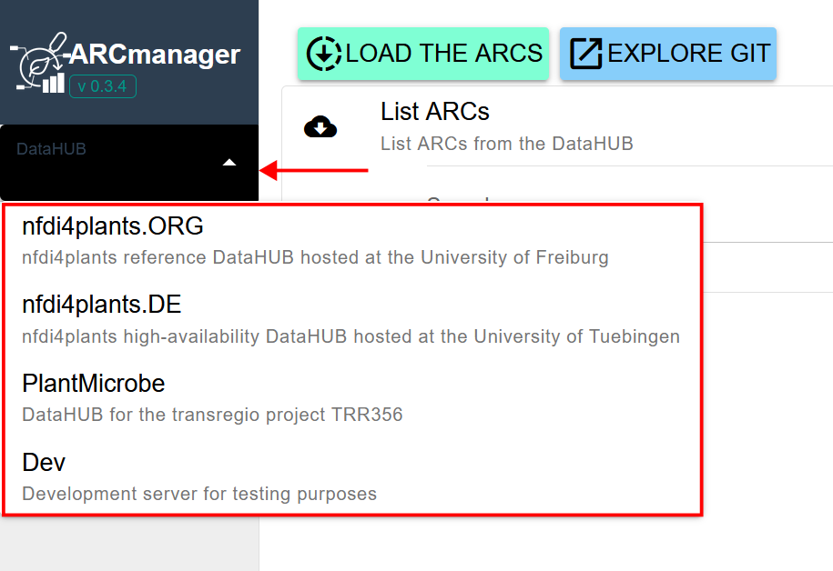
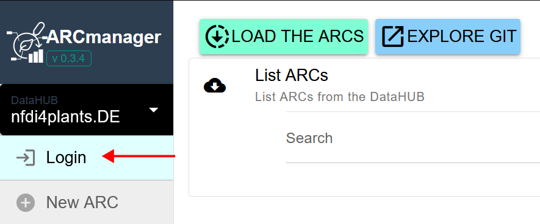
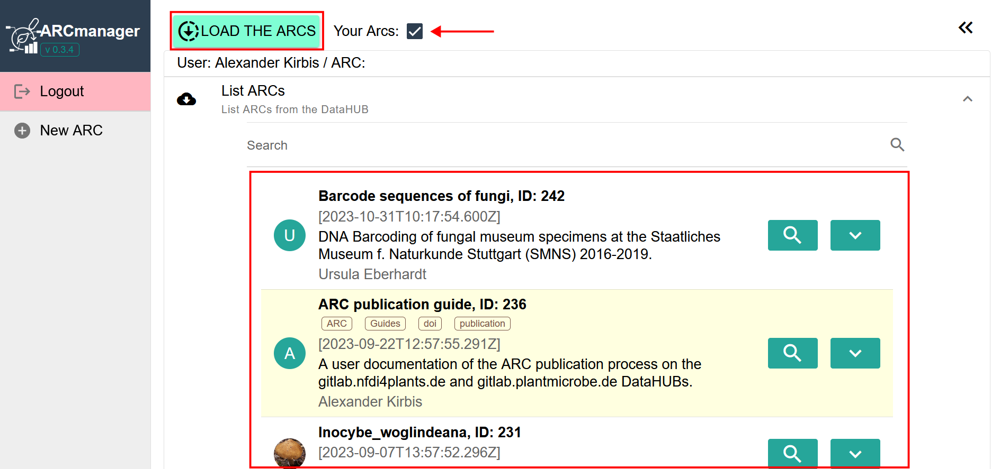

Using the ARCmanager does not require any prior software setup or similar. However, a basic understanding of the [ARC concept](https://nfdi4plants.org/nfdi4plants.knowledgebase/docs/implementation/AnnotatedResearchContext.html) and other DataPLANT services, in particular the [DataHUBs](https://nfdi4plants.org/nfdi4plants.knowledgebase/docs/DataHUB-Manual/index.html), is beneficial.

To get started, visit the [ARCmanager domain](https://nfdi4plants.de/arcmanager/app/index.html) with a web browser of your choice.

On the left side, select a DataHUB of your choice and click on the 'Login' button. You will be forwarded to the login page of the selected DataHUB. After entering your credentials, you have to confirm that the ARCmanager service is allowed to access and modify your ARCs on this DataHUB.

    
    

You will then be redirected to the ARCmanager webpage again. Now, that you are logged in, you can load all publicly available ARCs and the ARCs that are owned by you (highlighted in yellow). You can view details of your ARCs, edit files, add new studies or assays, or edit metadata annotation sheets. Clicking on the 'New ARC' button on the left side will guide you through the process of creating a new ARC.

A more detailed user guide will follow soon. In the meantime, we encourage users to experiment with the web service. You don't need to be afraid to mess up your ARCs, since the version control feature of all DataHUBs allows undoing all changes that were made through the ARCmanager. On the same note, we have intentionally not included a 'Delete ARC' feature for the time being to prevent all possibilities of data loss. If you want to delete a test ARC or similar, this is best done through the homepage of the corresponding DataHUB.
