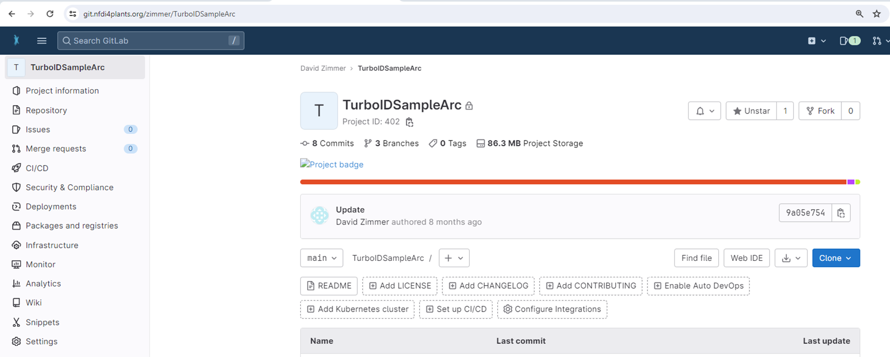
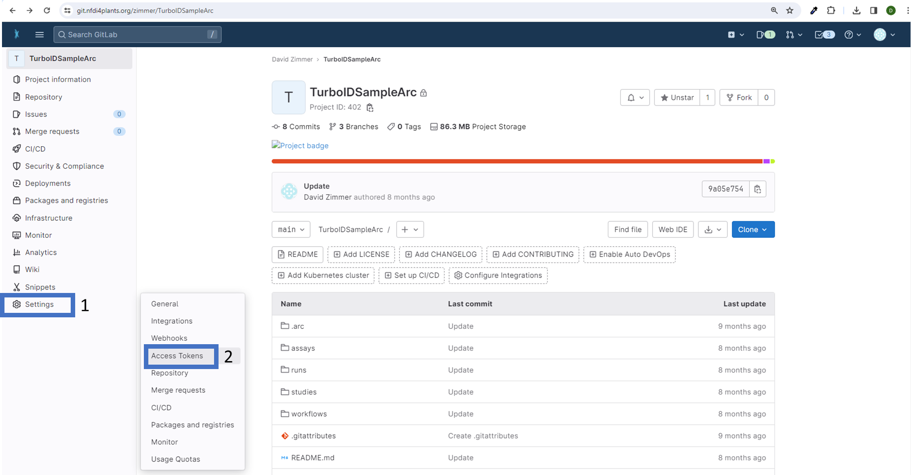
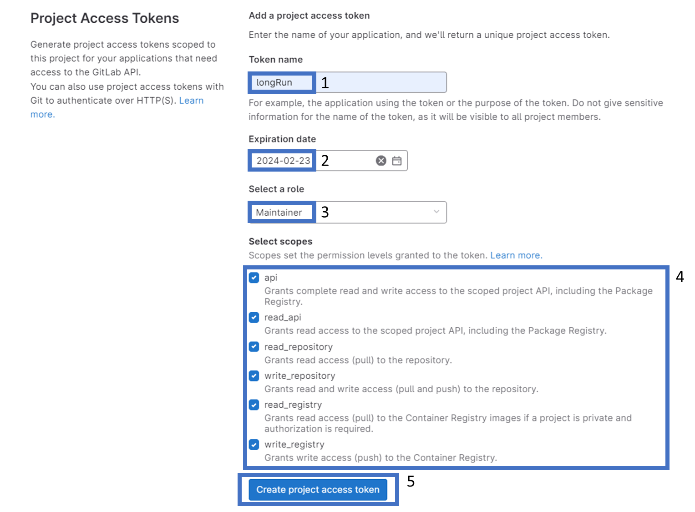
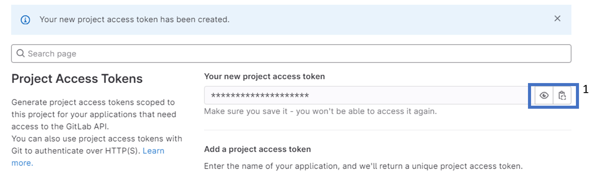

The [DataHUB](<https://git.nfdi4plants.org>) allows you to share your ARCs with registered lab or project partners. After [registration](<https://register.nfdi4plants.org>), you need to setup the ARC Commander for smooth ARC synchronization between your computer and the DataHUB.

:bulb: This needs to be done only once per computer.

## Enable Git to store credentials on your computer

Open a command prompt or terminal and execute the following command(s)

### Windows / Linux

```bash
git config --global credential.helper store
```

### MacOS

```bash
git config --global credential.helper osxkeychain
```

## Receive and store a DataHUB temporary (2 hour) access token

```bash
arc remote accesstoken get -s https://git.nfdi4plants.org
```

A browser window will open asking for your DataPLANT login. After login you are asked to authorize your computer to communicate with the DataHUB.  
In case you are already logged in, the browser will directly display a plain `Success` message to you.

:bulb: This authenticates your computer to communicate with your personal DataHUB account

:bulb: After two hours you have to repeat this process as this token will expire. Have a look at the next section to learn how to create a longer lasting token.

## Create and store a configurable DataHUB access token for your project

Access tokens created with the ARCommander expire after two hours. To create a longer-lasting access token for your project, follow these steps:

1. In your browser, visit your ARC in the DataHub instance of your choice, e.g.:


2. Select 'Settings' (1), then 'Access Tokens' (2):


3. Choose a name for your token (1), set an expiration date (2), assign a role (3), configure permissions (4), and create your token (5):


4. Once created, you can copy the token:


5. Finally, save the token by opening a command-line interface and navigating to the root of your project. Then, execute to save your token locally:

```bash
arc remoteaccess accesstoken store --token <replaceWithYourToken>
```

Once set up, you will not need to authenticate yourself (e.g., by manually retrieving a token through 'arc remote token get') until the token expires. When switching to another machine you have to repeat the process.
