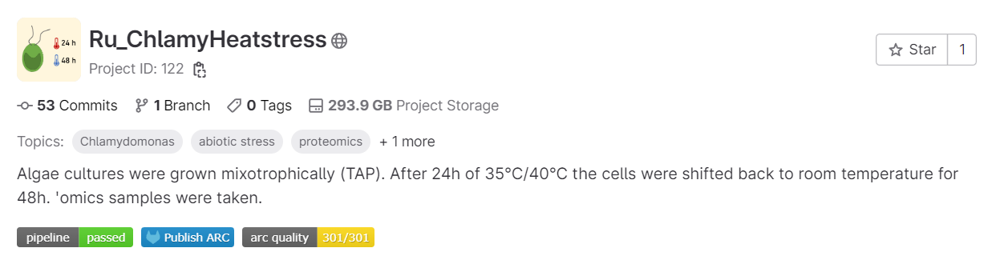
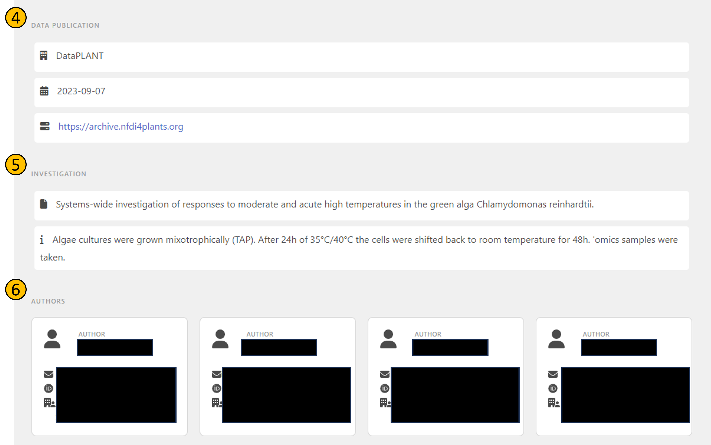
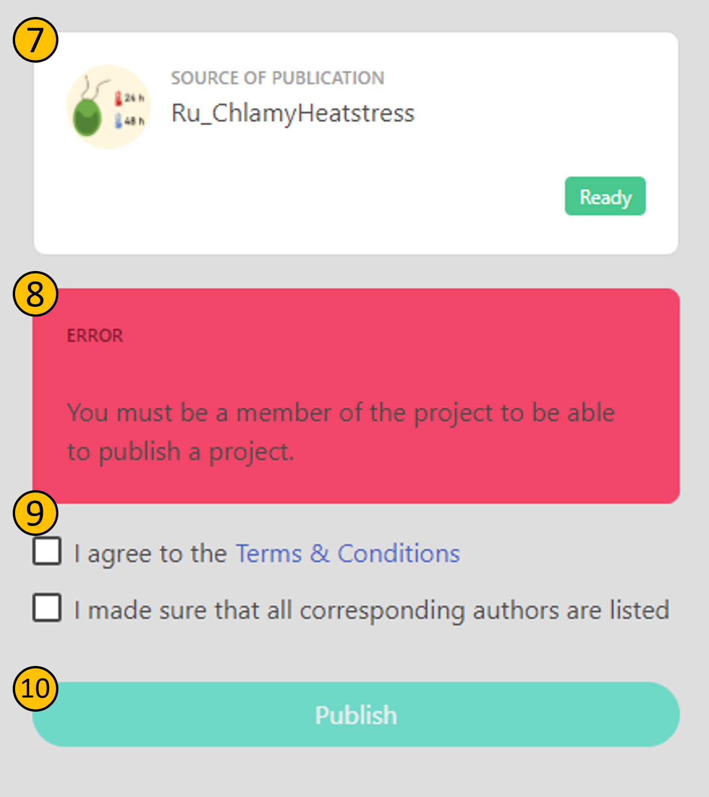

ARChigator is a tool for submitting ARCs hosted on DataHUB for publication to the [ARChive](https://archive.nfdi4plants.org/communities/dataplant).

## Start the publication process

To start the publication process, click on the _publish button_ (**2**) on the ARC homepage. Make sure that the test pipeline (**1**) passes, otherwise you will not be able to proceed to the next steps.

- **(1)**: The _pipeline badge_ indicates wether all steps of CQC have passed, or if there are any failures.
- **(2)**: The _publish button_ is used to submit the ARC to the ARChive via [ARChigator](datahub-data-publications-archigator.html). Note that ARCs that fail CQC are not eligible for publication.
- **(3)**: The _arc quality badge_ indicates the overall metadata quality of the ARC. This is calculated based on the results of the CQC pipeline, and signifies how many of the performed tests have passed. The badge is color-coded, and the color indicates the quality of the ARC.

## Review record metadata

After clicking the _publish button_ (**2**), you will be redirected to the ARChigator page, where you can review the metadata of the record that will be created in the ARChive. Note that you can only proceed to this page if you are logged in to DataHUB.

- **(4)**: The source of your ARC
- **(5)**: Selected investigation metadata from the ARC that will also be shown in the publication record
- **(6)**: Author metadata from the ARC that will also be shown in the publication record. Note that author details are blacked out here for privacy reasons.

Once you double-checked the metadata, you can proceed to submitting the ARC.

## Submit the ARC

- **(7)**: Name and image of the ARC. The `Ready` badge signifies that this ARC is eligible for publication (it has passed the CQC pipeline **(1)**). Note that you are stopped from publishing here at latest if the CQC pipeline fails.
- **(8)**: You cannot publish an ARC that you do not have access control for on the DataHUB instance it is hosted on.
- **(9)**: You can only publish an ARC if you agree to the terms of use of the ARChive and made sure to include all authors.
- **(10)**: Clicking on the _publish button_ will submit the ARC to the ARChive.

After clicking on the _publish button_ (**10**), your ARC is officially in Request For Publication (**RFP**) stage. You will receive a confirmation mail with a link to the publication status page of your ARC.

## Publication status

Once you clicked on the _publish button_ (**10**), you will be redirected to the submission ticket, and receive a confirmation mail. For more information on tracking the publication progress, refer to this [guide](datahub-data-publications-status.html).