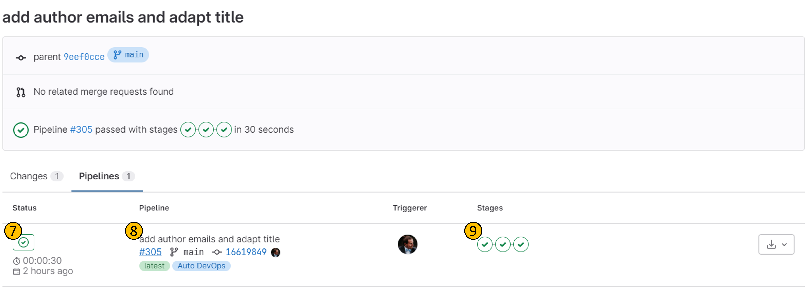
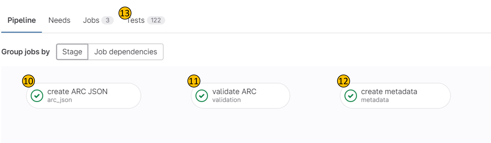

Continuous Quality Control (**CQC**) is a process that ensures the quality of the metadata of an ARC meets certain standards.

CQC is performed on each commit to an ARC, and the results are displayed on the ARC homepage:

## ARC homepage

- **(1)**: The _pipeline badge_ indicates wether all steps of CQC have passed, or if there are any failures.
- **(2)**: The _publish button_ is used to submit the ARC to the ARChive via [ARChigator](datahub-data-publications-archigator.html). Note that ARCs that fail CQC are not eligible for publication.
- **(3)**: The _arc quality badge_ indicates the overall metadata quality of the ARC. This is calculated based on the results of the CQC pipeline, and signifies how many of the performed tests have passed. The badge is color-coded, and the color indicates the quality of the ARC.

For more details, you can click on the pipeline badge **(1)**, and investigate the steps of the CQC pipeline details:

## CQC pipeline details

- **(4)**: List of commits, with the most recent commit on top.
- **(5)**: _Pipeline result_: If the pipeline passed, it shows a green checkmark.
- **(6)**: _Pipeline result_: If the pipeline failed, it shows a red cross.

Click on a _pipeline result_ (e.g., **(4)**) of a commit of choice to open the CQC pipeline details for that commit.

On the next page, you can see the details of the CQC pipeline for the selected commit:

- **(7)**: overall pipeline result
- **(8)**: associated commit information
- **(9)**: pipeline step results

Clicking on **(7)** will open the CQC pipeline, where each step can be viewed in detail:

- **(10)** _CQC step 1_: a machine-readable representation (JSON) of the ARC metadata is created and linked with the commit, which makes it discoverable for search tools. 
- **(11)** _CQC step 2_: ARC metadata is subjected to a set of quality checks, e.g., if ORCIDs associated with persons are valid or if each author has a contact email. 
- **(12)** _CQC step 3_: The ARC metadata is converted to a metadata record, which is used by subsequent tools to trigger the data publication and associated creation of a DOI via DataCite for that record.
- **(13)**: _Test tab_ shows the results of each individual test performed in _CQC step 2_ **(11)**

## Starting the publication process

Clicking on the _publish button_ **(2)** on the ARC homepage will start the publication process. Refer to the [ARChigator guide](datahub-data-publications-archigator.html) for more information on the publication process.

## What to do when the CQC pipeline fails?

There are multiple issues that can lead to a failed CQC pipeline:

### CQC step 1 fails

_CQC step 1_ **(10)**, should never fail, as it usually creates a json file even when there is no ARC in the repository. If this step fails, please contact the DataHUB support team, as there is something fundamentally wrong with your repository.

### CQC step 2 fails

_CQC step 2_ **(11)**, is the most common step to fail. This step contains a set of critical quality checks that **MUST** pass in order for the ARC to be eligible for publication, and a set of non-critical checks that signify metadata quality. Only failed critical tests lead to a failed CQC pipeline. If this happens, investigate the failed tests in the _Test tab_ **(13)**, and fix the issues based on the information displayed there. An example could for example be a person not having a first name in your investigation metadata. Commit your changes and check wether the tests pass.

### CQC step 3 fails

As _CQC step 3_ **(12)** is only performed after the ARC has passed all critical tests **(10)**, it is very unlikely that this step fails. If it does, please contact the DataHUB support team.
