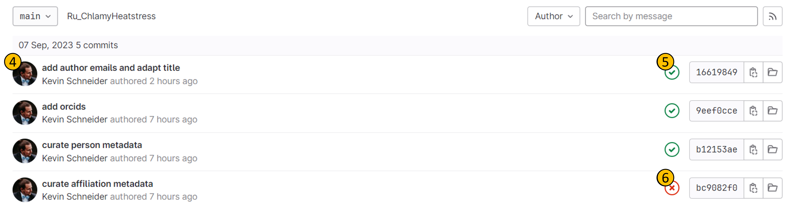

Continuous Quality Control (**CQC**) is a process that ensures the quality of the metadata of an ARC meets certain standards.

CQC i performed on each commit to an ARC, and the results are displayed on the ARC homepage:

- **(1)**:
- **(2)**:
- **(3)**:

For more details, you can click on the pipeline badge, and investigate the steps of the CQC pipeline:

- **(1)**:
- **(2)**:

- **(1)**:
- **(2)**:
- **(3)**:

Clicking on **(2)** will open the CQC pipeline, where each step can be viewed in detail. The **Tests tab (2)** contains even more details about the performed quality control tests.

## What to do when the CQC pipeline fails?

fix it, kthxbye.