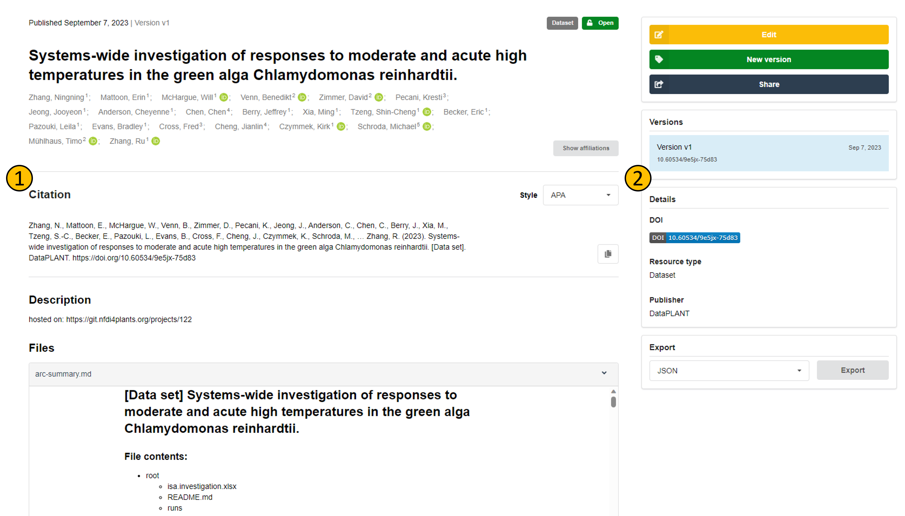
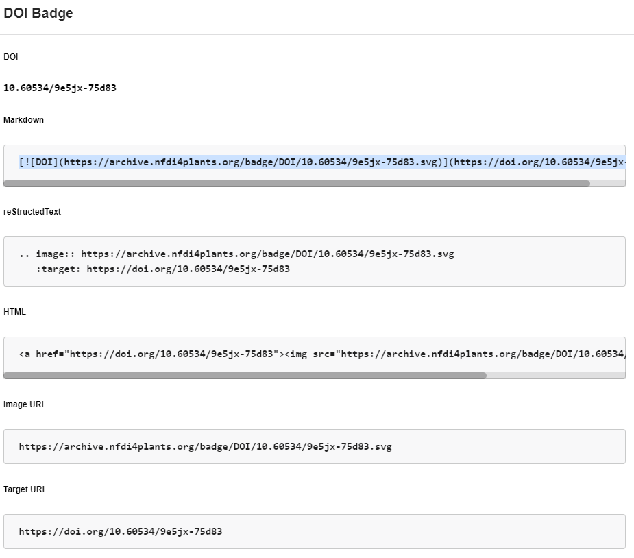
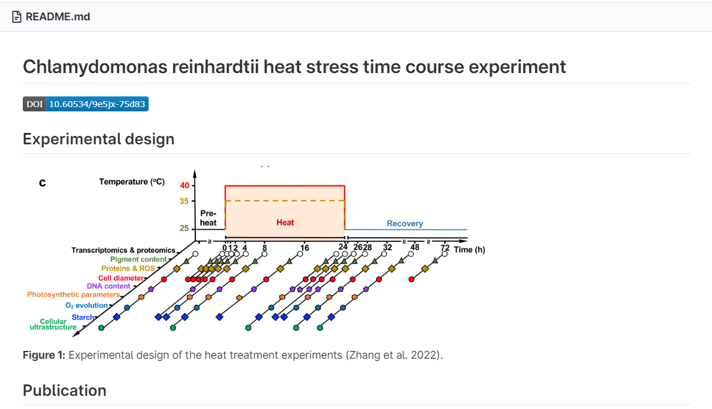

Once your data publication is published on the ARChive, you can use its digital object identifier (DOI) to cite your data publication. The DOI is a [persistent identifier](./../fundamentals/PersistentIdentifiers.html) and will always resolve to the data publication. The DOI is also registered with DataCite and will be indexed by DataCite and other DOI registration agencies. This means that your data publication will be findable and citable by other researchers.

## How to cite your data publication

You can cite your data publication in the same way as you would cite a journal article. The citation can be copied from the record in the ARChive **(1)**

- **(1)**: Citation of the record.
- **(2)**: Details of the record. You can get the DOI badge from here.

## How to display your DOI as a badge on your ARC (or other websites)

By clicking on the DOI badge **(2)**, you can get the code to display the badge on your ARC homepage or other websites.

For example, you can copy the markdown code to display the badge on your ARC homepage.

Paste the code into the README.md of your ARC, and the badge will be displayed on your ARC homepage:

