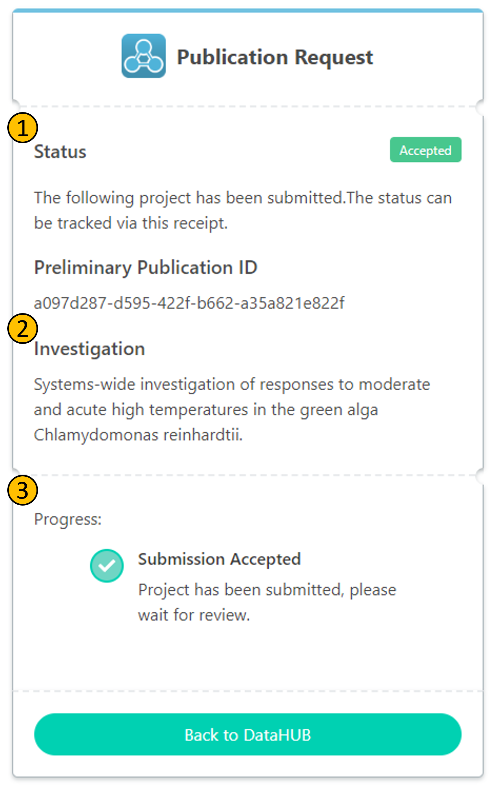

Once you submitted a record to the ARChive, it is in **RFP** (Request For Publication) stage. You can track the publication status of your record. To do so, click on the link you received in the confirmation mail after submitting the record.

Once an ARC is in **RFP** (Request For Publication) stage, emails are sent to the addresses registered in the ARCs metadata that contain a link to the ARCs publication status update page. **RFP**s are reviewed by the ARChive's editorial board, which might request changes to certain metadata entries to meet our quality criteria.

Here is an example on the publication status page of a record:

- **(1)**: The _publication status_ of the submission. This submission has been accepted.
- **(2)**: The _title_ of the investigation associated with the submission.
- **(3)**: The _progress_ of the submission process. If there are requests for changes, they will be listed here.