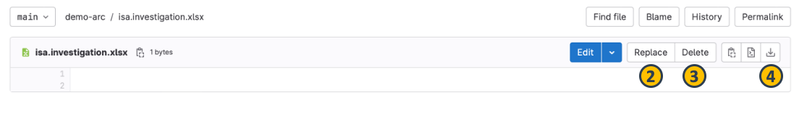
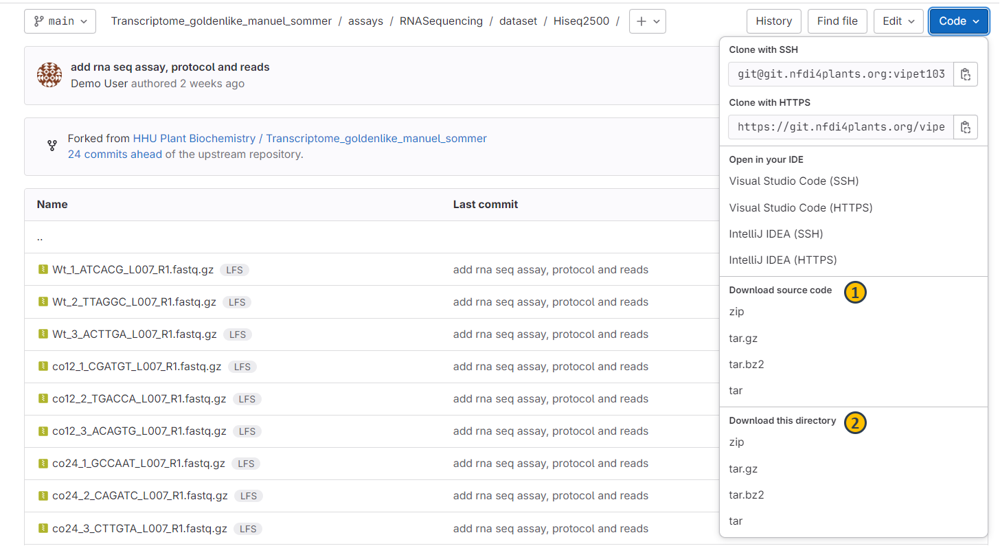

The DataHUB allows to directly operate files and folders without using any other tools similar to what you are used to from your computer's file explorer or finder.

## Add files or folders

1. From the [ARC panel](./datahub-ARCPanel.html), navigate to subdirectory of your ARC. 
2. Click the plus sign next to your ARC's name (1).
3. Select to upload a file (2) or create a new directory (3) in the current directory. 
4. This will open a new menu where you can upload your file or choose a name for your new directory. 

## Replace, delete or download single files

1. Select a file (1) that you want to change or download

2. From the next view you can choose to replace (2) a file via upload, delete (3) or download (4) the file. 

:bulb: By selecting replace (2) you can simply upload another version of the same file. The name of the original file is kept. 

## Download folders

1. From the [ARC panel](./datahub-ARCPanel.html), navigate to subdirectory of your ARC that you would like to download
2. From the download menu, you can
   1. download the complete ARC including all data files (1) or 
   2. download only the currently displayed directory including all its files (2)

