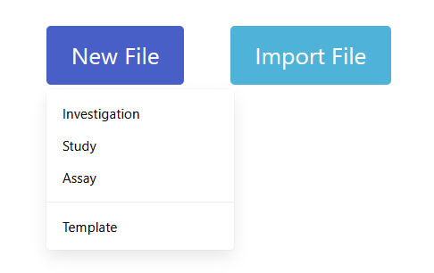
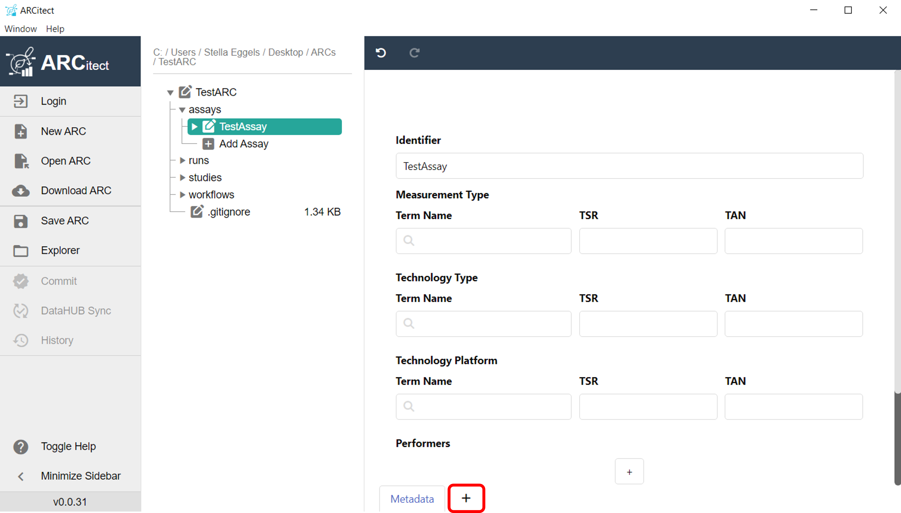

## Before we can start

:bulb: Consider reading about [Swate](./../implementation/Swate.html)

## Open or create an assay or study file

- To create an annotation table file with the [Swate standalone](https://swate-alpha.nfdi4plants.org/) in your browser, click "New File" and select which kind of file (investigation, study, assay) you want to create. If you already created a isa.study.xlsx or isa.assay.xlsx file, you can select "Import File" to modify and add to it.

 

- In the "Metadata" sheet, you can fill in general metadata about your investigation, study or assay.

## Add an annotation table

- In the "New Table" sheet, you can create your annotation table by adding [building blocks](https://nfdi4plants.org/nfdi4plants.knowledgebase/docs/SwateManual/Docs03-Building-Blocks.html). Your annotation table should consist of an *Input*, multiple descriptive building blocks (*Characteristics, Parameters, Components*) and an *Output*.
- To create an annotation table within ARCitect, add a new table to your assay or study by clicking the plus (+) symbol next to your metadata sheet. Here, you can build your annotation table by adding [building blocks](https://nfdi4plants.org/nfdi4plants.knowledgebase/docs/SwateManual/Docs03-Building-Blocks.html) the same way as in the Swate standalone.

 
