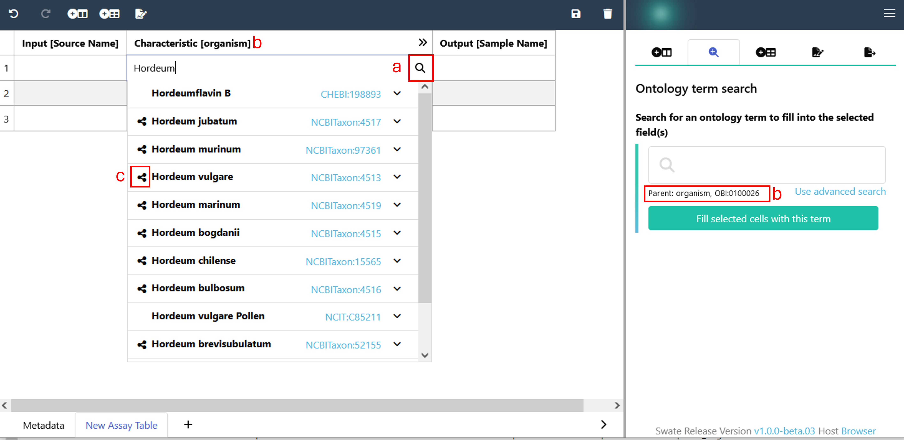

<br>

While this page will focus on the ontology term search, it will also feature useful information about term search related to the [Building Blocks](https://nfdi4plants.org/nfdi4plants.knowledgebase/docs/SwateManual/swate_blocks_add.html) page. Such general applicable information will be listed under [General](#General).

[Ontologies](https://nfdi4plants.org/nfdi4plants.knowledgebase/docs/fundamentals/Ontologies.html) are controlled vocabularies, consisting of terms and relationships. Most of these terms feature a name, a unique identifier and a description. We use these ontology terms for workflow description to utilize the benefits of a unified language in terms of machine-readability and reproducibility, following [FAIR principles](https://www.go-fair.org/fair-principles/).

- [General](#general)
- [Term Insert](#term-insert)
- [Relationship-Directed Search](#relationship-directed-search)

# General

You can find ontology term search fields on the *Building Blocks* and on the *Ontology Term Search* tab in the <a href="./../img/Swate_a_overview2.png" target="_blank">sidebar</a>.

**Features:**
- Access to the SwateDB with a list of established, [external ontologies](https://nfdi4plants.org/nfdi4plants.knowledgebase/docs/implementation/OntologyServiceLandscape.html) deemed fit for use in plant science. In addition we feature our very own ontology [DPBO](https://github.com/nfdi4plants/nfdi4plants_ontology/blob/main/nfdi4plants_ontology.obo), which we extend with missing but necessary terms.
    - External ontologies are typically taken from the [OBO Foundry](https://obofoundry.org) and updated regularly.
    - 👀 If you miss a term or ontology, please follow the [DPBO contribution guide](https://github.com/nfdi4plants/nfdi4plants_ontology) to let us know.
- Search through our database with autocomplete search on term names.
- If you already know what you are searching for, you can also type in the term unique identifier (example: `MS:1000031`). 
    - To trigger this search the input must match the [Swate Regex pattern](http://regexstorm.net/tester?p=%5b%5cw%5d%2b%3f%3a%5b%5cd%5d%2b&i=MS%3a1000031%0d%0aDPBO%3a1000161%0d%0a) for term accessions.
- To execute the search query on any search text again after closing the dropdown with the search results, double click into the search field.
- You can also use the advanced term search for a more refined search approach. Just click on the blue link close to the related search field in the side bar.

<br>

# Term Insert

<br>

<p style="display: flex; justify-content: center">

</p>

- You can find the "Ontology term search" function in the respective tab in the side bar or you can activate it in any cell of your annotation table with the magnifying glass symbol ( a ) after double clicking into a cell. With this function you will insert ontology terms in an [ISA-Tab conform way](https://isa-specs.readthedocs.io/en/latest/isatab.html#ontology-annotations).

- Type in the search field to trigger the auto-complete function and find terms. Select the term you want. When using the ontology term search in the sidebar, click "Fill selected cells with this term" to add it to your table. When using the term search within your table, the term will automatically be added in the proper format once you select the term. 
- Terms will be added to the selected rows in the format:

```
| term name | term source ontology | term id |
```  

<br>

## Relationship-Directed Search 

Ontology terms contain different types of relationships between each other. For example `is_a`, `part_of`, `xref` relationships. Swate and the SwateDB utilize these relationships to provide the user with a predefined set of terms as most likely search requests. 

Let's look at this with an example:

| Input [Source Name] | Component [instrument model] | TSR (MS:1000031) | TAN (MS:1000031) | Output [Sample Name] |
|-------------|------------------------------|------------------------------|------------------------------------|-------------|
|             |                              |                              |                                    |             |

If a user wants to fill in cells of the column `Component [instrument model]`, they are most likely looking for the instrument model used in their experimental workflow. In this example the instrument model series and the exact instrument models are so-called child terms of `instrument model (MS:1000031)` because they are connected to `instrument model (MS:1000031)` via [`is_a` relationships](./../img/Swate-RelationshipGraph-Exp.jpg). When a cell of the column `Component [instrument model]` is selected, the respective child terms can be shown by double clicking into the empty search field.

When you start typing a word to search for a specific term, both child terms and unrelated terms will be suggested. You can recognize the terms that are related to your building block header (parent term, b) by the symbol in front of the terms ( c ). To switch off this feature in your annotation table you can deactivate the magnifying glass symbol by clicking the symbol or by pressing <kbd>Tab</kbd>.
