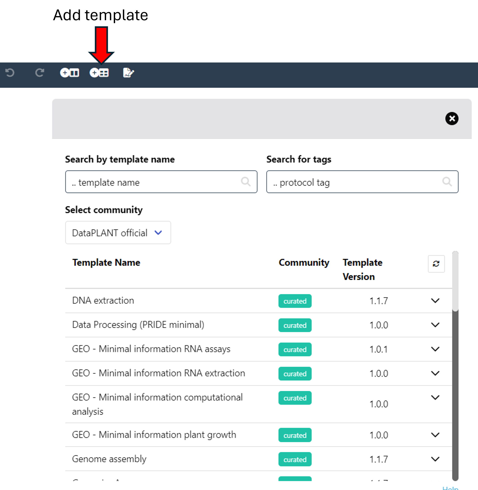

A good starting point for your data annotation is using a predefined template. You can find them by clicking the "Add Template" widget at the top or under the "Templates" tab in the sidebar. Here, click on the "Browse database" to explore all currently available templates.

### Template search

In the template browser, you can:

1. **Sort** the templates by names according to the search input. While the search default is by template name, you can also search by authors or organisation. For this, in the search field type: <kbd>/a</kbd> to search authors, <kbd>/o</kbd> to search organisations, or <kbd>/n</kbd> to search template names.

2. Filter the templates by **tags**.

- To filter with tags, just start typing in the respective search field and Swate will show you related tags. Then click on any tag of interest to apply the filter to the templates. You can also search for a combination of multiple tags.

3. Filter the templates by **origin**.

- By default, the search results will be filtered to show only templates generated by DataPLANT members (marked as curated). You can change this with the "Select community" drop-down, where you can select to show templates created by specific communities or to show all.

### Template information

When you click on a template you will be presented with some additional information, like authors, the date of creation, the version and related tags. When you click "select" you are presented with all building blocks contained in the template. Click "Add template" to add the template to the right side of your annotation table. *Only building blocks not yet in your table will be added*.

## Get in contact

If you have any problems in using the templates please contact us [here](https://github.com/nfdi4plants/Swate/issues/new/choose) or if you want to discuss existing templates or request new ones, please contact us [here](https://github.com/nfdi4plants/SWATE_templates/issues/new/choose).
