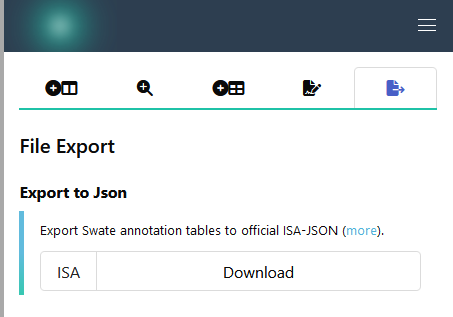

 

:construction: The function to export your Swate annotation tables to ISA-JSON conform .json files and to import .json files is currently under development. :construction:
The "File Export" function can be found in the <a href="./../img/Swate_a_overview2.png" target="_blank">Sidebar</a>.

You can follow the development in the [Swate GitHub repository](https://github.com/nfdi4plants/Swate/issues).