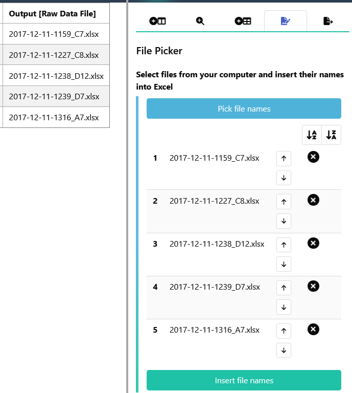

You might want to add file names to a column, especially when using *Raw Data File* or *Derived Data File* as *Input** or *Output*. Since typing them in name by name could get quite tedious, you can copy the file names with the file picker instead. For this, click on the 'File Picker' tab in the sidebar and select 'Pick file names'. The file names will appear in the sidebar and you can modify their order. Once your files are listed in the correct order, click on 'Insert File Names' to directly paste their names into the selected column. 

