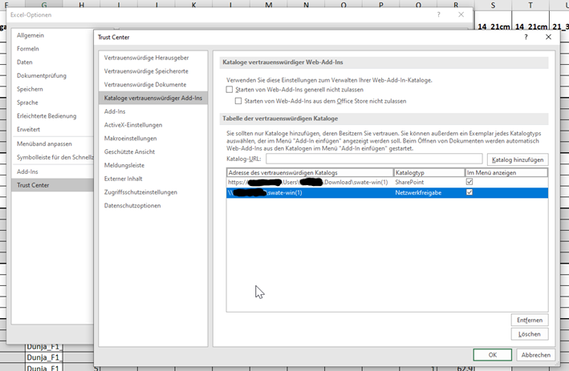

1. Download the latest [Swate manifests](https://github.com/nfdi4plants/Swate/blob/developer/.assets/swate-win.zip?raw=true) and unzip it.
2. (optional) You might have to add `swate-win` to your `programs` directory before you have the option to share the folder using network access. Using `Sharepoint` and the Swate repo inside the `Downloads` directory might not work (See Fig. 1).
3. Follow the official microsoft docs to [sideload Swate in Excel](https://learn.microsoft.com/de-de/office/dev/add-ins/testing/create-a-network-shared-folder-catalog-for-task-pane-and-content-add-ins).
4. You will need to add the `core_manifest.xml` (and optionally the `experts_manifest.xml`) to your shared folder.

Fig. 1: Sideloading SWATE in Excel might only work correctly when `swate-win` is located in the `programs` directory using `network access`, but not using `sharepoint` and a different directory.
