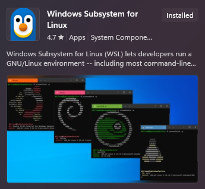
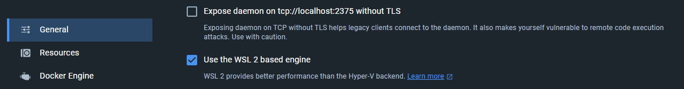
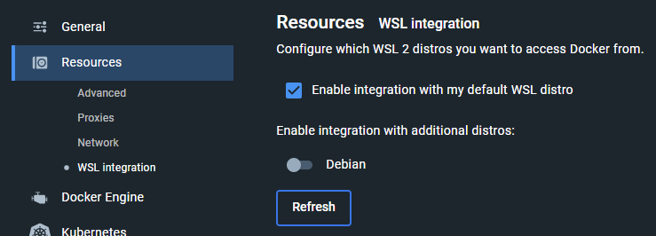

# CWL runner installation

The recommended cwl-runner is [cwltool](https://github.com/common-workflow-language/cwltool), the 
reference implementation for cwl-runners.

## Installation Windows

The installation can be done following the guide [here](https://github.com/common-workflow-language/cwltool#ms-windows-users).

 - Install Windows Subsystem for Linux from the Microsoft Store
 
 
 
 - Install Debian from the Microsoft Store
 
 
 - Set Debian as your default WSL 2 distro: `wsl --set-default debian`
 - Install [Docker Desktop for Windows](https://desktop.docker.com/win/main/amd64/Docker%20Desktop%20Installer.exe)
   - Start Docker Desktop and Navigate to Settings
   - Select "Use WSL 2 based engine" in the general tab and apply
    
   - Select "Enable Integration with my default distro" in the resources tab under WSL Integration
    
 - Start WSL
 - Run `sudo apt-get update`
 - Run `sudo apt-get install cwltool`