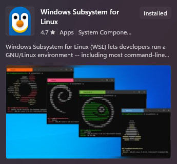
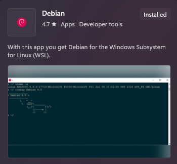
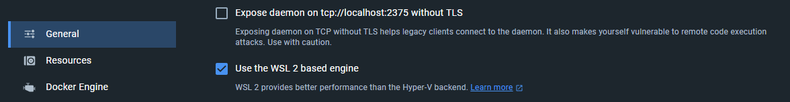
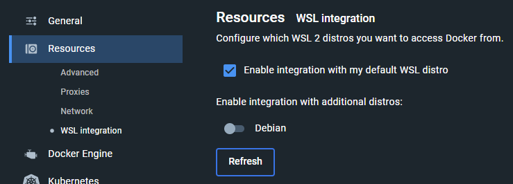

# CWL runner installation

The recommended cwl-runner is [cwltool](https://github.com/common-workflow-language/cwltool), the 
reference implementation for cwl-runners.

## Installation Windows

The installation can be done following the guide [here](https://github.com/common-workflow-language/cwltool#ms-windows-users).

 - Install Windows Subsystem for Linux from the Microsoft Store
 
 
 
 - Install Debian from the Microsoft Store
 
 
 - Set Debian as your default WSL 2 distro: `wsl --set-default debian`
 - Install [Docker Desktop for Windows](https://desktop.docker.com/win/main/amd64/Docker%20Desktop%20Installer.exe)
   - Start Docker Desktop and Navigate to Settings
   - Select "Use WSL 2 based engine" in the general tab and apply
    
   - Select "Enable Integration with my default distro" in the resources tab under WSL Integration
    
 - Start WSL
 - Follow the Instructions for Linux (Debian/Ubuntu)

 ## Installation Linux (Debian/Ubuntu)
 
 - Run `sudo apt-get update`
 - Install Python 3 if it is not already preinstalled `sudo apt install python3`
 - Install python virtual environment `sudo apt install python3.[your version here]-venv`
 - Create a virtual environment `python3 -m venv env` (named env here, name can vary)
 - Activate the virtual environment `source env/bin/activate`
 - Install the cwltool with pip `pip install cwltool`

 ## cwltool usage
 
 - If you are on Windows, start the WSL
 - Activate the virtual environment `source env/bin/activate`
 - Navigate to the results destination directory
 - Run the cwltool with the cwl file and the job file `cwltool file:///full/path/to/cwlfile.cwl file:///full/path/to/jobfile.yml`
   - Important: cwltool requires [URIs](https://en.wikipedia.org/wiki/File_URI_scheme) for the input files 