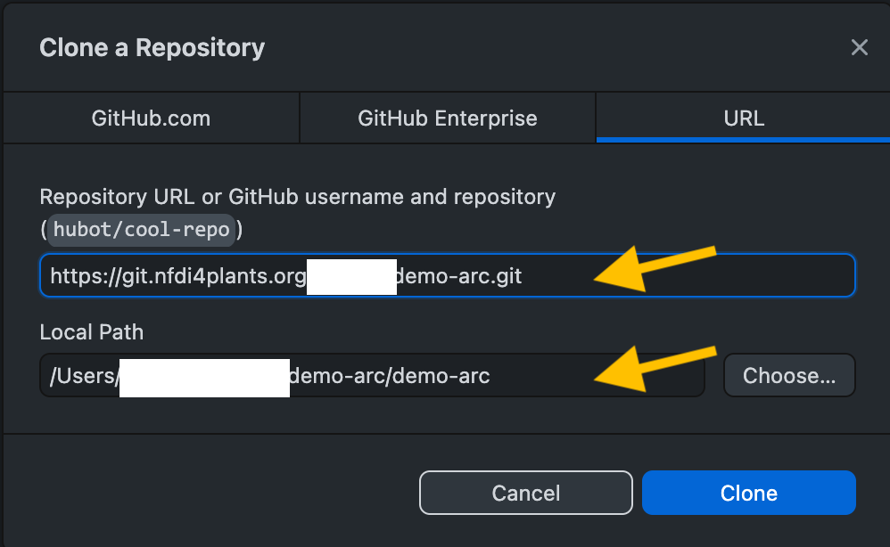
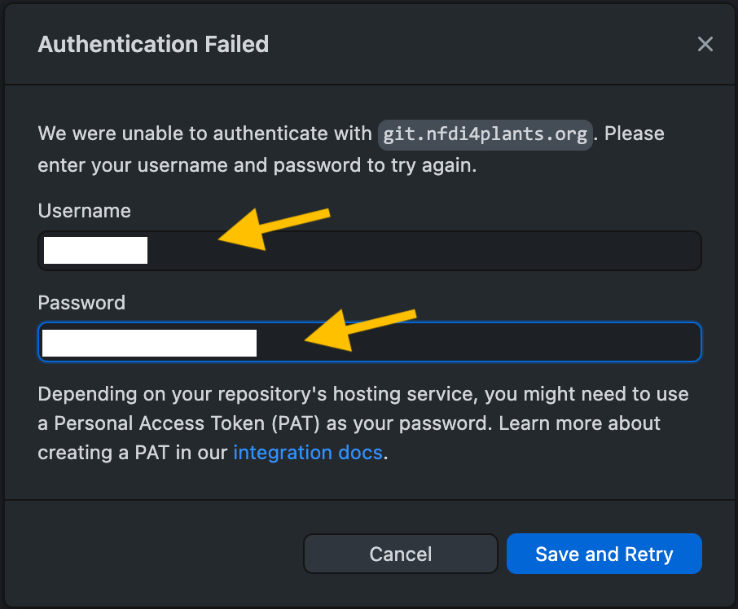

## Goal

Use [GitHub Desktop](https://desktop.github.com/) to synchronize ARCs between the DataHUB and your local machine.
GitHub Desktop is a user-friendly software to help you synchronize (pull, commit, push, ...) and track and communicate changes (diff, pull request, ...) git repositories without memorizing and executing the git commands in your command line.

> Note: This authenticates your local GitHub Desktop to communicate with the DataHUB.
> You need to do this only once per machine (unless you specify an expiration date in step 4)

## Steps

1. Download [GitHub Desktop](https://desktop.github.com/)
2. Sign in to the [DataHUB](https://git.nfdi4plants.org/)
3. Go to the [Access Tokens](https://git.nfdi4plants.org/-/profile/personal_access_tokens) settings
4. Fill all required information
   1. Token name: e.g. "GitHub Desktop"
   2. Expiration date (optional)
   3. Select scope: `api`

5. Click "Create personal access token"
6. `Your new personal access token` appears on top. Copy it somewhere for later use.

7. Within the DataHUB, go to your ARC.
8. Click on `Clone` and copy the HTTPS url, e.g. `https://git.nfdi4plants.org/<yourUserName>/<yourArc>.git`

9.  Open GitHub Desktop.
10. Select `File` -> `Clone repository`

11. Select the tab `URL` on top.
12. Paste the HTTPS link to your ARC (step 8) inside the URL field and select the destination folder, where your ARC will be stored locally. Click `Clone`
13. A pop-up window "Authentication Failed" will ask you for Username and Password. Fill in the
    1. Username: this is your DataHUB username. You can find it under your avatar in the DataHUB
    2. Password: paste the access token copied in step 6.

14. Click `Save and Retry`.

15. Your ARC is now available in your GitHub Desktop.
