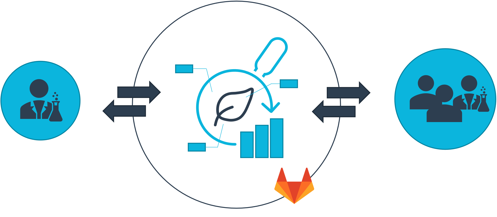
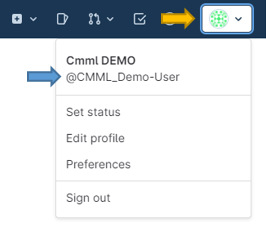
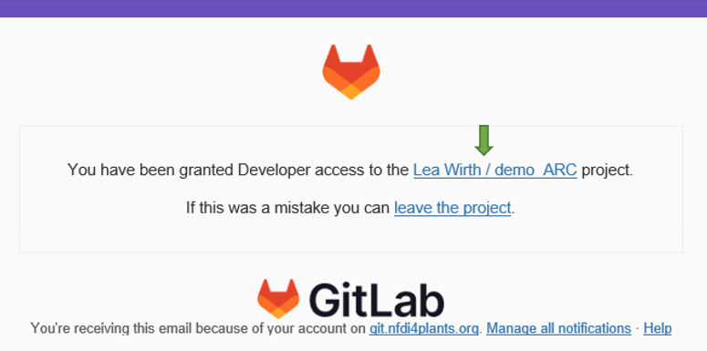
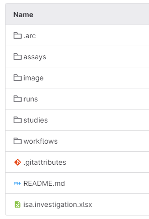

## 👥Cooperation - User regulation

__All cooperations__ are incumbent upon the ["Nutzerordnung"](https://www.plant-biochemistry.hhu.de/facilities/metabolic-profiling/nutzerordnung).

Excerpt of ["Nutzerordnung"](https://www.plant-biochemistry.hhu.de/facilities/metabolic-profiling/nutzerordnung):

>Das CEPLAS metabolomics & metabolism laboratory (CMML) ist Teil der Infrastruktureinheit „Technologie-Plattform: Pflanzenstoffwechsel und Metabolomik“ des Cluster of Excellence on Plant Sciences (CEPLAS) sowie des Instituts Biochemie der Pflanzen. Die Aufgabe des CMML ist die Bereitstellung und Entwicklung analytischer Methoden im Bereich Stoffwechselanalytik (Metabolomics) mit besonderem Fokus auf sogenannte Primärmetabolite. Des Weiteren unterstützen wir Forschende des Clusters und der Heinrich-Heine-Universität im Bereich Experimentdesign und Probenaufarbeitung in dem interdisziplinären Umfeld der Lebenswissenschaften (v.a. Pflanzenbiologie, Mikrobiologie, Medizin). Eine Nutzung durch externe Forschergruppen ist nach Absprache ebenfalls möglich.

***

## 🌐 ARC - Annotated Research Context

DataPLANT provides with the Annotated Research Context (ARC) a Research Data Management (RDM) platform after the FAIR principle. The CMML  implements the ARC for cooperations.

The aim is to exchange samplesheets, workflows, protocols and share (meta-)data inside a common and shareable folder structure.

:bulb: For more information about ARC click [here](./../../implementation/AnnotatedResearchContext.html).

The previously created ARC will be shared with you over the [DataHUB platform](https://git.nfdi4plants.org/). Please read the following setup and complete the next steps.

***

## 👣 Setup

1. At first you have to [__create a DataHUB account!__](https://register.nfdi4plants.org)

    :bulb: You can also log in with your scientific account ORCID or Life Sciences!

2. If you have sucessfully created your account you can check on the website at the top left (yellow arrow) your _@username_ (blue arrow).

3. __Commit__ this _@username_ to the CMML to get started with the common ARC.

    ✉️ You will recieve an e-mail after the access for the ARC was granted.

4. __Follow__ the link (green arrow) in the e-mail and log in with your DataHUB account.

5. __Read and follow__ the next instructions - __📘 User Guide - ARC__ and __📙 User Guide - DataHUB__.

***

## 📙 User Guide - DataHUB

### 📖 Introduction to DataHUB

This section gives you a short introduction to some helpful parts of DataHUB. The sidebar is found on the left side of the website.

1. If you click on the __name of the ARC__ you can always return to the front page.

   :arrow_right: At the front page there is also the possibility to search for specific files with __'Find Files'__.

2. Under __'Project information'__ in the section __'Members'__ you can see all members involved in the ARC and there is also the possibility to add other members.

3. The section __'Issues'__ should help to collaborate on ideas, solve problems, and plan work.

4. Under __'Wiki'__ you can create or edit a 'Page' for meeting-protocols or writing down sharable notes.

<!-- 

@Dominik: part mit deleting/adding/changing files and folders
---

The DataHUB allows to directly operate files and folders without using any other tools similar to what you are used to from your computer's file explorer or finder.
-->

***

### 📖 Add files or folders
<!-- 

1. From the [ARC panel](./datahub-ARCPanel.html), navigate to subdirectory of your ARC. 
2. Click the plus sign next to your ARC's name (1).
3. Select to upload a file (2) or create a new directory (3) in the current directory. 
4. This will open a new menu where you can upload your file or choose a name for your new directory. 
-->

***

### 📖 Replace, delete or download single files
<!-- 

1. Select a file (1) that you want to change or download

2. From the next view you can choose to replace (2) a file via upload, delete (3) or download (4) the file. 

:bulb: By selecting replace (2) you can simply upload another version of the same file. The name of the original file is kept. 
-->

***

### 📖 Download folders
<!-- 

1. From the [ARC panel](./datahub-ARCPanel.html), navigate to subdirectory of your ARC that you would like to download
2. From the download menu, you can
   1. download the complete ARC including all data files (1) or 
   2. download only the currently displayed directory including all its files (2)

-->
***

## 📘 User Guide - ARC

### 📖 Introduction to ARC

The ARC always has a specific folder structure that consists of:

- studies
- assays
- workflows
- runs

It can also contain project-specific folders like 'images' or 'literature'.

 Those folders contain specific parts of a research project.

> Example:
>
> - studies: Cultivation and sampling of plants or cells 
> - assays: Extraction, derivatization and measuring of the samples 
>

The following guide will help you to get started to work with ARC.

***

### 📖 isa.investigations.xlsx

This workbook records the metadata of the whole project. In the first part it stores information about the whole project. It includes an Identifier, Title and Description and also publication data - if published. There is also a part for personal data. Here each column is deticated to a person and it can be filled out manually.

:pen: __Fill out__ the part __'INVESTIGATION CONTACTS'__ with your personal data (the following are mandatory):

- First and Last Name
- Email
- Phone
- Address
- Affiliation

:bulb: For the other parts below the __'INVESTIGATION CONTACTS'__ sections it is recommended to use [ARC Commander](./../../implementation/ArcCommander.html) for adding the metadata. This is less error-prone than filling it out manually.

***

### 📖 Studies and Assays

A study and assay always consist of the following structures:

Every part of a research project finds a place to be put in:

1. __isa.study.xlsx__ or __isa.assay.xlsx__:  

   :arrow_right: for this describtion go to the [next](#📖-isastudyxlsx-or-isaassayxlsx) part of the instruction

2. __Protocols__:  

   - "substitute" for Lab-book
   - here you should write down the used method, but also put in for example plasmid-cards that are specific for this part of the research
   - most optimal file-format would be .txt, but a Word-file can also be possible

3. __Resources__ (only in studies)

4. __Dataset__ (only in assays)
  
5. __README.md__: description and notes for the specific study or assay

***

### 📖 isa.study.xlsx and isa.assay.xlsx

The isa.study- and isa.assay-file consist of two excel-sheet

1. __Samplesheet__ that holds the name of the study or assay

  :arrow_right: Here you __describe__ the samples in details, how they have been processed and give them a __CMML-specific label__ that consists of your project-number and a following numbering

__:pen: The samples must be labelled with the last digits and the box with the project-number and sampleset.__
> Example:
>
> - The __first sampleset__ has 20 samples and your project-number is: 23-0065
> - The final numbering in the samplesheet would be: __23-0065_001__ up to __23-0065_020__
> - The samplebox must be labbeled with __23-0065_01__
> - The sampletubes must then be labelled with __001__ up to __020__
> - If you provide another sampleset, the numbering on the tubes are consecutive for all samples.
>

2. __Metadata__ - the sheet is called 'Study' or 'Assay'

 :pen: __Fill out__ the Metadata as best as you can (the following parts are mandatory):

- __for studies__:
  - Study Title
  - Study Description
  - STUDY CONTACTS
- __for assays__:
  - ASSAY PERFORMERS

***

## 🌱 CMML Support

If any problems occur there is the possibility to check the common [__Knowledgebase__](https://nfdi4plants.org/nfdi4plants.knowledgebase/index.html) from DataPLANT for solutions. Otherwise contact the CMML so the problems can be solved together. You can always come back to the __Qickstart__ with the shared link and we are open for any suggestions on it to improve it.
