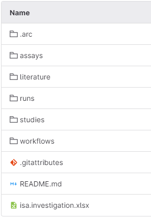

<!--
http://127.0.0.1:8080/docs/community-docs/CMML/cmml-quickstart.html
-->
## About this guide

This quick start introduces how to cooperate with the [CEPLAS metabolomics & metabolism laboratory (CMML)](https://www.ceplas.eu/en/research/plant-metabolism-and-metabolomics-facility) at Heinrich-Heine-University in Düsseldorf.

The primary focus is on the exchange of data between CMML and the user by applying tools and services provided by DataPLANT.

### Contact the CMML

Please check the CMML websites for contact options:

- at CEPLAS: https://www.ceplas.eu/en/research/plant-metabolism-and-metabolomics-facility
- at HHU: https://www.plant-biochemistry.hhu.de/facilities/metabolic-profiling

### Cooperation &ndash; User regulation

Please note that __all cooperations__ are incumbent upon the [User regulation ("Nutzerordnung")](https://www.plant-biochemistry.hhu.de/facilities/metabolic-profiling/nutzerordnung).

## Data Flow between CMML and the user

### ARC &ndash; Annotated Research Context

The CMML uses the [Annotated Research Context (ARC)](./../../implementation/AnnotatedResearchContext.html) for data exchange.
With the ARC we can easily exchange sample sheets, workflows, protocols and share (meta-)data inside a common and shareable folder structure. The ARC is shared via DataPLANT's [DataHUB](./../../implementation/DataHub.html).

The CMML creates an ARC for your project at the [DataHUB](https://git.nfdi4plants.org/) and invites you to the ARC. In order to do so, please complete the following setup.

***

### Setup

1. Please __create__  a [DataHUB account!](https://register.nfdi4plants.org)

    :bulb: You can also log in with your scientific account ORCID or Life Sciences!

2. Once you successfully created your account and logged in, you can find your _@username_ (blue arrow) in the avatar menu in the top right of the website (yellow arrow).

3. Please __email__ this _@username_ to the CMML.   
4. The CMML will invite you to a shared ARC for your project.
5. Once the access to your ARC was granted, you will receive an e-mail.

   :arrow_right: The name of your ARC is your __project-number__ followed by your last name.

6. Please follow the link in the e-mail (green arrow) and log in with your DataHUB account.

***

## User Guide &ndash; DataHUB

This section gives you a short introduction to some helpful features of the DataHUB.

:bulb: The DataHUB allows to directly operate files and folders without using any other tools similar to what you are used to from your computer's file explorer or finder.

On the website you can find the sidebar on the left side of your ARC.

1. If you click on the name of the ARC you can always return to the front page.

   :bulb: At the front page there is also the possibility to search for specific files with 'Find Files'.

2. Under 'Project information' in the section 'Members' you can see all members involved in the ARC and there is also the possibility to add other members.

3. The section 'Issues' helps to collaborate on ideas, solve problems, and plan work.

4. Under 'Wiki' you can find 'Page'. Here we can create or edit a 'Page' to summarize meeting minutes or write down sharable notes.

:bulb: For more details about DataHUB &ndash; please check out the [DataHUB manual](./../../DataHUB-Manual/datahub-files.html).

## User Guide &ndash; the ARC

### Introduction to the ARC

The ARC is made up of several folders. The basic ARC folder structure consists of:

- studies
- assays
- workflows
- runs

Those folders contain specific parts of a research project.

> Example:
>
> - studies: Cultivation and sampling of plants or cells 
> - assays: Metabolite extraction and derivatization or measurements of the samples

It is also possible to add additional folder structures like "_literature" to the ARC so it can be adapted for the project.

***

### isa.investigations.xlsx

This workbook records the metadata of the whole project. In the first part it stores information about the whole project. It includes an Identifier, Title and Description and also publication data - if published. There is also a part for personal data. Here each column is deticated to a person and it can be filled out manually.

:pen: __Fill out__ the part __INVESTIGATION CONTACTS__ with your personal data. You can download the file and replace the online-version afterwards. The following information are mandatory:

- First and Last Name
- Email
- Phone
- Address
- Affiliation

<!--
:bulb: For the other parts below the __INVESTIGATION CONTACTS__ sections it is recommended to use [ARC Commander](./../../implementation/ArcCommander.html) for adding the metadata. This is less error-prone than filling it out manually.
-->

***

### Studies and Assays

Study and assay folders always consist of the following structures:

Every part of a research project finds a place to be put in:

1. __isa.study.xlsx__ or __isa.assay.xlsx__ consist of two excel sheets:  

- __Sample sheet__ that holds the name of the study or assay.
  
    :arrow_right: Here you __describe__ your samples, how they have been processed and give them a __CMML-specific identifier__ that consists of your project-number and a following numbering. You can download the file and replace the online-version afterwards.

    :pen: The samples must be __labelled with a continous number and the box with the project-number and sample set.__

    :arrow_right: Also let us know whether the samples should be stored after processing, picked up or whether they can be destroyed.

> Example &ndash; the first sample set has 20 samples and your project-number is 23-0065:
>
> - The final numbering in the sample sheet would be: __23-0065_001__ up to __23-0065_020__
> - The sample box must be labeled with __23-0065_01__
> - The sample tubes must then be labelled with __001__ up to __020__
> - If you provide another sample set, the numbering on the tubes and in the sample sheet are consecutive for all samples.

- __Metadata__ - the sheet is called 'Study' or 'Assay'.

2. __Protocols__:

    :pen: Here you should __write down__ the used method, but also put in for example plasmid-cards or images that are specific for this part of the research.

    :arrow_right: Most optimal __file-format__ would be __.txt__ or __.md__, but a Word-file and other formats can also be possible.

3. __Resources__ (only in studies)

4. __Dataset__ (only in assays)
  
5. __README.md__: This file can be used to describe different "studies" and "assays" and take notes for this specific section of the experiment. The document is then visible on the website in the lower area when opening the respective structure.

***

## Checklist for Cooperations with CMML

:bulb: Our department is only able to accept and process the samples if the following checklist is fulfilled:

1. Read the [User regulation ("Nutzerordnung")](https://www.plant-biochemistry.hhu.de/facilities/metabolic-profiling/nutzerordnung).
1. Setup a [DataHUB account](https://register.nfdi4plants.org).
1. Access to your ARC.
1. __isa.investigations.xlsx__: Fill out the part INVESTIGATION CONTACTS with the mandatory information.
1. __isa.study/assay.xlsx__: Fill out the Sample sheet.
1. Labelling of the samples with CMML-specific identifier.
1. Also let us know whether the samples should be stored after processing, picked up or whether they can be destroyed.

## CMML Support 🌱

If any problems occur please also check the common [DataPLANT Knowledgebase](./../../index.html) for solutions. Otherwise contact the CMML so the problems can be solved together. You can always come back to this __Quickstart__ with the shared link and we are open for any suggestions to improve it.
