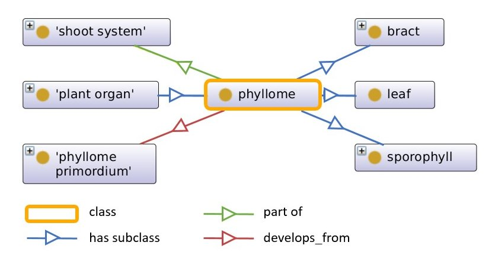

# **Ontology**

## **What is an Ontology?**

The term ontology has its origin in the philosophic question about the very nature of our existence. Here, we do not want to engage into a discussion that could fill whole books.

In our context, an ontology comprises a conceptualized collection of well-defined terms and their relationships for a specific research domain (e.g. plant sciences). Therefore, it can be used to semantically annotate and describe research data in a way that makes it both human- and machine-readable.

All knowledge within an ontology is described through axiom triples in a subject-predicate-object syntax. There are several terms (depending on the ontology format) that are used to describe specific parts of an ontology:

| OWL term | OBO term | Explanation |
| :----- | :----- | :----- |
| Class | Term (stanza) | Define groups of individuals that belong together because they share some properties. |
| ObjectProperty | Typedef (stanza) | Relations between instances of two classes. |
| DatatypeProperty | no equivalent | Relations between instances of classes and datatypes. |
| AnnotationProperty | property_value (tag) | Define that a property is an annotation. |
| NamedIndividual | Instance (stanza) | Instances of classes that can be related to other instances through properties. |
| domain | domain (tag) | Subject of a relationship triplet. |
| range | range (tag) | Object of a relationship triplet. |
<br />



Fig. 1: Excerpt of the plant ontology. Boxes describe classes, arrows describe object properties. The class “phyllome” is defined as a subclass of “plant organ”. The class “phyllome” has three subclasses: “bract”, “leaf” and “sporophyll”. It is furthermore defined as “part of” the class “shoot system” that “develops_from” the “phyllome primordium”.

</br>

## **OBO and OWL format**

Ontologies can be used for many different purposes. As such, there are also multiple languages which an ontology can be written in, as well as many formats. Some of the most important relevant for our context include the Web Ontology Language (OWL) and Open Biomedical Ontologies (OBO) format. OBO was mainly used by the biomedical community (see section OBO Foundry) before the rise of OWL and today is considered a dialect of OWL.

The OBO format is the simplest format and not only machine-readable but also easily read by humans. As such, it is easy to edit and review, but also lacks multiple features only available in other formats. For instance, it is not possible to define DatatypeProperties in OBO, which are used in OWL ontologies. 

OBO example:
```
[Typedef]
id: BFO_0000050
name: part of
property_value: http://purl.org/dc/elements/1.1/creator "Hannah Doerpholz" xsd:string
property_value: http://purl.org/dc/elements/1.1/date 2022-10-17T08:33:26Z xsd:dateTime
domain: PO_0006001 ! phyllome
range: PO_0009006 ! shoot system
```

When it comes to OWL ontologies, there are several common formats: RDF/XML, OWL/XML, OWL Functional Syntax and OWL Manchester Syntax. All formats are more complex than the easy-to-read OBO format. While RDF/XML is the best format for providing a suitable input format file for a multitude of tools, it is very complex and more difficult to review without a good understanding of the format. Review and editing can be more easily performed using the OWL Manchester Syntax, which provides all information about a concept and its usages within the ontology in one paragraph.

RDF/XML example:
```
<owl:ObjectProperty rdf:about="http://purl.obolibrary.org/obo/BFO_0000050">
    <rdfs:domain rdf:resource="http://purl.obolibrary.org/obo/PO_0006001"/>
    <rdfs:range rdf:resource="http://purl.obolibrary.org/obo/PO_0009006"/>
    <dc:creator rdf:datatype="http://www.w3.org/2001/XMLSchema#string">Hannah Doerpholz</dc:creator>
    <dc:date rdf:datatype="http://www.w3.org/2001/XMLSchema#dateTime">2022-10-17T08:33:26Z</dc:date>
    <rdfs:label xml:lang="en">part of</rdfs:label>
</owl:ObjectProperty>
```

OWL Manchester example:
```
ObjectProperty: BFO_0000050
    Annotations: 
        dc:creator "Hannah Doerpholz"^^xsd:string,
        dc:date "2022-10-17T08:33:26Z"^^xsd:dateTime,
        rdfs:label "part of"@en
    Domain: 
        PO_0006001
    Range: 
        PO_0009006
```

Since the OBO format does not cover all aspects that can be included in OWL formatted ontologies, conversion between the formats can be problematic. Generally, it is possible to convert OBO files into OWL files using conversion tools such as the [OWL API](https://owlapi.sourceforge.net/), since OBO can be interpreted as a reduced OWL form. However, when trying to convert OWL files to OBO files, there can be significant information loss when concepts foreign to OBO (such as DatatypeProperties mentioned above) are used.

</br>

## **OBO Foundry**
The Open Biological Biomedical Ontologies (OBO) Foundry is a team of scientists interested in the development, collection and maintenance of ontologies for the biological and biomedical domain of life sciences. 

The OBO Foundry is open for contribution from everyone. For an ontology to be accepted into the OBO Foundry, it must follow the [OBO Foundry Principles](https://obofoundry.org/principles/fp-000-summary.html):

1.	It must be open and it needs to be licensed (e.g. CC-BY 3.0)
2.	A common format must be must (see section OBO and OWL format)
3.	Each term should have a unique identifier by using a unique prefix (such as GO) followed by a numerical ID thereby resulting in an unique OBO Foundry URL
4.	Every new version of an ontology must be versioned using documented procedures.
5.	The domain or matter of the ontology must be described.
6.	Each term in an ontology must be described in a human-readable form.
7.	Relations between different items of the ontology should be described using defined vocabulary described by the Relations Ontology (RO).
8.	Documentations for the ontology must be available. Here, the best way is to provide a GitHub repository.
9.	It should be documented that multiple independent people or organizations use the ontology.
10.	The ontology should be open to contribution from anyone.
11.	One person should be listed as contact and responsible person for the ontology.
12.	The naming of for elements such as classes, subclasses etc. should follow naming conventions.
13.	The ontology needs to be maintained.

</br>

## **Sources and further information**
* [OBO Foundry](https://obofoundry.org/)
* [AgroPortal](https://agroportal.lirmm.fr)
* [OBO Academy](https://oboacademy.github.io/obook/explanation/owl-format-variants/)
* [W3 - Web Ontology Language](https://www.w3.org/TR/owl-features/)
