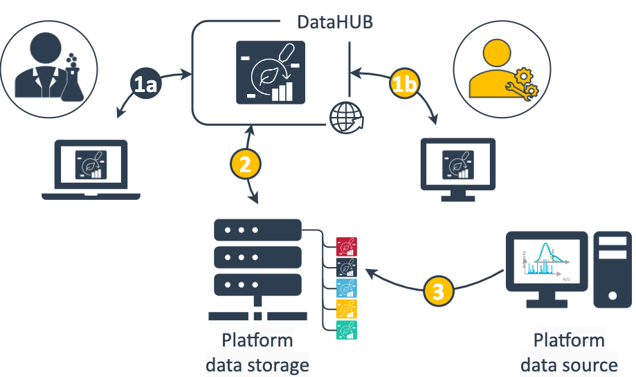

:construction: work in progress :construction:

<!-- http://127.0.0.1:8080/docs/guides/ARC-enablingPlatforms.html -->

## About this guide

In this guide we explore how the ARC can help streamline data flows and project management in enabling platforms.

<a href="./index.html">
    UserAdvanced
    ModeRead
</a>

 
 

## Before we can start

It helps to be familiar with

- :ballot_box_with_check: the concept of the [ARC](./../implementation/AnnotatedResearchContext.html)
- :ballot_box_with_check: the different [ISA file types](./isa_FileTypes.html)
- :ballot_box_with_check: the [DataHUB](./../implementation/DataHub.html)
 
 
- :bulb: Note that this guide can only stay at a very abstract level. Feel free to contact us to work out a suitable solution for your platform together.
- :warning: In part, this guide presents interim solutions for which we are working on more user-friendly implementations. Your feedback helps!

## Enabling Platforms

Central *enabling platforms* can range from small single-lab services to large instrumentation-based research infrastructures such as core facilities. Platforms offer a specific set of methods and assays as a routine support to a community of researchers. Typical examples with application in plant sciences include platforms offering "omics" technologies (genome, transcriptome, proteome, metabolome), phenotyping, (microscopic) imaging, genetic engineering or plant growth facilities.

## Project communication and data flow

*For simplicity, in this guide we call researchers, clients and customers approaching the platform "collaborators".*

  collaborator
  platform team

Central platforms interact with many versatile collaborators. Most platforms have established workflows or routines for (i) project initiation, (ii) submission of samples to be assayed, (iii) exchange of and access to generated data. This communication typically includes a ping-pong of meetings and emails to shape the study in mind, elaborate the biological question and hypothesis, define the most suitable method offered by the platform. To effectively process the project, the platform raises requirements for how samples need to be prepared and submitted.

### Project management

As a platform you manage a lot of projects in parallel. Keeping these projects up-to-date and coordinated between collaborators and platform team members is challenging.

Here's a few tips to support your project management:

- You can use the [wiki associated to the ARC](./../DataHUB-Manual/datahub-ARCWiki.html) to collect meeting minutes with your collaborators
- You can use the [ARC's issue board](./../DataHUB-Manual/datahub-ARCPanel.html) to coordinate tasks between collaborators, team members, data analysts and others involved
- You can use your established system of identifiers (e.g. for projects, samples) in [ISA metadata](./../guides/isa_FileTypes.html)
- You can also keep naming your ARCs with the same way you are used to name your project folders

### Streamlined data exchange

During project collaboration a lot of information including metadata is exchanged.
Here's an idea what your data flow could look like with the ARC:

  
  <figcaption>  </figcaption>

1. Data exchange between collaborator and platform occurs through the ARC shared via the DataHUB. Depending on the phase of the project this involves different data and information.  
   (1a) The collaborator primarily describes the investigation's goal and study design, annotates the submitted samples with metadata and adds associated protocols. Once available the collaborator receives assayed data and relevant information.  
   (1b) The platform team receives relevant sample metadata to run the respective assay and complements the ARC with platform-specific assay metadata, protocols and standard operating procedures (SOPs).
2. A clone of the ARC is stored locally at the platform.
3. From the platform data source, e.g. a workstation attached to your assay device, the generated data can directly be written or transferred to the assay dataset folder of your ARC stored in the file storage

A few tips to streamline your data exchange:

- You can [use metadata templates](./../SwateManual/Docs05-Templates.html)
  - to communicate with collaborators and team members, which metadata is crucial for specific assays
- You can also store filled-out templates for your routine measurements as a reusable [JSON file](./../SwateManual/Docs06-ISA-JSON.html)

### Data storage, handling and transfer

Your platform produces a lot of valuable raw data. Depending on your setup and the type of data you generate, the data is stored on individual machines, hard drives, institutional or internal file shares. For instance, workstations directly associated with measuring devices require quickest data transfer rates or specific security restrictions and write data to proximal data stores rather than a cloud storage.

The DataHUB can help as a platform to centralize data from different sources and function as a geo-redundant backup with tracked changes:

- No matter where you work (office desktop, remote laptop, workstation), you can always sync your current state of the ARC via the [DataHUB](./../implementation/DataHub.html)
- You can follow the evolution of a project via ARC's [version control](./../fundamentals/VersionControlGit.html)

### Track changes and provenance

Different people are involved in the projects passing your platform. From team members to internal and external collaboration partners (collaborators). This makes it sometimes hard to keep track of who contributed how, what, when, why and to manage who needs access to which data.

- The [DataHUB](./../implementation/DataHub.html) facilitates access management across institute boarders
- ARCs document [changes and contributions](./../fundamentals/VersionControlGit.html)
- The [ISA metadata model](./isa_FileTypes.html) allows to associate contributors with investigations and studies. List your team members to ensure proper credit for their contributions

### Routine computations

Your platform supports researchers with a specific set of methods and assays. You perform routine measurements, follow established protocols and SOPs to generate specific types of samples and data. Aligned with your lab workflows, you also follow computational routines: For the same types of (raw) data you re-use computational steps for processing and analysis.
Reusing computational workflows across projects helps comprehensibility for your collaborators and ensures reproducibility and quality for your data.

The standardized ARC structure helps with routine computations:

- The ARC's simple [directory structure](./../implementation/AnnotatedResearchContext.html) itself helps building routines, no matter whether you work with code or licensed software. Across projects, you and your collaborators know, where to find metadata and raw data, where to store processed data and results.
- The ARC facilitates task automation such as quality control and validation within one project or across multiple ARCs covering routine measurements
- Code-based computations can be designed as reusable and reproducible workflows using Common Workflow Language (CWL)

<!-- TODO: Link to CWL article / guide -->
:construction: Articles and guides on CWL are currently work in progress.

### Data publication

At some point you and your collaborator want to [publish the data](./../fundamentals/DataPublications.html) resulting from the project.

There are two major options: You can publish the current version of the ARC and receive a [DOI](./../fundamentals/PersistentIdentifiers.html). Some scientific journals require data to be published in  [domain-specific repositories](./../fundamentals/PublicDataRepositories.html), specialized for a certain type of assay. For this purpose converters help you export the relevant dataset and metadata into a repository-accepted format.

<!-- TODO: Link to DOI and converter article / guide -->
:construction: Both these routines are work in progress.

:bulb: We are working on converters to read and reshape the relevant data and metadata of your ARC into a format accepted by domain-specific repositories. You can support this by telling us relevant repositories for your type of data or help creating [templates](./../SwateManual/Docs05-Templates.html).

## Preparing your platform to benefit from the ARC

Here we recommend steps that you *can* take to prepare your platform towards using ARCs.
They are optional and it depends on your platform, whether these are suitable.

☑️ **[Create](./../guides/index-CreateYourARC.html) an example ARC**
- Try to structure a typical experiment run in your platform as an ARC
- Consider what information is required to reproduce the experiment from *source-to-data*
- What information is provided by the collaborator or by the platform?
- Which protocols (materials and methods) are required?
- At what step and how does the collaborator "hand over" or submit?

☑️ **Share your example ARC via the [DataHUB](https://git.nfdi4plants.org)**

- An example ARC helps collaborators understand the ARC concept and structure with your type of data and metadata
- Where can they find what information (protocols, datasets, results)?
- How can they interact with the ARC (upload, download, edit)

☑️ **[Create a DataHUB group](./../DataHUB-Manual/datahub-CreateGroup.html) for your platform**

- A group can help you organize all running projects in one place
- You can easily manage access for multiple ARCs

☑️ **Design [metadata templates](./../guides/swate_template-contribution.html) for sample annotation**

- Let your collaborators know, what information you need from them
- You can either use those templates yourself, when initiating a new ARC for collaboration or let collaborators select the template directly via [Swate](./../implementation/Swate.html)

☑️ **Write a short guide for your collaborators**

- Especially for new collaboration partners, it helps to summarize your platforms routine with a short guide.
- How does your platform incorporate ARCs and what are the exact steps for interaction between you and the collaboration partner?
- You could share this guide via this knowledge base or attach it to your example ARC or group in the DataHUB.

☑️ **Start packaging your projects as ARCs :rocket:**

## Meet your collaborators in an ARC

You are all set and ready to use ARCs for collaboration in your platform.
Here we try to address a few questions from discussions with platform heads.

**Who initiates the ARC: platform or collaborator?**

You decide whether you prepare the ARC for you collaborators (scenario A) or meet them half the way (scenario B).
Eventually this depends on different factors, e.g. the type of collaboration you agreed upon or whether or not the collaborators are used to work with the ARC and associated tools.

Following the exemplary scenario A, you could setup the ARC for your collaboration (1), add the relevant studies and assays (2) as well as templates (3) as discussed with them and ask them to complement the required metadata (4) and protocols (5) before you can run the assays and add the dataset (6).

Alternatively, collaborators already working with ARCs could invite you to "their" ARC (exemplary scenario B). They can independently set up the ARC and fill metadata (4) based on your prepared templates (3).

:bulb: In scenario B the collaborator might invite you to a very large ARC with data not really relevant for your platform-specific collaboration. In this case you might want to [exclude irrelevant data or avoid downloading large data](./../guides/arc_gitignore.html) when syncing the ARC.

**Can I retain my established naming convention for project management and data storage?**

Running a central platform, you probably follow an established project management system or naming convention.
This is particularly important for how project folders are named on your platform's data storage. When implementing ARCs, **you do not need to change** this system.
You can simply name the ARCs the same way you are used to name your project folders.

This is also true for scenario B exemplified above. You can simply [fork](./../DataHUB-Manual/datahub-fork.html) the collaborator's ARC and rename it according to your system.

:bulb: You might want to consider requiring your collaborators to name the assays (folder name or assay identifier) according to your project management system.

**How can I share ARCs with non-ARC collaborators?**

Not all of your collaborators use ARCs or are planning to do so, but you still want to interact with those collaborators in the same routines employed with everyone else. They only need a DataHUB account and they can simply sign in with their existing scientific account.

The DataHUB comes with [built-in features](./../DataHUB-Manual/datahub-files.html) that allow interaction with the ARC solely via the web browser without any addional tools. 

<!-- 

### Benefits for the researcher

- already described investigation (and study) for another facility, would not want to double the work for another assay -->
